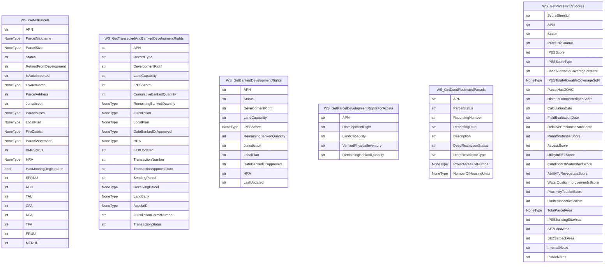

# Development & Development-Rights ERD (Tahoe / TRPA)

> **Purpose**: inventory of the *existing* upstream systems (Corral SQL
> Server, LTinfo JSON web services, repo spreadsheets) that the new schema
> integrates. Not the proposal itself — that's [target_schema.md](./target_schema.md).
> **Audience**: anyone who needs context on what Corral and LTinfo already
> hold before reviewing the new-table proposal.


> **This document describes the *existing* upstream systems.** For the
> proposed new schema, see [target_schema.md](./target_schema.md) —
> anchored on the TRPA Cumulative Accounting framework (5 buckets per
> commodity per jurisdiction, 7 movement types). Also see
> the `trpa-cumulative-accounting` skill (or archived [`_archive/cumulative_accounting_reference.md`](./_archive/cumulative_accounting_reference.md))
> for the full vocabulary. The HTML viewer
> [development_rights_erd.html](./development_rights_erd.html) shows
> existing systems **and** the proposed schema side-by-side as tabs.

> **Context correction since this doc was first written**: Corral IS the
> LTinfo backend, not a separate system. The `sql24/Corral` connection is
> a Feb-2024 snapshot of that backend. Live data sync in the new system
> flows through the LTinfo JSON web services, not direct SQL.

Generated from three disparate sources to inform the design of a unified schema.

- **SQL Server `Corral`** on `sql24` — 573 tables / 1,041 FKs, read-only mirror of the system of record. Full table list: [corral_tables.md](corral_tables.md). Machine-readable schema dump: [corral_schema.json](corral_schema.json).
- **LTinfo web services** — public JSON endpoints at `https://www.laketahoeinfo.org/WebServices/*`, token-gated. Full probe results: [ltinfo_services.json](ltinfo_services.json).
- **Repo spreadsheets** — CSV/XLSX inputs under `data/` that feed the parcel-history and cumulative-accounting ETLs.

Scope of the diagrams below: development, allocations, TDR transactions, deed restrictions, IPES / land capability, commodity pools, parcel genealogy. The Corral ERD is a curated ~50-table subset; the remainder is catalogued in `corral_tables.md`.

Regenerate with:
```
python erd/dump_corral_schema.py
python erd/inventory_ltinfo_services.py
python erd/build_erd.py
```

## 1. Corral SQL Server — curated ERD

```mermaid
erDiagram
    AccelaCAPRecord {
        int AccelaCAPRecordID PK
        varchar AccelaID
        varchar KeyOne
        varchar KeyTwo
        varchar KeyThree
        varchar ShortNotes
        varchar DetailedDescription
        int AccelaCAPRecordStatusID
        varchar AccelaCAPTypeName
        datetime FileDate
        varchar AssignedToStaff
    }
    AccelaCAPRecordStatus {
        int AccelaCAPRecordStatusID PK
        varchar AccelaCAPRecordStatusName
        varchar AccelaCAPRecordStatusDisplayName
    }
    Commodity {
        int CommodityID PK
        varchar CommodityName
        varchar CommodityDisplayName
        int CommodityUnitTypeID
        bit IsCoverage
        bit CanHaveLandCapability
        varchar CommodityShortName
        int SortOrder
        bit CanHaveCommodityPool
    }
    CommodityConvertedToCommodity {
        int CommodityConvertedToCommodityID PK
        int CommodityID
        int ConvertedToCommodityID
    }
    CommodityPool {
        int CommodityPoolID PK
        varchar CommodityPoolName
        int JurisdictionID
        varchar Comments
        bit IsActive
        datetime InactivatedDate
        int InactivatedByPersonID
        int CommodityID
    }
    CommodityPoolDisbursement {
        int CommodityPoolDisbursementID PK
        int CommodityPoolID
        varchar CommodityPoolDisbursementTitle
        smalldatetime CommodityPoolDisbursementDate
        int CommodityPoolDisbursementAmount
        varchar CommodityPoolDisbursementDescription
        datetime CreateDate
        int CreatePersonID
        datetime UpdateDate
        int UpdatePersonID
        int RollOverDisbursementYear
    }
    CommodityUnitType {
        int CommodityUnitTypeID PK
        varchar CommodityUnitTypeName
        varchar CommodityUnitTypeDisplayName
        varchar CommodityUnitTypeNameSingular
        varchar CommodityUnitTypeAbbreviation
    }
    DeedRestriction {
        int DeedRestrictionID PK
        int DeedRestrictionStatusID
        varchar RecordingNumber
        datetime RecordingDate
        varchar Description
    }
    DeedRestrictionDeedRestrictionType {
        int DeedRestrictionDeedRestrictionTypeID PK
        int DeedRestrictionID
        int DeedRestrictionTypeID
    }
    DeedRestrictionStatus {
        int DeedRestrictionStatusID PK
        varchar DeedRestrictionStatusName
        varchar DeedRestrictionStatusDisplayName
    }
    DeedRestrictionType {
        int DeedRestrictionTypeID PK
        varchar DeedRestrictionTypeName
        varchar DeedRestrictionTypeDisplayName
    }
    IpesScore {
        int IpesScoreID PK
        int ParcelID
        int ParcelLandCapabilityVerificationID
        int TotalParcelArea
        int IpesBuildingSiteArea
        int SEZLandArea
        int SEZSetbackArea
        bit HasDeterminationOfAllowableCoverage
        datetime FieldEvaluationDate
        int IpesScoreStatusID
        int RecordedByPersonID
        datetime RecordedDate
        int Score
        int RelativeErosionScore
        int RunoffPotentialScore
        int AccessScore
        int UtilityInSEZScore
        int ConditionOfWatershedScore
        int AbilityToRevegetateScore
        int ProximityToLakeScore
        int WaterQualityImprovementsScore
        int LimitedIncentivePoints
        float ParcelAreaFactor5K
        float ParcelAreaFactor10K
        int BaseAllowablePercent
        int BaseAllowableLandCoverageArea
        bit IsImported
        varchar InternalNotes
        varchar PublicNotes
        bit OverrideScore
    }
    IpesScoreParcelInformation {
        int IpesScoreParcelInformationID PK
        int IpesScoreID
        int IpesProximityToLakeTahoePointID
        int WatershedID
        int IpesVegetativeGroupPointID
        int IpesElevationOfParcelPointID
        int GradientOfParcel
        varchar SlopeType
        int CompassDegree
        varchar CompassDirection
    }
    IpesScoreStatus {
        int IpesScoreStatusID PK
        varchar IpesScoreStatusName
        varchar IpesScoreStatusDisplayName
        int SortOrder
    }
    LandBank {
        int LandBankID PK
        int LeadAgencyID
    }
    LandCapabilityType {
        int LandCapabilityTypeID PK
        int CommodityID
        int BaileyRatingID
    }
    Parcel {
        int ParcelID PK
        varchar ParcelNumber
        varchar GeometryXml
        varchar ParcelStreetAddress
        varchar ParcelCity
        varchar ParcelState
        varchar ParcelZipCode
        varchar ParcelNickname
        varchar ParcelPublicNotes
        varchar OwnerName
        int JurisdictionID
        int ParcelSize
        int VerifiedParcelSize
        varchar LocalPlan
        varchar HRA
        varchar FireDistrict
        int WatershedID
        int ParcelStatusID
        bit AutoImported
        int ExistingOffsiteCoverage
        bit IsRetired
        int OwnerLandBankID
        int CoverageExemptionPerviousCoverage
        int CoverageExemptionPerviousDeck
        int CoverageExemptionShed
        int CoverageExemptionADA
        int ExistingCoverageTotal
    }
    ParcelAccelaCAPRecord {
        int ParcelAccelaCAPRecordID PK
        int ParcelID
        int AccelaCAPRecordID
    }
    ParcelCommodityInventory {
        int ParcelCommodityInventoryID PK
        int ParcelID
        int LandCapabilityTypeID
        int VerifiedPhysicalInventoryQuantity
        varchar ParcelCommodityInventoryNotes
        datetime LastUpdateDate
        int LastUpdatePersonID
        int RemainingBaseAllowableQuantity
        int ExcessCoverage
        int MitigatedExcessCoverage
        varchar AccelaFileNumber
        int BankedQuantity
        datetime BankedDate
        int RemainingBankedQuantityAdjustment
    }
    ParcelGenealogy {
        int ParcelGenealogyID PK
        int ParentParcelID
        int ChildParcelID
    }
    ParcelGeometry {
        int ParcelGeometryID PK
        int ParcelID
        varchar ParcelNumber
        geometry Ogr_Geometry
        int UpdatedPersonID
        datetime UpdatedDate
    }
    ParcelLandCapabilityBaileyRating {
        int ParcelLandCapabilityBaileyRatingID PK
        int ParcelLandCapabilityVerificationID
        int BaileyRatingID
        int SquareFootage
    }
    ParcelLandCapabilityVerification {
        int ParcelLandCapabilityVerificationID PK
        int ParcelID
        int ParcelLandCapabilityVerificationDeterminationTypeID
        datetime DeterminationDate
        int SitePlanFileResourceInfoID
        int AccelaCAPRecordID
        varchar LandCapabilityNotes
        datetime LastUpdateDate
        int LastUpdatePersonID
    }
    ParcelNote {
        int ParcelNoteID PK
        int ParcelID
        varchar Note
        int CreatePersonID
        datetime CreateDate
        int UpdatePersonID
        datetime UpdateDate
    }
    ParcelPermit {
        int ParcelPermitID PK
        int ParcelID
        int JurisdictionID
        int ParcelPermitTypeID
        varchar PermitNumber
        varchar ProjectDescription
        datetime IssuedDate
        datetime AcknowledgedDate
        datetime PreGradeInspectionDate
        datetime FinalInspectionDate
        varchar Notes
        int ProposedOffsiteCoverage
        int CoverageExemptionPerviousCoverage
        int CoverageExemptionPerviousDeck
        int CoverageExemptionShed
        int CoverageExemptionADA
        money SecurityAmount
        money FeeApplication
        money FeeWaterQualityMitigation
        money FeeAirQualityMitigation
        money FeeExcessCoverageMitigation
        money FeeOffsiteCoverage
        bit ShouldBMPCertificateBeIssued
        bit IsBMPCertificateAlreadyIssued
        bit HasCertificateOfOccupancyBeenIssued
        date ApplicationReceivedDate
        date ApplicationCompleteDate
        date FeeApplicationPaidDate
        money SecurityAmmount
        date SecurityPostedDate
        date SecurityReleasedDate
        int LastUpdatedPersonID
        date LastUpdatedDate
        varchar ApplicantName
        bit IsApplicationOverviewComplete
        bit IsProposedCoverageComplete
        bit IsDeedRestrictionAndViolationComplete
        bit IsFeesAndSecurityComplete
        date MitigationFeesPaidDate
        bit IsProposedDevelopmentRightComplete
        date PermitExpirationDate
        int ExcessCoverageMitigationQuantity
        varchar PlannerName
        bit IsUploadDocumentComplete
        bit RequiresDeedRestriction
        int ParcelPermitStatusID
    }
    ParcelPermitBankedDevelopmentRight {
        int ParcelPermitBankedDevelopmentRightID PK
        int ParcelPermitID
        int LandCapabilityTypeID
        int Quantity
        varchar Notes
    }
    ParcelPermitBuildingType {
        int ParcelPermitBuildingTypeID PK
        varchar ParcelPermitBuildingTypeName
        int SortOrder
    }
    ParcelPermitDeedRestriction {
        int ParcelPermitDeedRestrictionID PK
        int ParcelPermitID
        varchar RecordingNumber
        datetime RecordedDate
        varchar Description
    }
    ParcelPermitProposedDevelopmentRight {
        int ParcelPermitProposedDevelopmentRightID PK
        int ParcelPermitID
        int LandCapabilityTypeID
    }
    ParcelPermitProposedDevelopmentRightDetail {
        int ParcelPermitProposedDevelopmentRightDetailID PK
        int ParcelPermitProposedDevelopmentRightID
        int ParcelPermitProposedDevelopmentRightDetailTypeID
        int ParcelPermitProposedCoverageDetailTypeID
        int ParcelPermitProposedDevelopmentRightValue
        varchar Notes
        int RemainingBaseAllowableQuantity
    }
    ParcelPermitProposedDevelopmentRightDetailType {
        int ParcelPermitProposedDevelopmentRightDetailTypeID PK
        varchar ParcelPermitProposedDevelopmentRightDetailTypeName
        varchar ParcelPermitProposedDevelopmentRightDetailTypeDisplayName
        int SortOrder
    }
    ParcelPermitStatus {
        int ParcelPermitStatusID PK
        varchar ParcelPermitStatusName
        varchar ParcelPermitStatusDisplayName
    }
    ParcelPermitType {
        int ParcelPermitTypeID PK
        int ParcelPermitBuildingTypeID
        varchar ParcelPermitTypeName
        int SortOrder
    }
    ParcelStatus {
        int ParcelStatusID PK
        varchar ParcelStatusName
        varchar ParcelStatusDisplayName
    }
    ResidentialAllocation {
        int ResidentialAllocationID PK
        int JurisdictionID
        int IssuanceYear
        int ResidentialAllocationTypeID
        int AllocationSequence
        int CommodityPoolDisbursementID
        int TdrTransactionID
        bit IsAllocatedButNoTransactionRecord
        int CommodityPoolID
        int AssignedToJurisdictionID
        varchar Notes
        int CertificateFileResourceInfoID
        int AllocationLetterFileResourceInfoID
    }
    ResidentialAllocationCommodityPoolHistory {
        int ResidentialAllocationCommodityPoolHistoryID PK
        int ResidentialAllocationID
        int CommodityPoolID
        int PreviousCommodityPoolID
        varchar ChangeCommodityPoolNotes
        int ChangePoolPersonID
        datetime ChangePoolDate
    }
    ResidentialAllocationType {
        int ResidentialAllocationTypeID PK
        varchar ResidentialAllocationTypeName
        varchar ResidentialAllocationTypeCode
        varchar Description
    }
    ResidentialAllocationUseType {
        int ResidentialAllocationUseTypeID PK
        varchar ResidentialAllocationUseTypeName
        varchar ResidentialAllocationUseTypeDisplayName
    }
    ResidentialBonusUnitCommodityPoolTransfer {
        int ResidentialBonusUnitCommodityPoolTransferID PK
        int SendingCommodityPoolID
        int ReceivingCommodityPoolID
        int TransferAmount
        varchar TransferCommodityPoolNotes
        int TransferPoolPersonID
        datetime TransferPoolDate
    }
    ShorezoneAllocation {
        int ShorezoneAllocationID PK
        int CommodityPoolID
        int IssuanceYear
        int ShorezoneAllocationTypeID
        int AllocationSequence
        int CommodityPoolDisbursementID
        int TdrTransactionID
        int WithdrawnOrExpiredTdrTransactionID
        bit IsAllocatedButNoTransactionRecord
        varchar Notes
        int AllocationLetterFileResourceInfoID
    }
    ShorezoneAllocationType {
        int ShorezoneAllocationTypeID PK
        varchar ShorezoneAllocationTypeName
        varchar ShorezoneAllocationTypeDisplayName
        varchar ShorezoneAllocationTypeCode
    }
    TdrListing {
        int TdrListingID PK
        datetime PostingDate
        int TdrListingTypeID
        int TdrListingStatusID
        int ParcelID
        int LandCapabilityTypeID
        money UnitPrice
        int TransferQuantity
        int CreatePersonID
        varchar OrganizationName
        varchar PhoneNumber
        varchar AdditionalContactInformation
        varchar Notes
    }
    TdrListingStatus {
        int TdrListingStatusID PK
        varchar TdrListingStatusName
        varchar TdrListingStatusDisplayName
        int SortOrder
    }
    TdrListingType {
        int TdrListingTypeID PK
        varchar TdrListingTypeName
        varchar TdrListingTypeDisplayName
        int SortOrder
    }
    TdrTransaction {
        int TdrTransactionID PK
        int LeadAgencyID
        varchar LeadAgencyAbbreviation
        int TransactionTypeCommodityID
        int TransactionTypeID
        varchar TransactionTypeAbbreviation
        int CommodityID
        varchar DeallocatedRationale
        datetime LastUpdateDate
        int LastUpdatePersonID
        varchar ProjectNumber
        varchar Comments
        int TransactionStateID
        int AccelaCAPRecordID
        datetime ApprovalDate
        date ExpirationDate
    }
    TdrTransactionAllocation {
        int TdrTransactionAllocationID PK
        int TdrTransactionID
        int SendingAllocationPoolID
        int ReceivingOwnershipID
        int ReceivingParcelID
        int AllocatedQuantity
        int ReceivingBaileyRatingID
        bit ResidentialAllocationFeeReceived
        int ReceivingIpesScoreID
        int ResidentialAllocationUseTypeID
    }
    TdrTransactionAllocationAssignment {
        int TdrTransactionAllocationAssignmentID PK
        int TdrTransactionID
        int SendingAllocationPoolID
        int RetiredSensitiveOwnershipID
        int RetiredSensitiveParcelID
        int ReceivingOwnershipID
        int ReceivingParcelID
        int AllocatedQuantity
        int ReceivingBaileyRatingID
        bit ResidentialAllocationFeeReceived
        int ReceivingIpesScoreID
        int ResidentialAllocationUseTypeID
    }
    TdrTransactionConversion {
        int TdrTransactionConversionID PK
        int TdrTransactionID
        int ParcelID
        int OwnershipID
        int CommodityConvertedToID
        int BaileyRatingID
        int SendingQuantity
        int ReceivingQuantity
        int IpesScoreID
    }
    TdrTransactionConversionWithTransfer {
        int TdrTransactionConversionWithTransferID PK
        int TdrTransactionID
        int SendingOwnershipID
        int SendingParcelID
        int ReceivingOwnershipID
        int ReceivingParcelID
        int SendingBaileyRatingID
        int ReceivingBaileyRatingID
        int SendingQuantity
        int ReceivingQuantity
        int CommodityConvertedToID
        money TransferPrice
        int ReceivingIpesScoreID
        int SendingIpesScoreID
    }
    TdrTransactionLandBankAcquisition {
        int TdrTransactionLandBankAcquisitionID PK
        int TdrTransactionID
        int SendingParcelID
        int SendingQuantity
        int SendingBaileyRatingID
        int LandBankID
        money TransferPrice
        int SendingIpesScoreID
        geometry SendingParcelGeometry
    }
    TdrTransactionLandBankTransfer {
        int TdrTransactionLandBankTransferID PK
        int TdrTransactionID
        int SendingLandBankID
        int TdrTransactionLandBankAcquisitionID
        int SendingQuantity
        int SendingBaileyRatingID
        int SendingIpesScoreID
        int ReceivingParcelID
        int ReceivingQuantity
        int ReceivingBaileyRatingID
        int ReceivingIpesScoreID
        money TransferPrice
    }
    TdrTransactionShorezoneAllocation {
        int TdrTransactionShorezoneAllocationID PK
        int TdrTransactionID
        int SendingShorezoneAllocationPoolID
        int ReceivingParcelID
        int AllocatedQuantity
        varchar AccelaFileNumber
        int PierParcelTypeID
        int ShorezoneAllocationVisuallySensitiveTypeID
        int MooringLotterySubmissionID
    }
    TdrTransactionStateHistory {
        int TdrTransactionStateHistoryID PK
        int TdrTransactionID
        int TransactionStateID
        int UpdatePersonID
        datetime TransitionDate
    }
    TdrTransactionTransfer {
        int TdrTransactionTransferID PK
        int TdrTransactionID
        int SendingParcelID
        int SendingQuantity
        int SendingBaileyRatingID
        int ReceivingOwnershipID
        int ReceivingParcelID
        int ReceivingQuantity
        int ReceivingBaileyRatingID
        money TransferPrice
        int RetiredQuantity
        int SendingIpesScoreID
        int ReceivingIpesScoreID
        bit IsBaileyRatingOrIpesScoreRequired
    }
    TransactionTypeCommodity {
        int TransactionTypeCommodityID PK
        int TransactionTypeID
        int CommodityID
    }
    vGeoServerAllParcels {
        int PrimaryKey
        int ParcelID
        varchar ParcelNumber
        varchar ParcelNickname
        int ParcelSize
        varchar ParcelPublicNotes
        varchar ParcelStatusName
        int OrganizationID
        varchar OrganizationName
        int WatershedID
        varchar WatershedName
        varchar OwnerName
        int ParcelStreetNumber
        varchar ParcelAddress
        varchar ParcelStreetAddress
        varchar ParcelCity
        varchar ParcelState
        varchar ParcelZipCode
        varchar LocalPlan
        varchar BMPStatus
        varchar FireDistrict
        varchar HRA
        bit AutoImported
        geometry Ogr_Geometry
    }
    vGeoServerParcelDevelopmentRightTransfers {
        int PrimaryKey
        int ParcelID
        varchar ParcelNumber
        varchar ParcelNickname
        int ParcelSize
        varchar ParcelPublicNotes
        varchar ParcelStatusName
        int OrganizationID
        varchar OrganizationName
        int WatershedID
        varchar WatershedName
        varchar OwnerName
        int ParcelStreetNumber
        varchar ParcelAddress
        varchar ParcelStreetAddress
        varchar ParcelCity
        varchar ParcelState
        varchar ParcelZipCode
        varchar LocalPlan
        varchar BMPStatus
        varchar FireDistrict
        varchar HRA
        bit AutoImported
        varchar ParcelFillColor
        datetime LastUpdateDate
        geometry Ogr_Geometry
    }
    vParcelCurrentInventoryByCommodity {
        int PrimaryKey
        int ParcelID
        int Coverage
        int CommercialFloorArea
        int SingleFamilyResidentialUnitOfUse
        int MultiFamilyResidentialUnitOfUse
        int ResidentialAllocation
        int ResidentialBonusUnit
        int PotentialResidentialUnitOfUse
        int TouristAccommodationUnit
    }
    vTransactedAndBankedCommodities {
        uniqueidentifier PrimaryKey
        int ParcelID
        int TransactionTypeID
        int CommodityID
        int BaileyRatingID
        int Quantity
        datetime LastUpdateDate
        varchar ParcelAction
    }
    AccelaCAPRecordStatus ||--o{ AccelaCAPRecord : "AccelaCAPRecordStatusID -> AccelaCAPRecordStatusID"
    CommodityUnitType ||--o{ Commodity : "CommodityUnitTypeID -> CommodityUnitTypeID"
    Commodity ||--o{ CommodityConvertedToCommodity : "CommodityID -> CommodityID"
    Commodity ||--o{ CommodityConvertedToCommodity : "ConvertedToCommodityID -> CommodityID"
    Commodity ||--o{ CommodityPool : "CommodityID -> CommodityID"
    CommodityPool ||--o{ CommodityPoolDisbursement : "CommodityPoolID -> CommodityPoolID"
    DeedRestrictionStatus ||--o{ DeedRestriction : "DeedRestrictionStatusID -> DeedRestrictionStatusID"
    DeedRestriction ||--o{ DeedRestrictionDeedRestrictionType : "DeedRestrictionID -> DeedRestrictionID"
    DeedRestrictionType ||--o{ DeedRestrictionDeedRestrictionType : "DeedRestrictionTypeID -> DeedRestrictionTypeID"
    IpesScoreStatus ||--o{ IpesScore : "IpesScoreStatusID -> IpesScoreStatusID"
    Parcel ||--o{ IpesScore : "ParcelID -> ParcelID"
    ParcelLandCapabilityVerification ||--o{ IpesScore : "ParcelLandCapabilityVerificationID -> ParcelLandCapabilityVerificationID"
    IpesScore ||--o{ IpesScoreParcelInformation : "IpesScoreID -> IpesScoreID"
    Commodity ||--o{ LandCapabilityType : "CommodityID -> CommodityID"
    LandBank ||--o{ Parcel : "OwnerLandBankID -> LandBankID"
    ParcelStatus ||--o{ Parcel : "ParcelStatusID -> ParcelStatusID"
    AccelaCAPRecord ||--o{ ParcelAccelaCAPRecord : "AccelaCAPRecordID -> AccelaCAPRecordID"
    Parcel ||--o{ ParcelAccelaCAPRecord : "ParcelID -> ParcelID"
    LandCapabilityType ||--o{ ParcelCommodityInventory : "LandCapabilityTypeID -> LandCapabilityTypeID"
    Parcel ||--o{ ParcelCommodityInventory : "ParcelID -> ParcelID"
    Parcel ||--o{ ParcelGenealogy : "ChildParcelID -> ParcelID"
    Parcel ||--o{ ParcelGenealogy : "ParentParcelID -> ParcelID"
    Parcel ||--o{ ParcelGeometry : "ParcelID -> ParcelID"
    ParcelLandCapabilityVerification ||--o{ ParcelLandCapabilityBaileyRating : "ParcelLandCapabilityVerificationID -> ParcelLandCapabilityVerificationID"
    AccelaCAPRecord ||--o{ ParcelLandCapabilityVerification : "AccelaCAPRecordID -> AccelaCAPRecordID"
    Parcel ||--o{ ParcelLandCapabilityVerification : "ParcelID -> ParcelID"
    Parcel ||--o{ ParcelNote : "ParcelID -> ParcelID"
    Parcel ||--o{ ParcelPermit : "ParcelID -> ParcelID"
    ParcelPermitStatus ||--o{ ParcelPermit : "ParcelPermitStatusID -> ParcelPermitStatusID"
    ParcelPermitType ||--o{ ParcelPermit : "ParcelPermitTypeID -> ParcelPermitTypeID"
    LandCapabilityType ||--o{ ParcelPermitBankedDevelopmentRight : "LandCapabilityTypeID -> LandCapabilityTypeID"
    ParcelPermit ||--o{ ParcelPermitBankedDevelopmentRight : "ParcelPermitID -> ParcelPermitID"
    ParcelPermit ||--o{ ParcelPermitDeedRestriction : "ParcelPermitID -> ParcelPermitID"
    LandCapabilityType ||--o{ ParcelPermitProposedDevelopmentRight : "LandCapabilityTypeID -> LandCapabilityTypeID"
    ParcelPermit ||--o{ ParcelPermitProposedDevelopmentRight : "ParcelPermitID -> ParcelPermitID"
    ParcelPermitProposedDevelopmentRight ||--o{ ParcelPermitProposedDevelopmentRightDetail : "ParcelPermitProposedDevelopmentRightID -> ParcelPermitProposedDevelopmentRightID"
    ParcelPermitProposedDevelopmentRightDetailType ||--o{ ParcelPermitProposedDevelopmentRightDetail : "ParcelPermitProposedDevelopmentRightDetailTypeID -> ParcelPermitProposedDevelopmentRightDetailTypeID"
    ParcelPermitBuildingType ||--o{ ParcelPermitType : "ParcelPermitBuildingTypeID -> ParcelPermitBuildingTypeID"
    CommodityPool ||--o{ ResidentialAllocation : "CommodityPoolID -> CommodityPoolID"
    CommodityPool ||--o{ ResidentialAllocation : "CommodityPoolID -> CommodityPoolID"
    CommodityPool ||--o{ ResidentialAllocation : "JurisdictionID -> JurisdictionID"
    CommodityPoolDisbursement ||--o{ ResidentialAllocation : "CommodityPoolDisbursementID -> CommodityPoolDisbursementID"
    CommodityPoolDisbursement ||--o{ ResidentialAllocation : "CommodityPoolID -> CommodityPoolID"
    CommodityPoolDisbursement ||--o{ ResidentialAllocation : "CommodityPoolDisbursementID -> CommodityPoolDisbursementID"
    ResidentialAllocationType ||--o{ ResidentialAllocation : "ResidentialAllocationTypeID -> ResidentialAllocationTypeID"
    TdrTransaction ||--o{ ResidentialAllocation : "TdrTransactionID -> TdrTransactionID"
    CommodityPool ||--o{ ResidentialAllocationCommodityPoolHistory : "CommodityPoolID -> CommodityPoolID"
    CommodityPool ||--o{ ResidentialAllocationCommodityPoolHistory : "PreviousCommodityPoolID -> CommodityPoolID"
    ResidentialAllocation ||--o{ ResidentialAllocationCommodityPoolHistory : "ResidentialAllocationID -> ResidentialAllocationID"
    CommodityPool ||--o{ ResidentialBonusUnitCommodityPoolTransfer : "ReceivingCommodityPoolID -> CommodityPoolID"
    CommodityPool ||--o{ ResidentialBonusUnitCommodityPoolTransfer : "SendingCommodityPoolID -> CommodityPoolID"
    CommodityPool ||--o{ ShorezoneAllocation : "CommodityPoolID -> CommodityPoolID"
    CommodityPoolDisbursement ||--o{ ShorezoneAllocation : "CommodityPoolDisbursementID -> CommodityPoolDisbursementID"
    ShorezoneAllocationType ||--o{ ShorezoneAllocation : "ShorezoneAllocationTypeID -> ShorezoneAllocationTypeID"
    TdrTransaction ||--o{ ShorezoneAllocation : "TdrTransactionID -> TdrTransactionID"
    TdrTransaction ||--o{ ShorezoneAllocation : "WithdrawnOrExpiredTdrTransactionID -> TdrTransactionID"
    LandCapabilityType ||--o{ TdrListing : "LandCapabilityTypeID -> LandCapabilityTypeID"
    Parcel ||--o{ TdrListing : "ParcelID -> ParcelID"
    TdrListingStatus ||--o{ TdrListing : "TdrListingStatusID -> TdrListingStatusID"
    TdrListingType ||--o{ TdrListing : "TdrListingTypeID -> TdrListingTypeID"
    AccelaCAPRecord ||--o{ TdrTransaction : "AccelaCAPRecordID -> AccelaCAPRecordID"
    Commodity ||--o{ TdrTransaction : "CommodityID -> CommodityID"
    TransactionTypeCommodity ||--o{ TdrTransaction : "TransactionTypeCommodityID -> TransactionTypeCommodityID"
    TransactionTypeCommodity ||--o{ TdrTransaction : "TransactionTypeCommodityID -> TransactionTypeCommodityID"
    TransactionTypeCommodity ||--o{ TdrTransaction : "TransactionTypeID -> TransactionTypeID"
    TransactionTypeCommodity ||--o{ TdrTransaction : "CommodityID -> CommodityID"
    CommodityPool ||--o{ TdrTransactionAllocation : "SendingAllocationPoolID -> CommodityPoolID"
    IpesScore ||--o{ TdrTransactionAllocation : "ReceivingIpesScoreID -> IpesScoreID"
    IpesScore ||--o{ TdrTransactionAllocation : "ReceivingIpesScoreID -> IpesScoreID"
    IpesScore ||--o{ TdrTransactionAllocation : "ReceivingParcelID -> ParcelID"
    Parcel ||--o{ TdrTransactionAllocation : "ReceivingParcelID -> ParcelID"
    ResidentialAllocationUseType ||--o{ TdrTransactionAllocation : "ResidentialAllocationUseTypeID -> ResidentialAllocationUseTypeID"
    TdrTransaction ||--o{ TdrTransactionAllocation : "TdrTransactionID -> TdrTransactionID"
    CommodityPool ||--o{ TdrTransactionAllocationAssignment : "SendingAllocationPoolID -> CommodityPoolID"
    IpesScore ||--o{ TdrTransactionAllocationAssignment : "ReceivingIpesScoreID -> IpesScoreID"
    IpesScore ||--o{ TdrTransactionAllocationAssignment : "ReceivingIpesScoreID -> IpesScoreID"
    IpesScore ||--o{ TdrTransactionAllocationAssignment : "ReceivingParcelID -> ParcelID"
    Parcel ||--o{ TdrTransactionAllocationAssignment : "ReceivingParcelID -> ParcelID"
    Parcel ||--o{ TdrTransactionAllocationAssignment : "RetiredSensitiveParcelID -> ParcelID"
    ResidentialAllocationUseType ||--o{ TdrTransactionAllocationAssignment : "ResidentialAllocationUseTypeID -> ResidentialAllocationUseTypeID"
    TdrTransaction ||--o{ TdrTransactionAllocationAssignment : "TdrTransactionID -> TdrTransactionID"
    Commodity ||--o{ TdrTransactionConversion : "CommodityConvertedToID -> CommodityID"
    IpesScore ||--o{ TdrTransactionConversion : "IpesScoreID -> IpesScoreID"
    IpesScore ||--o{ TdrTransactionConversion : "IpesScoreID -> IpesScoreID"
    IpesScore ||--o{ TdrTransactionConversion : "ParcelID -> ParcelID"
    Parcel ||--o{ TdrTransactionConversion : "ParcelID -> ParcelID"
    TdrTransaction ||--o{ TdrTransactionConversion : "TdrTransactionID -> TdrTransactionID"
    Commodity ||--o{ TdrTransactionConversionWithTransfer : "CommodityConvertedToID -> CommodityID"
    IpesScore ||--o{ TdrTransactionConversionWithTransfer : "ReceivingIpesScoreID -> IpesScoreID"
    IpesScore ||--o{ TdrTransactionConversionWithTransfer : "ReceivingIpesScoreID -> IpesScoreID"
    IpesScore ||--o{ TdrTransactionConversionWithTransfer : "ReceivingParcelID -> ParcelID"
    IpesScore ||--o{ TdrTransactionConversionWithTransfer : "SendingIpesScoreID -> IpesScoreID"
    IpesScore ||--o{ TdrTransactionConversionWithTransfer : "SendingIpesScoreID -> IpesScoreID"
    IpesScore ||--o{ TdrTransactionConversionWithTransfer : "SendingParcelID -> ParcelID"
    Parcel ||--o{ TdrTransactionConversionWithTransfer : "ReceivingParcelID -> ParcelID"
    Parcel ||--o{ TdrTransactionConversionWithTransfer : "SendingParcelID -> ParcelID"
    TdrTransaction ||--o{ TdrTransactionConversionWithTransfer : "TdrTransactionID -> TdrTransactionID"
    IpesScore ||--o{ TdrTransactionLandBankAcquisition : "SendingIpesScoreID -> IpesScoreID"
    IpesScore ||--o{ TdrTransactionLandBankAcquisition : "SendingIpesScoreID -> IpesScoreID"
    IpesScore ||--o{ TdrTransactionLandBankAcquisition : "SendingParcelID -> ParcelID"
    LandBank ||--o{ TdrTransactionLandBankAcquisition : "LandBankID -> LandBankID"
    Parcel ||--o{ TdrTransactionLandBankAcquisition : "SendingParcelID -> ParcelID"
    TdrTransaction ||--o{ TdrTransactionLandBankAcquisition : "TdrTransactionID -> TdrTransactionID"
    IpesScore ||--o{ TdrTransactionLandBankTransfer : "ReceivingIpesScoreID -> IpesScoreID"
    IpesScore ||--o{ TdrTransactionLandBankTransfer : "ReceivingIpesScoreID -> IpesScoreID"
    IpesScore ||--o{ TdrTransactionLandBankTransfer : "ReceivingParcelID -> ParcelID"
    IpesScore ||--o{ TdrTransactionLandBankTransfer : "SendingIpesScoreID -> IpesScoreID"
    LandBank ||--o{ TdrTransactionLandBankTransfer : "SendingLandBankID -> LandBankID"
    Parcel ||--o{ TdrTransactionLandBankTransfer : "ReceivingParcelID -> ParcelID"
    TdrTransaction ||--o{ TdrTransactionLandBankTransfer : "TdrTransactionID -> TdrTransactionID"
    TdrTransactionLandBankAcquisition ||--o{ TdrTransactionLandBankTransfer : "TdrTransactionLandBankAcquisitionID -> TdrTransactionLandBankAcquisitionID"
    CommodityPool ||--o{ TdrTransactionShorezoneAllocation : "SendingShorezoneAllocationPoolID -> CommodityPoolID"
    Parcel ||--o{ TdrTransactionShorezoneAllocation : "ReceivingParcelID -> ParcelID"
    TdrTransaction ||--o{ TdrTransactionShorezoneAllocation : "TdrTransactionID -> TdrTransactionID"
    TdrTransaction ||--o{ TdrTransactionStateHistory : "TdrTransactionID -> TdrTransactionID"
    IpesScore ||--o{ TdrTransactionTransfer : "ReceivingIpesScoreID -> IpesScoreID"
    IpesScore ||--o{ TdrTransactionTransfer : "ReceivingIpesScoreID -> IpesScoreID"
    IpesScore ||--o{ TdrTransactionTransfer : "ReceivingParcelID -> ParcelID"
    IpesScore ||--o{ TdrTransactionTransfer : "SendingIpesScoreID -> IpesScoreID"
    IpesScore ||--o{ TdrTransactionTransfer : "SendingIpesScoreID -> IpesScoreID"
    IpesScore ||--o{ TdrTransactionTransfer : "SendingParcelID -> ParcelID"
    Parcel ||--o{ TdrTransactionTransfer : "ReceivingParcelID -> ParcelID"
    Parcel ||--o{ TdrTransactionTransfer : "SendingParcelID -> ParcelID"
    TdrTransaction ||--o{ TdrTransactionTransfer : "TdrTransactionID -> TdrTransactionID"
    Commodity ||--o{ TransactionTypeCommodity : "CommodityID -> CommodityID"
```

## 2. LTinfo web-service response entities



### Web-services inventory

| Endpoint | Records | Purpose | Likely Corral backing | Token required |
|---|---:|---|---|:---:|
| `GetAllParcels` | 72,472 | Parcel master list (APN, jurisdiction, land use). | dbo.Parcel, dbo.vGeoServerAllParcels | Yes |
| `GetTransactedAndBankedDevelopmentRights` | 5,186 | All transacted + banked dev rights; history of transfers. | dbo.TdrTransaction*, dbo.ParcelPermitBankedDevelopmentRight, dbo.vGeoServerParcelDevelopmentRightTransfers, dbo.vTransactedAndBankedCommodities | Yes |
| `GetBankedDevelopmentRights` | 2,183 | Currently banked development rights inventory. | dbo.ParcelPermitBankedDevelopmentRight, dbo.vTransactedAndBankedCommodities | Yes |
| `GetParcelDevelopmentRightsForAccela` | 12,540 | Parcel-level dev rights as exposed to the Accela permit system. | dbo.ParcelCommodityInventory, dbo.vParcelCurrentInventoryByCommodity | Yes |
| `GetDeedRestrictedParcels` | 4,253 | Parcels with recorded deed restrictions (affordable/achievable housing, etc.). | dbo.DeedRestriction, dbo.DeedRestrictionType, dbo.DeedRestrictionStatus | Yes |
| `GetParcelIPESScores` | 14,978 | IPES scores per parcel (land capability sensitivity index). | dbo.IpesScore, dbo.IpesScoreParcelInformation | Yes |
| `GetAccelaRecordDetailsExcel` | — | Per-record Accela permit details as Excel file. URL pattern: https://laketahoeinfo.org/Api/GetAccelaRecordDetailsExcel/{GUID} (per-record, not a bulk feed). | dbo.AccelaCAPRecord, dbo.AccelaCAPRecordDocument (per-record export) | Yes |

## 3. Repo spreadsheet inventory

| Path | Domain | Key columns | Consumed by |
|---|---|---|---|
| `data/raw_data/ExistingResidential_2012_2025_unstacked.csv` | Units (RU) | APN, Final2012..Final2025 | `parcel_development_history_etl/steps/s02_load_csv.py` |
| `data/raw_data/TouristUnits_2012to2025.csv` | Units (TAU) | APN, CY2012..CY2025 | `parcel_development_history_etl/steps/s04b_update_tourist_commercial.py` |
| `data/raw_data/CommercialFloorArea_2012to2025.csv` | Units (CFA sqft) | APN, CY2012..CY2025 | `parcel_development_history_etl/steps/s04b_update_tourist_commercial.py` |
| `data/raw_data/apn_genealogy_tahoe.csv` | Genealogy (consolidated) | apn_old, apn_new, change_year, source | `parcel_development_history_etl/steps/s02b_genealogy.py` |
| `data/raw_data/apn_genealogy_master.csv` | Genealogy (manual master) | old_apn, new_apn, change_year, change_type, is_primary | `parcel_development_history_etl/scripts/build_genealogy_master.py` |
| `data/raw_data/apn_genealogy_accela.csv` | Genealogy (Accela) | old_apn, new_apn, change_year | `parcel_development_history_etl/scripts/parse_genealogy_sources.py` |
| `data/raw_data/apn_genealogy_ltinfo.csv` | Genealogy (LTinfo) | old_apn, new_apn, change_year | `parcel_development_history_etl/scripts/parse_genealogy_sources.py` |
| `data/raw_data/apn_genealogy_spatial.csv` | Genealogy (spatial overlap) | old_apn, new_apn, change_year | `parcel_development_history_etl/scripts/build_spatial_genealogy.py` |
| `data/raw_data/Transactions_InactiveParcels.csv` | TDR / inactive APN mapping | InactiveAPN, ActiveAPN, TransactionNumber | `general/cumulative_accounting.py` |
| `data/raw_data/Transactions_Allocations_Details.xlsx` | TDR / allocation details | TransactionNumber, AllocationID, APN | `general/cumulative_accounting.py` |
| `data/permit_data/Allocation_Tracking.xlsx` | Allocations (RBU) | Jurisdiction, Year, RBU_Allocated, RBU_Used | `general/cumulative_accounting.py` |
| `data/permit_data/ADU Tracking.xlsx` | Accessory Dwelling Units | APN, Permit#, ApprovalDate | `general/cumulative_accounting.py` |
| `data/permit_data/HousingDeedRestrictions_All.csv` | Housing / deed restrictions | Permit#, APN, TRPA_AllocationID, HousingType, Units | `general/cumulative_accounting.py` |
| `data/permit_data/Detailed Workflow History.xlsx` | Permit workflow | Permit#, WorkflowStep, StatusDate | `(reference / manual review)` |
| `data/permit_data/Full RBU History Feb 2024.xlsx` | RBU history snapshot | APN, AllocationID, Year | `(reference / manual review)` |
| `data/permit_data/PermitData_ElDorado_040124.csv` | County permits | APN, Permit#, IssueDate, Units | `general/cumulative_accounting.py` |
| `data/permit_data/PermitData_Placer_040924.csv` | County permits | APN, Permit#, IssueDate, Units | `general/cumulative_accounting.py` |
| `data/permit_data/PermitData_CSLT_040224.csv` | County permits | APN, Permit#, IssueDate, Units | `general/cumulative_accounting.py` |
| `data/raw_data/FINAL-2026-Cumulative-Accounting_ALL_04032026.xlsx` | Accounting snapshot | Jurisdiction, Year, RU, TAU, CFA | `(output / review)` |

## 4. Cross-system key map

| Key | Corral | LTinfo web service | Spreadsheets |
|---|---|---|---|
| **APN** (Parcel ID) | `dbo.Parcel.ParcelNumber` — referenced by ~60+ tables | Every JSON endpoint returns `APN` | Every `*.csv` / `*.xlsx` row is keyed on APN |
| **Accela Record ID / CAP ID** | `dbo.AccelaCAPRecord.AccelaCAPRecordID`, link table `dbo.ParcelAccelaCAPRecord` | `GetTransactedAndBankedDevelopmentRights.AccelaID`, `GetAccelaRecordDetailsExcel/{GUID}` | `HousingDeedRestrictions_All.csv.AccelaDoc` |
| **TRPA Allocation ID** | `dbo.ResidentialAllocation.ResidentialAllocationID` (+ `dbo.TdrTransactionAllocation`) | Implicit in `GetTransactedAndBankedDevelopmentRights` via `TransactionNumber` | `HousingDeedRestrictions_All.csv.TRPA_AllocationID`, `Transactions_Allocations_Details.xlsx` |
| **TDR Transaction #** | `dbo.TdrTransaction.TransactionNumber` | `GetTransactedAndBankedDevelopmentRights.TransactionNumber` | `Transactions_InactiveParcels.csv.TransactionNumber` |
| **Jurisdiction Permit #** | `dbo.ParcelPermit.JurisdictionPermitNumber` | `GetTransactedAndBankedDevelopmentRights.JurisdictionPermitNumber` | County permit CSVs `Permit#` |
| **Land Capability / IPES** | `dbo.LandCapabilityType`, `dbo.IpesScore` | `GetParcelIPESScores`, `LandCapability` field on dev-rights endpoints | IPES referenced in `FINAL-*-Cumulative-Accounting*.xlsx` |
| **Commodity type** (RU / TAU / CFA / RFA / TFA / PRUU / MFRUU / SFRUU) | `dbo.Commodity`, `dbo.CommodityPool`, `dbo.CommodityUnitType` | `GetAllParcels` exposes one column per type; dev-rights endpoints carry `DevelopmentRight` string | `ExistingResidential_*`, `TouristUnits_*`, `CommercialFloorArea_*` CSVs |
| **Parcel genealogy** (old → new APN) | `dbo.ParcelGenealogy` (2,405 rows) | *(not exposed)* | `apn_genealogy_tahoe.csv` merges Corral + Accela + LTinfo + spatial sources |
| **Deed restriction** | `dbo.DeedRestriction`, `dbo.ParcelPermitDeedRestriction` | `GetDeedRestrictedParcels` | `HousingDeedRestrictions_All.csv`, `DeedRestricted_HousingUnits.csv` |
