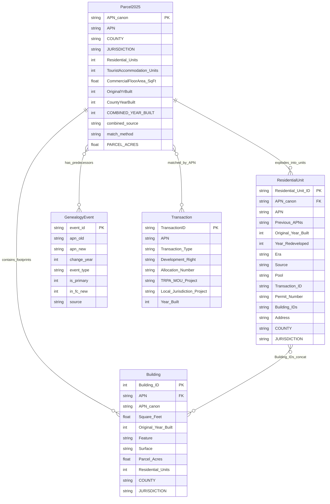

# Inventory tables — Residential Units + Buildings + PDH 2025

> **Status: analyst-facing artifacts (CSV).**
> **Audience: anyone consuming the per-unit / per-building cumulative-accounting derivations.**

Three CSVs produced from the PDH 2025 ETL output, plus Ken's deliverables and live REST services. These are **derived analyst products** (not yet promoted to SDE tables) that join the per-parcel PDH FC with year-built data, the genealogy chain, the transactions/allocations registry, and the buildings footprint layer.

For the SDE proposal these would eventually fold into, see [target_schema.md](./target_schema.md).

## Pipeline

```
PDH FC (YEAR=2025)  ─┐
                     ├─► PDH_2025_OriginalYrBuilt.csv  ─┐
OriginalYrBuilt.csv ─┤                                   ├─► residential_units_inventory_2025.csv
Parcels FS YEAR_BUILT┘                                   │
                                                         │
apn_genealogy_tahoe.csv ─────► Previous_APNs ────────────┤
Transactions xlsx ───► Era/Source/Pool/Tx/Permit ───────┤
Buildings_2019 FC (spatial join) ──► Building_IDs ──────┤
Parcels FS APO_ADDRESS ──────► Address ─────────────────┘

Buildings_2019 FC ──┐
                    ├─► buildings_inventory_2025.csv (one row per footprint)
PDH 2025 (LARGEST_OVERLAP) ──► APN + parcel context ─┘
```

Sources by script:
- [`build_2025_yrbuilt.py`](../parcel_development_history_etl/scripts/build_2025_yrbuilt.py) → `PDH_2025_OriginalYrBuilt.csv`
- [`build_residential_units_inventory.py`](../parcel_development_history_etl/scripts/build_residential_units_inventory.py) → `residential_units_inventory_2025.csv`
- [`build_buildings_inventory.py`](../parcel_development_history_etl/scripts/build_buildings_inventory.py) → `buildings_inventory_2025.csv`

---

## Entity-relationship diagram



### Relationship notes

- **`Parcel2025 ‖−o{ ResidentialUnit`** — one parcel explodes into N units (N = `Residential_Units` count). A vacant residential parcel yields zero unit rows.
- **`Parcel2025 ‖−o{ Building`** — one parcel can have 0..N building footprints; a parcel with no detected footprint (1.3% of unit parcels) gets `Building_IDs` empty.
- **`Parcel2025 }o−o{ GenealogyEvent`** — many-to-many. A parcel can appear in many genealogy events (as either `apn_old` or `apn_new`); a single event can have multiple parents/children. Predecessors are walked up to 5 hops back from each current APN.
- **`Parcel2025 }o−o{ Transaction`** — many-to-many. A parcel can have multiple transactions (allocation + transfer, banking + conversion, etc.); the `Source` and `Pool` fields capture the **highest-priority** transaction per the order Allocation > Bonus Unit > Banked Unit > Transfer > Conversion.
- **`ResidentialUnit }o−o{ Building`** — many-to-many, modeled as a **concatenated string** in `Building_IDs` (semicolon-separated `BLDG-<id>` values) rather than a junction table. Units on the same parcel share the same Building_IDs string. The set of buildings on a parcel comes from the **same `LARGEST_OVERLAP` assignment used in the buildings inventory** — each building has exactly one primary parcel, no double-listing across boundaries. A future SDE promotion would split this into a proper junction table.

---

## Field dictionary

### `residential_units_inventory_2025.csv` — one row per current (2025) residential unit

| Field | Type | Source | Notes |
|---|---|---|---|
| `Residential_Unit_ID` | string PK | synthetic | `RU-<APN_canon>-<seq>`; sequential 001..N within each APN. Regenerates deterministically. |
| `APN` | string | PDH FC | Raw APN as stored in `Parcel_Development_History.APN`. Mixed pre/post-2018 format. |
| `APN_canon` | string | `utils.canonical_apn()` | Padded to NNN-NNN-NNN form for joining. The canonical join key. |
| `Previous_APNs` | string | `apn_genealogy_tahoe.csv` | Semicolon-separated predecessor canonical APNs walked backward up to 5 hops. Empty when no genealogy. |
| `Original_Year_Built` | int (nullable) | `PDH_2025_OriginalYrBuilt.csv` | The parcel's earliest structure year — `COMBINED_YEAR_BUILT` from the join (Ken's value primary, county YEAR_BUILT filler). 98.7% coverage. |
| `Year_Redeveloped` | int (nullable) | derived from `Final2026_Residential.csv` | Year units came back up after a demolition gap (units > 0 → 0 → units > 0). Empty for non-redev units. Currently catches 8 units (strict demolish-rebuild definition). |
| `Era` | enum | `Original_Year_Built` | `Pre-1987 Plan` (≤1987), `1987 Plan` (1988–2011), `2012 Plan` (≥2012), `Unknown` (null). Per the **original** year — redev does not change era because no new allocation is drawn. |
| `Source` | enum | Transactions xlsx | How the unit was authorized: `Existing` (pre-2012 default), `Allocation`, `Bonus Unit`, `Banked Unit`, `Transfer`, `Conversion`, `Unknown`. Tie-break priority: Allocation > Bonus Unit > Banked Unit > Transfer > Conversion. |
| `Pool` | enum | Transactions xlsx | Which account the allocation drew from: `TRPA`, `El Dorado`, `Placer`, `Washoe`, `Douglas`, `Carson City`, `CSLT`, `Banked Inventory`, `Private`, `N/A (Pre-Allocation)`, `Unknown`. Derived from `Development Right` text + `Allocation Number` prefix (EL/PL/DG/WA/SLT). |
| `Transaction_ID` | string | Transactions xlsx | Semicolon-separated `TransactionID` values from `2025 Transactions and Allocations Details.xlsx` matching this APN (e.g., `TRPA-ALLOC-758`, `WCNV-ALLOC-613`). |
| `Permit_Number` | string | Transactions xlsx | Semicolon-separated permit IDs prefixed `TRPA-` (from `TRPA/MOU Project #`) and `LOCAL-` (from `Local Jurisdiction Project #`). E.g., `TRPA-ERSP2023-0515; LOCAL-WDADAR24-0004`. |
| `Building_IDs` | string | `LARGEST_OVERLAP` spatial join of `Buildings_2019` to PDH 2025 polygons, inverted | Semicolon-separated `BLDG-<OBJECTID>` values for every Buildings_2019 footprint whose **primary** parcel (largest area overlap) is this one. E.g., `BLDG-30876; BLDG-30890; BLDG-30920`. Same assignment logic as the buildings inventory — no double-listing across neighboring parcels. Empty for parcels with no primary footprint (~18% of unit rows — post-2019 construction or buildings primarily on a neighbor). |
| `Address` | string | Parcels FS `APO_ADDRESS` | Mailing/site address from the public Parcels FeatureService. 100% populated (49,017 of 49,018). |
| `COUNTY` | string | PDH FC | 2-char code: `EL`, `PL`, `DG`, `WA`, `CSLT`, `CC`. |
| `JURISDICTION` | string | PDH FC | Same as COUNTY in most cases; CSLT may differ from EL. |

**Row scope**: One row per **currently existing** (2025) unit. A duplex on one parcel = 2 rows sharing APN, year, address, buildings. A parcel with 0 units in 2025 = 0 rows. Demolished units are NOT represented; the redev year is captured separately on the surviving unit rows.

### `buildings_inventory_2025.csv` — one row per Buildings_2019 footprint

| Field | Type | Source | Notes |
|---|---|---|---|
| `Building_ID` | int PK | `Buildings_2019.OBJECTID` | Stable identifier from the source GIS layer. |
| `APN` | string | `LARGEST_OVERLAP` spatial join to PDH 2025 | The parcel with the most overlap with this footprint. 99.4% matched. |
| `APN_canon` | string | `utils.canonical_apn()` | Canonical form for joining to other tables. |
| `Square_Feet` | float | `SHAPE@.getArea("PLANAR","SquareFeetUS")` | Computed at script run time, not the source `Shape_Area` field (which is in projection-dependent units). |
| `Original_Year_Built` | int (nullable) | Parcel's `COMBINED_YEAR_BUILT` | **Parcel-level**, not per-building. Buildings_2019 has no per-building year. Use as best-available approximation. 93.1% populated. |
| `Feature` | string | `Buildings_2019.Feature` | Building type from source. Currently always `"Building"` — no further subtype data. |
| `Surface` | string | `Buildings_2019.Surface` | Building material/surface — sparsely populated in source. |
| `Parcel_Acres` | float | PDH FC | Parent parcel acreage (context). |
| `Residential_Units` | int | PDH FC | Number of residential units on the parent parcel (0 for non-residential parcels). |
| `COUNTY`, `JURISDICTION` | string | PDH FC | Same as parent parcel. |

**Row scope**: One row per Buildings_2019 footprint (44,739 total). 269 footprints (0.6%) don't match a 2025 parcel — usually dock/pier polygons outside the PDH boundary.

### `PDH_2025_OriginalYrBuilt.csv` — intermediate: parcel × year built

| Field | Type | Source | Notes |
|---|---|---|---|
| `APN` | string | PDH FC | Raw 2025 APN. |
| `APN_canon` | string | canonical | Join key. |
| `YEAR` | int | PDH FC | Always 2025 in this CSV. |
| `Residential_Units`, `TouristAccommodation_Units`, `CommercialFloorArea_SqFt` | numeric | PDH FC | 2025 counts. |
| `COUNTY`, `JURISDICTION`, `PARCEL_ACRES` | mixed | PDH FC | Parcel attributes. |
| `OriginalYrBuilt` | int (nullable) | Ken's `original_year_built.csv` | Direct join or genealogy fallback. |
| `OriginalYrBuilt_source_APN` | string | Ken's file | The APN actually matched (for genealogy cases, the predecessor APN). |
| `match_method` | enum | join logic | `direct`, `genealogy_old_from_new`, `genealogy_new_from_old`, `unmatched`. |
| `CountyYearBuilt` | int (nullable) | Parcels FS `YEAR_BUILT` | County assessor's value — used as filler. |
| `COMBINED_YEAR_BUILT` | int (nullable) | derived | `OriginalYrBuilt` if present, else `CountyYearBuilt`. This is what feeds `Original_Year_Built` in the units inventory. |
| `combined_source` | enum | derived | `original`, `county`, or `none`. |

**Row scope**: One row per PDH 2025 parcel (61,240 rows). Includes vacant parcels (units = 0).

---

## Coverage summary (current run)

| Table | Rows | Notable coverage |
|---|---:|---|
| `PDH_2025_OriginalYrBuilt.csv` | 61,240 | 73.4% have a year-built from any source; 16,023 truly null (mostly vacant land) |
| `residential_units_inventory_2025.csv` | 49,018 | 98.7% Original_Year_Built; 82.0% Building_IDs (primary-parcel only); 100% Address; 3.3% Permit_Number; 3.0% Era=2012 Plan |
| `buildings_inventory_2025.csv` | 44,739 | 99.4% APN-matched; 93.1% Original_Year_Built; 86.9M sq ft total footprint |

## Known data limitations

1. **Pre-2012 allocations are not in the transactions xlsx**. About 5,500 of the 6,731 cumulative residential allocations since 1987 fall before the xlsx coverage. Those units' `Source` defaults to `Existing` and `Pool` defaults to `N/A (Pre-Allocation)`. A future ingestion of historical allocation records would refine those classifications.
2. **Bonus Units undercounted**. Only 45 RBU units detected vs Ken's 736 cumulative. The xlsx tracks BANKING/TRANSFER of RBUs but only 11 rows have `Transaction Type = "Residential Bonus Unit (RBU)"`. The actual unit-construction events for RBUs appear to be tracked under a different transaction type.
3. **`Building_IDs` is a concatenated string, not a junction table**. Units on the same parcel share the same string. If a future SDE schema needs per-unit-per-building links, this is the right place to normalize.
4. **`Year_Redeveloped` uses a strict definition** (units > 0 → 0 → units > 0). Loose redevelopment (replacing a structure without ever zeroing out the unit count) is not flagged.

## Future SDE promotion

If these tables get promoted into the SDE proposal in [target_schema.md](./target_schema.md), the cleanest path:

- **`ResidentialUnit`** becomes a new table in the development-rights schema, with FKs to `ParcelExistingDevelopment` (provides Era + counts) and `vPermitAllocation` (provides Source + Pool + Permit_Number).
- **`Building`** becomes a new spatial table sharing the same SDE instance as the parcel FC; FK to `ParcelExistingDevelopment` via APN.
- **`UnitBuilding`** junction table replaces the concatenated `Building_IDs` string.
- `Era` / `Source` / `Pool` become enum lookups (small reference tables), not free-text columns.
