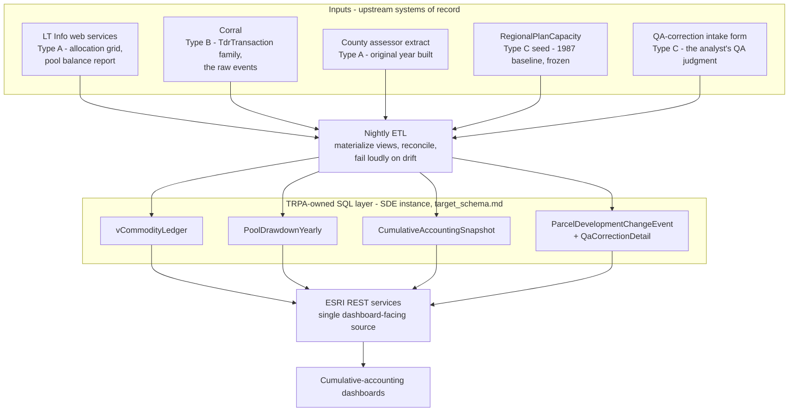

# Roadmap: retire the hand-crafted xlsx

> **Status: ROADMAP.** Companion to [`target_schema.md`](./target_schema.md) (the
> SQL tables) and [`regional_plan_allocations_service.md`](./regional_plan_allocations_service.md)
> (the pool-balance service spec). This doc is the portfolio-level plan; those
> two are the detailed specs for specific pieces.

## The goal

Every data element the dashboards show traces to a **system of record**. The
analyst stops hand-assembling spreadsheets each accounting cycle. "By hand" is
acceptable only where a human genuinely *is* the system of record - and even
then, into a structured, validated, versioned store, not a free-form xlsx.

## Why it matters - the fragility chain

Today every cumulative-accounting dashboard sits on top of this chain:

```
analyst hand-assembles xlsx  ->  converter script  ->  static JSON/CSV  ->  dashboard fetch
        ^^^^^^^^^^^^^^^^^^^                                                              
        the fragile root
```

The converter -> JSON -> dashboard half is reproducible and reasonably robust.
The first step is not: it is a person, once per cycle, copying numbers out of
LT Info reports and historical files into a spreadsheet by hand. Until that step
is gone, nothing downstream is truly robust - a typo, a stale pull, or a skipped
cycle silently propagates to every dashboard.

## Three kinds of hand-crafted artifact

Not everything can be "automated away." Sorting the inputs into three types is
what makes the roadmap tractable:

- **Type A - a system already has it; the analyst is a manual courier.**
  The data lives in LT Info or Corral. The analyst manually pulls a report or
  runs an export and drops the file in a folder. **Fix = plumbing:** a scheduled
  fetch of the live source.
- **Type B - Corral has the raw events, not the shape the dashboards need.**
  Corral holds `TdrTransaction` and friends, but not a materialized
  "X assigned / Y remaining, by year, by jurisdiction" view. **Fix = build the
  views/tables** in `target_schema.md`.
- **Type C - a human genuinely is the system of record.**
  QA-correction rationale; the 1987 Plan baseline (predates the tracking
  system). No upstream system can generate these. **Fix is not automation** -
  it is giving the analyst a structured, validated, versioned data-entry
  surface (a reference table + a form) instead of a free-form spreadsheet. Still
  "by hand," but *into a system*.

## Inventory - every analyst-delivered input today

| Artifact | Feeds | What it really is | System of record | Type | Migration path |
|---|---|---|---|---|---|
| `All Regional Plan Allocations Summary.xlsx` | regional-capacity-dial, pool-balance-cards, public-allocation-availability (via `convert_regional_plan_allocations.py`) | hand-compiled: 2012-era pulled from the LT Info pool balance report, 1987-era hard-coded from the 2012 RP Update Analysis | LT Info pool balance report (2012) + the 1987 baseline reference (Type C) | A + C | thin combiner now, SQL view later - see `regional_plan_allocations_service.md` |
| `Additional Development as of April2026.xlsx` | public-allocation-availability jurisdiction tiles | a pull of the LT Info pool balance report | LT Info `GetDevelopmentRightPoolBalanceReport` | A | folds into the same source as the row above |
| `residentialAllocationGridExport_fromAnalyst.xlsx` | allocation-tracking (via `convert_allocation_grid.py`) | an **export** from the LT Info allocation grid; the analyst exports + drops it manually | LT Info `ResidentialAllocation` / the allocation grid | A | scheduled fetch of the LT Info allocation web service - eliminates the manual export step |
| `CFA_TAU_allocations.csv` | allocation-tracking Commercial/Tourist tabs (fetched off a GitHub branch URL) | CFA + TAU allocation transactions | LT Info / Corral CFA + TAU allocations | A | same live source as the allocation grid, or the SQL layer |
| `2025 Transactions and Allocations Details.xlsx` | residential_units_inventory (PDH ETL) | per-APN TDR transaction detail | Corral `TdrTransaction` family | A / B | `target_schema.md` `vCommodityLedger` |
| `FINAL RES SUMMARY 2012 to 2025.xlsx` | residential-additions-by-source (inlined; provenance only) | Summary sheet hand-rolled; Residential sheet is per-APN year-by-year | Corral transactions + the PDH feature class | B | `target_schema.md` `CumulativeAccountingSnapshot` + `vCommodityLedger` |
| `Final CFA Tracking 2025.xlsx`, `Final TAU Tracking 2025.xlsx`, `Final2026_*.csv` | the PDH ETL (`config.py` CSV inputs) | per-APN year-by-year commodity tracking | Corral + county assessor, reconciled by the analyst | B | the PDH pipeline reading the `Parcel_Development_History` store directly |
| `OriginalYrBuilt.xlsx` / `original_year_built.csv` | `build_2025_yrbuilt.py` -> genealogy_solver | APN -> original year built lookup | county assessor records | A | a recurring county-assessor extract |
| `CA Changes breakdown.xlsx` | qa-change-rationale (via `notebooks/04_load_ca_changes.ipynb`) | the analyst's master log of QA correction decisions + rationale | **the analyst** - no system generates QA judgment | C | structured `QaCorrectionDetail` / `ParcelDevelopmentChangeEvent` tables + a data-entry form (`target_schema.md`) |
| `Cumulative Accounting 2026 Report.pptx` | the report deliverable itself | output, not input | n/a | (output) | eventually generate report figures from the dashboards; out of immediate scope |

## The target architecture

The end state is **layered**, and every arrow points one way. Upstream systems of
record feed a nightly ETL; the ETL materializes the `target_schema.md` tables on the
SDE SQL instance; those publish as ESRI REST services; the dashboards read only from
there. No dashboard calls LT Info directly, and no dashboard ever reads a
hand-assembled file.



Read against the fragility chain above, the hand-assembled xlsx is simply *gone* -
nothing in this picture is a person copying numbers into a spreadsheet. The analyst
still appears, but only as the QA-correction intake form: a structured surface, the
Type C case. Phase 1 stands up the left edge (the live inputs and the seed) without
touching the SQL layer; Phase 2 builds the ETL, the SQL layer, and the REST services.

## The migration, phased

**Phase 0 - now (done).** The converter pattern: hand xlsx -> tidy JSON/CSV ->
dashboard fetch. This is the *interim* state, not the goal - it makes the
xlsx-onward half reproducible but leaves the hand-assembly step in place.

**Phase 1 - near-term, no Corral write access required.**
- **Type A:** repoint each converter's *input* from "the analyst's hand file"
  to the live LT Info source. The allocation grid is already a LT Info export -
  the only thing to remove is the manual export-and-drop. Pool balances have a
  ready web service (`GetDevelopmentRightPoolBalanceReport`).
- **Type C:** stand up the `RegionalPlanCapacity` reference table, seeded once
  from the 2012 RP Update Analysis (the 1987 baseline is effectively frozen).
  The `regional_plan_1987_baseline.csv` already produced is the seed content.
- Stand up the **thin combiner** for pool balances (live LT Info 2012-era +
  the seed) per `regional_plan_allocations_service.md`. This alone retires
  `All Regional Plan Allocations Summary.xlsx` and `Additional Development...xlsx`.

**Phase 2 - mid-term, needs Corral write access + a named DB owner.**
- Build the `target_schema.md` tables/views in the SDE SQL backend:
  `vCommodityLedger`, `PoolDrawdownYearly`, `CumulativeAccountingSnapshot`,
  `ParcelDevelopmentChangeEvent` + `QaCorrectionDetail`.
- Publish each as an ESRI REST service (same pattern as the planned
  `Parcel_Development_History` service).
- Repoint dashboards from static JSON to those REST endpoints. This retires
  `FINAL RES SUMMARY`, the `Final * Tracking` files, and the transaction xlsx.
- Give the analyst a data-entry form over `QaCorrectionDetail` - retires
  `CA Changes breakdown.xlsx` as a free-form file while keeping the analyst as
  the system of record for QA judgment.

**Phase 3 - ongoing.** Automation: scheduled refresh, freshness monitoring,
reconciliation checks, schema-contract tests (below).

## What is still missing for robustness

Beyond "wire up a source," a robust portfolio needs:

1. **A live connection at all.** Today everything the dashboards fetch is a
   snapshot. Nothing is live.
2. **The SQL tables.** `target_schema.md` is a draft proposal - the Type B
   destination does not exist yet.
3. **The reference tables.** `RegionalPlanCapacity` and the QA-correction
   intake are CSVs / spreadsheets today, not real validated tables.
4. **Confirmed field semantics.** The LT Info pool balance service's fields
   (`BalanceRemaining`, `ApprovedTransactionsQuantity`, `TotalDisbursements`)
   do not cleanly map to assigned / not-assigned / maximum - open question #1
   in `regional_plan_allocations_service.md`. Cannot safely build on the
   service until the LT Info owner confirms.
5. **Refresh automation + freshness monitoring.** The converters run by hand.
   Robust = scheduled refresh + a "this source is N days stale" check.
6. **Reconciliation that fails loudly.** The converter already surfaced a real
   discrepancy (TAU pool rows summing to 395 vs a stated 400). That class of
   thing should block a refresh / page someone, not pass silently.
7. **Schema-contract tests.** If LT Info or Corral renames or drops a column,
   the pipeline should fail an integration test, not silently emit wrong data.
8. **Auth / CORS for a public page.** The LT Info `WebServices/*` endpoints take
   a token in the URL - fine internally, not for a public GitHub Pages dashboard
   calling them directly. Dashboards calling a TRPA-owned ESRI REST service
   instead makes this a non-issue (one more reason the SQL layer, not LT Info,
   should be the dashboard-facing source).

## Dependencies - the asks

Retiring the hand xlsx is not purely an internal repo task. It needs:

- **Corral write access + a named DB owner** for the `target_schema.md` tables
  and the nightly ETL that materializes them.
- **The LT Info team** to confirm the `GetDevelopmentRightPoolBalanceReport`
  field semantics (robustness gap #4).
- **A decision on the QA-correction intake surface** - a form over a table vs
  a maintained reference table - so `CA Changes breakdown.xlsx` has a real home.
- **A recurring county-assessor extract** for original-year-built data.
- **A scheduled-job host** for the ETL, freshness monitoring, and reconciliation
  alerting.

## Bottom line

The end state is **layered**: a TRPA-owned SQL layer published as ESRI REST is
the single dashboard-facing source; LT Info web services and the seeded
reference tables are *inputs* to the ETL that populates it. The analyst's role
shrinks from "assemble the spreadsheets" to "maintain the genuinely-human inputs
(QA judgment) through a structured form" - which is the realistic, correct
reading of "stop doing things by hand."
