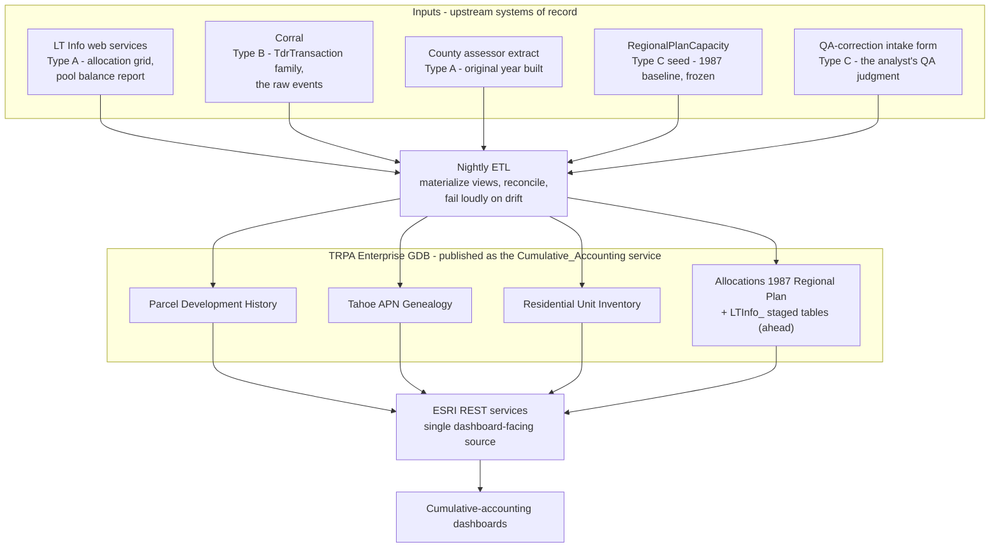

# Roadmap: retire the hand-crafted xlsx

> **Status: the architecture - decided, and partly built.** The
> `Cumulative_Accounting` REST service is live on maps.trpa.org with four
> populated layers. Companions: [`questions_for_analyst.md`](./questions_for_analyst.md)
> (open questions) and [`regional_plan_allocations_service.md`](./regional_plan_allocations_service.md)
> (the 1987-baseline / pool-balance service spec). The earlier `target_schema.md`
> proposal - new tables resident inside Corral - is superseded; see [`_archive/`](./_archive/).

## The goal

Every data element the dashboards show traces to a **system of record**. The
analyst stops hand-assembling spreadsheets each accounting cycle. "By hand" is
acceptable only where a human genuinely *is* the system of record - and even
then, into a structured, validated, versioned store, not a free-form xlsx.

## Why it matters - the fragility chain

Today every cumulative-accounting dashboard sits on top of this chain:

```
analyst hand-assembles xlsx  ->  converter script  ->  static JSON/CSV  ->  dashboard fetch
        ^^^^^^^^^^^^^^^^^^^                                                              
        the fragile root
```

The converter -> JSON -> dashboard half is reproducible and reasonably robust.
The first step is not: it is a person, once per cycle, copying numbers out of
LT Info reports and historical files into a spreadsheet by hand. Until that step
is gone, nothing downstream is truly robust - a typo, a stale pull, or a skipped
cycle silently propagates to every dashboard.

## Three kinds of hand-crafted artifact

Not everything can be "automated away." Sorting the inputs into three types is
what makes the roadmap tractable:

- **Type A - a system already has it; the analyst is a manual courier.**
  The data lives in LT Info or Corral. The analyst manually pulls a report or
  runs an export and drops the file in a folder. **Fix = plumbing:** a scheduled
  fetch of the live source.
- **Type B - Corral has the raw events, not the shape the dashboards need.**
  Corral holds `TdrTransaction` and friends, but not a materialized
  "X assigned / Y remaining, by year, by jurisdiction" view. **Fix = build the
  views/tables** in the TRPA Enterprise GDB.
- **Type C - a human genuinely is the system of record.**
  QA-correction rationale; the 1987 Plan baseline (predates the tracking
  system). No upstream system can generate these. **Fix is not automation** -
  it is giving the analyst a structured, validated, versioned data-entry
  surface (a reference table + a form) instead of a free-form spreadsheet. Still
  "by hand," but *into a system*.

## Inventory - every analyst-delivered input today

| Artifact | Feeds | What it really is | System of record | Type | Migration path |
|---|---|---|---|---|---|
| `All Regional Plan Allocations Summary.xlsx` | tahoe-development-tracker, pool-balance-cards (via `convert_regional_plan_allocations.py`) | hand-compiled: 2012-era pulled from the LT Info pool balance report, 1987-era hard-coded from the 2012 RP Update Analysis | LT Info pool balance report (2012) + the 1987 baseline reference (Type C) | A + C | 1987 half is the `Allocations 1987 Regional Plan` layer 3 (live); 2012 half is interim-loaded as `Development Right Pool Balance Report` layer 5 (live); the staging ETL refreshes layer 5 from `GetDevelopmentRightPoolBalanceReport` |
| `Additional Development as of April2026.xlsx` | (retired with public-allocation-availability) | a pull of the LT Info pool balance report | LT Info `GetDevelopmentRightPoolBalanceReport` | A | folded into layer 5 (above); no separate consumer remains |
| `residentialAllocationGridExport_fromAnalyst.xlsx` | allocation-tracking (via `convert_allocation_grid.py`) | an **export** from the LT Info allocation grid; the analyst exports + drops it manually | LT Info `ResidentialAllocation` / the allocation grid | A | interim done: the CSV is live as `Cumulative_Accounting` layer 4, "Residential Allocations 2012 Regional Plan"; target: the nightly staging ETL refreshes that layer from a new LT Info allocation-grid endpoint |
| `CFA_TAU_allocations.csv` | allocation-tracking Commercial/Tourist tabs (fetched off a GitHub branch URL) | CFA + TAU allocation transactions | LT Info / Corral CFA + TAU allocations | A | same live source as the allocation grid, via the LT Info staging ETL |
| `2025 Transactions and Allocations Details.xlsx` | residential_units_inventory (PDH ETL) | per-APN TDR transaction detail | Corral `TdrTransaction` family | A / B | the existing `Development_Rights_Transacted_and_Banked` service / LT Info transaction web services |
| `FINAL RES SUMMARY 2012 to 2025.xlsx` | residential-additions-by-source (inlined; provenance only) | Summary sheet hand-rolled; Residential sheet is per-APN year-by-year | Corral transactions + the PDH feature class | B | derived from the PDH layer + the transaction services |
| `Final CFA Tracking 2025.xlsx`, `Final TAU Tracking 2025.xlsx`, `Final2026_*.csv` | the PDH ETL (`config.py` CSV inputs) | per-APN year-by-year commodity tracking | Corral + county assessor, reconciled by the analyst | B | the PDH pipeline reading the `Parcel_Development_History` store directly |
| `OriginalYrBuilt.xlsx` / `original_year_built.csv` | `build_2025_yrbuilt.py` -> genealogy_solver | APN -> original year built lookup | county assessor records | A | a recurring county-assessor extract; folded into PDH + Residential Unit Inventory as `ORIGINAL_YEAR_BUILT` |
| `CA Changes breakdown.xlsx` | qa-change-rationale (via `notebooks/04_load_ca_changes.ipynb`) | the analyst's master log of QA correction decisions + rationale | **the analyst** - no system generates QA judgment | C | a structured `QaCorrectionDetail` table + a data-entry form (intake surface still an open decision) |
| `Cumulative Accounting 2026 Report.pptx` | the report deliverable itself | output, not input | n/a | (output) | eventually generate report figures from the dashboards; out of immediate scope |

## The target architecture

The end state is **layered**, and every arrow points one way. Upstream systems of
record feed a nightly ETL; the ETL materializes the `Cumulative_Accounting` layers
in the TRPA Enterprise GDB; those publish as ESRI REST services on maps.trpa.org;
the dashboards read only from there. No dashboard calls LT Info directly, and no
dashboard ever reads a hand-assembled file.



Read against the fragility chain above, the hand-assembled xlsx is simply *gone* -
nothing in this picture is a person copying numbers into a spreadsheet. The analyst
still appears, but only as the QA-correction intake form: a structured surface, the
Type C case. Phase 1 (done) stood up the TRPA-owned layer; Phase 2 (underway) builds
the LT Info staging side and repoints the consumers - see the phases below.

## The migration, phased

**Phase 0 - done.** The converter pattern: hand xlsx -> tidy JSON/CSV ->
dashboard fetch. An interim state - reproducible from the xlsx onward, but the
hand-assembly step stayed.

**Phase 1 - done.** The architecture is decided and the TRPA-owned layer is
built. Two valid sources: the **TRPA Enterprise Geodatabase** (published as REST
on maps.trpa.org) and **LT Info web services** (the only path for Corral-origin
data). The `Cumulative_Accounting` REST service is **live** with four populated
layers - Parcel Development History, Tahoe APN Genealogy, Residential Unit
Inventory, and Allocations 1987 Regional Plan (the old
`regional_plan_1987_baseline.csv` is now a real table). The tables live in the
TRPA Enterprise GDB - **no Corral write access needed**; the ETL reads Corral
via LT Info and writes to the TRPA SDE.

**Phase 2 - underway.** Repoint consumers off local files onto the service, and
build the LT Info side. Done: the genealogy converter
(`build_genealogy_solver_data.py`) reads the live service; the Buildings
Inventory FC build (`build_buildings_inventory_fc.py`) is written, pending upload
to the service; the analyst's allocation-grid CSV is interim-loaded as
`Cumulative_Accounting` layer 4, "Residential Allocations 2012 Regional Plan";
the pool balance report is interim-loaded as layer 5, "Development Right Pool
Balance Report"; the nightly LT Info staging ETL
(`scripts/stage_ltinfo_allocations.py`) is a generic 4-pipeline runner that
refreshes layers 5/6/7/8 (layer 4 stub awaits the LT Info grid endpoint). The
3 transaction/banking CSVs (`GetDevelopmentRightTransactions`,
`GetBankedDevelopmentRights`, `GetTransactedAndBankedDevelopmentRights`) are
incoming as layers 6/7/8 (user to load the interim snapshots; ETL refreshes
thereafter), and the older `Development_Rights_Transacted_and_Banked` REST
service is being deprecated (it was a tagged copy of the same data). Ahead:
confirm `GetDevelopmentRightPoolBalanceReport` field semantics with the LT
Info owner, build the SDE combine view that UNIONs layers 3 + 5 into the
dashboards' shape, repoint the remaining converters and dashboards, add the
Banked column to the dashboards (per the UX review), and a structured
QA-correction intake surface.

**Phase 3 - ahead.** Automation and hardening: scheduled refresh, freshness
monitoring, reconciliation that fails loudly, schema-contract tests (below).

## What is still missing for robustness

Beyond "wire up a source," a robust portfolio needs:

1. ~~A live connection at all.~~ **Addressed.** The `Cumulative_Accounting`
   service is live - dashboards can fetch the TRPA-owned data directly.
2. ~~The SQL tables.~~ **Addressed.** Four layers exist in the TRPA Enterprise
   GDB and are published.
3. **Validated reference tables.** The 1987 baseline is now a real table; the
   QA-correction intake is still a free-form file with no real home.
4. **Confirmed field semantics.** The LT Info pool balance service's fields
   (`BalanceRemaining`, `ApprovedTransactionsQuantity`, `TotalDisbursements`)
   do not cleanly map to assigned / not-assigned / maximum. Cannot safely build
   on the service until the LT Info owner confirms - see `questions_for_analyst.md`.
5. **Refresh automation + freshness monitoring.** The converters and the staging
   ETL run by hand. Robust = scheduled refresh + a "this source is N days stale" check.
6. **Reconciliation that fails loudly.** A real discrepancy already surfaced
   (TAU pool rows summing to 395 vs a stated 400). That class of thing should
   block a refresh / page someone, not pass silently.
7. **Schema-contract tests.** If LT Info or Corral renames or drops a column,
   the pipeline should fail an integration test, not silently emit wrong data.
   The `area`-field publish quirk on the 1987-baseline table (since fixed by a
   rename to `jurisdiction`) was a real example of the class.
8. ~~Auth / CORS for a public page.~~ **Addressed for the TRPA-owned data.** The
   `Cumulative_Accounting` REST service is the TRPA-owned endpoint; the residual
   concern is the LT Info-direct feed, which the staging ETL removes.

## Dependencies - the asks

Retiring the hand xlsx is not purely an internal repo task. Still needed:

- **The LT Info team** to confirm the `GetDevelopmentRightPoolBalanceReport`
  field semantics and to expose a residential allocation grid endpoint - the
  reverse-engineered SQL spec is ready to hand them.
- **A decision on the QA-correction intake surface** - a form over a table vs
  a maintained reference table - so `CA Changes breakdown.xlsx` has a real home.
- **A recurring county-assessor extract** for original-year-built data.
- **A scheduled-job host** for the nightly staging ETL, freshness monitoring,
  and reconciliation alerting.
- **SDE field fixes** on the live service - the `area`-field rename is done
  (now `jurisdiction`); the minor type quirks remain; see `questions_for_analyst.md`.

"Corral write access" is no longer on this list: the new tables live in the TRPA
Enterprise GDB, which TRPA controls end to end.

## Bottom line

The end state is **layered**, and it is now partly real: a TRPA-owned layer (the
`Cumulative_Accounting` service, live) is the dashboard-facing source; LT Info
web services are *inputs* to the nightly ETL that will populate the staged side.
The analyst's role shrinks from "assemble the spreadsheets" to "maintain the
genuinely-human inputs (QA judgment) through a structured form" - the realistic,
correct reading of "stop doing things by hand."
