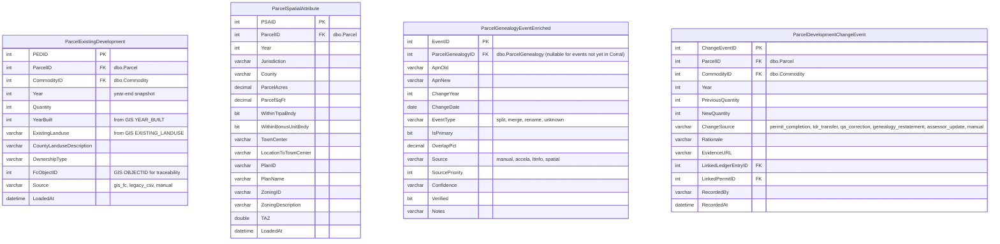
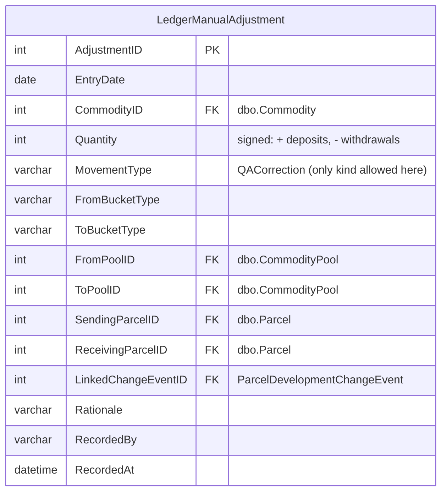
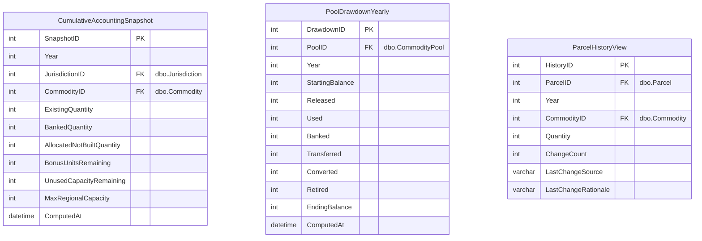

# Target schema — TRPA Cumulative Accounting tracking store

Proposed ERD for new tables in the **existing SDE SQL backend** that hosts
Corral + the enterprise GIS geodatabase. Anchored on the TRPA Cumulative
Accounting framework (TRPA Code §16.8.2). See
[.claude/skills/trpa-cumulative-accounting/SKILL.md](../.claude/skills/trpa-cumulative-accounting/SKILL.md)
for the full vocabulary.

> **Scope**: residential (SFRUU, MFRUU, RBU, ADU), tourist accommodation
> (TAU), commercial floor area (CFA). **Shorezone** (Mooring, Pier,
> `ShorezoneAllocation`, SHORE transaction type) is handled by a separate
> system and **out of scope**. PAOT and mitigation funds are deferred to v2+.

> **This is an ERD proposal, not DDL.** Captures entities, attributes, and
> relationships for review before CREATE TABLE statements.

## Design principle — never duplicate Corral

Corral is the system of record for TDR transactions, residential allocations,
banked rights, commodity pools, parcels, permits, deed restrictions, IPES, and
all reference lookups. **The new DB only creates tables for data Corral
genuinely lacks.** Everything else is FK'd, UNION'd in a view, or sidecar'd
with net-new columns only. When in doubt: don't duplicate.

## Where this lives — architecture

The new tables fold into the **same SDE-registered SQL Server instance** as
Corral and the enterprise GIS geodatabase. That means:

- **No bridge columns.** Foreign keys go directly to `dbo.Parcel`,
  `dbo.Commodity`, `dbo.CommodityPool`, `dbo.ResidentialAllocation`, etc.
  No more string-ID round-tripping.
- **Reference data is reused, not duplicated.** `Commodity`, `Jurisdiction`,
  `BaileyRating`, `LandCapabilityType`, `CommodityPool`, `TransactionType`,
  `ResidentialAllocationType`, `ResidentialAllocationUseType`,
  all stay in Corral as-is. We FK into them.
- **Publishing via ESRI is native.** SDE-registered tables can be exposed as
  MapServer / FeatureServer layers (like
  [Existing_Development/MapServer/2](https://maps.trpa.org/server/rest/services/Existing_Development/MapServer/2) — the future **Parcel Development History** service).
- **LTinfo JSON web services** remain the live read path for external
  systems but are not needed for in-DB queries once we're deployed.

## The accounting identity the schema serves

For every `(Commodity, Jurisdiction)`:

```
Max Regional Capacity  =  Existing + Banked + Allocated (not built)
                       +  Bonus Units + Unused Capacity
```

Every event moves commodity between these five buckets.

## Reference entities — reused from Corral

These tables **already exist in `dbo.*`** and don't get recreated. Listed so
you can see what the new tables FK into.

| Corral table | Row count | Role |
|---|---:|---|
| `dbo.Commodity` | 17 | Canonical commodity taxonomy (SFRUU, MFRUU, CFA, TAU, RBU, etc.) |
| `dbo.Jurisdiction` | 10 | Jurisdictions + abbreviations |
| `dbo.BaileyRating` | — | Bailey land-capability ratings (1a, 1b, 2, 3, ...) |
| `dbo.LandCapabilityType` | 114 | `Commodity × BaileyRating` |
| `dbo.CommodityPool` | 129 | All pools (Community Plan, Area Plan, Incentive, Bonus, CEP, generic) |
| `dbo.TransactionType` | 9 | The 9 canonical transaction types — see below |
| `dbo.ResidentialAllocationType` | 4 | **Allocation source**: Original, Reissued, LitigationSettlement, AllocationPool |
| `dbo.ResidentialAllocationUseType` | 2 | **Allocation use**: SingleFamily, MultiFamily |
| `dbo.Parcel` | 72K | Canonical parcel identity + geometry |
| `dbo.ParcelGenealogy` | 2.4K | Parent/Child parcel links (skeleton — enriched by new table below) |
| `dbo.ResidentialAllocation` | 1.9K | Allocation records (FK target; not redefined) |
| `dbo.TdrTransaction` + family | 2K | Transaction records — become inputs to the ledger |
| `dbo.AccelaCAPRecord` + `dbo.ParcelAccelaCAPRecord` | 124K / 179K | Accela bridge |
| `dbo.ParcelPermit` | 1.3K | Permit records — we extend, not replace |
| `dbo.ParcelCommodityInventory` | 10.5K | Current verified inventory (61% gap for residential; supplemented by `ParcelExistingDevelopment` below) |

### Found domain values

**`dbo.ResidentialAllocationType`** — what I earlier called "AllocationType":

| ID | Name | Code | Description |
|---:|---|---|---|
| 1 | Original | O | Original |
| 2 | Reissued | R | Reissued |
| 3 | LitigationSettlement | LS | Litigation Settlement |
| 4 | AllocationPool | AP | Allocation Pool |

My earlier sketch of `Allocation | BonusUnit | ADU` was wrong — those aren't
types, they're either sub-entities (`ResidentialBonusUnit`) or modeled
elsewhere (ADU probably as a flag on the permit or as a
`ResidentialAllocationUseType` value to be added).

**`dbo.ResidentialAllocationUseType`**:

| ID | Name | Display |
|---:|---|---|
| 1 | SingleFamily | Single-Family |
| 2 | MultiFamily | Multi-Family |

**`dbo.TransactionType`** — the 9 authoritative movement types:

| ID | Name | Abbr | Sending? | Receiving? | Conversion? | LandBank? |
|---:|---|---|:---:|:---:|:---:|:---:|
| 1 | Allocation | ALLOC | | ✓ | | |
| 2 | Conversion | CONV | | | ✓ | |
| 3 | ECM Retirement | ECM | ✓ | | | |
| 4 | Land Bank Acquisition | LBA | ✓ | | | |
| 5 | Transfer | TRF | ✓ | ✓ | | |
| 7 | Allocation Assignment | ALLOCASSGN | | ✓ | | |
| 8 | Conversion With Transfer | CONVTRF | ✓ | ✓ | | |
| 9 | Land Bank Transfer | LBT | | ✓ | | ✓ |

(ID 10 — Shorezone Allocation — is handled by the separate shorezone system
and **out of scope** for this schema.)

**`dbo.CommodityPool` — no formal PoolType column.** Pool type is encoded in
the pool name. Empirical classification by commodity:

| Commodity | Bonus | Incentive | Community Plan | Area Plan | CEP | Total |
|---|---:|---:|---:|---:|---:|---:|
| CFA | 0 | 0 | 15 | 5 | 1 | 30 |
| RBU | 2 | 1 | 5 | 3 | 1 | 18 |
| TAU | 0 | 0 | 1 | 4 | 0 | 21 |
| PAOT | 0 | 0 | 9 | 0 | 0 | 43 |
| Res. Alloc. | 0 | 0 | 0 | 0 | 0 | 9 |

Recommendation: **don't add a `PoolType` enum column to `CommodityPool`**.
Instead add a derived classification in the ETL layer or a view — parses
the name into `{CommunityPlan, AreaPlan, Bonus, Incentive, CEP, Generic}`.
Keeps the source table unchanged; accounting queries use the derived view.

## GIS source — the future Parcel Development History service

The existing prototype at
[Existing_Development/MapServer/2](https://maps.trpa.org/server/rest/services/Existing_Development/MapServer/2)
("Parcel Annual Attributes") is the shape the new **Parcel Development
History** service will have. Key fields:

| Field | Type | Role |
|---|---|---|
| `APN` | String(16) | Parcel key |
| `YEAR` | Integer | Year (part of composite key) |
| `Residential_Units` | Integer | RES count (→ new `ParcelExistingDevelopment`) |
| `TouristAccommodation_Units` | Integer | TAU count |
| `CommercialFloorArea_SqFt` | Double | CFA sq ft |
| `YEAR_BUILT` | String(5) | Assessor year-built |
| `JURISDICTION` | String(4) | |
| `COUNTY` | String(2) | |
| `OWNERSHIP_TYPE` | String(12) | |
| `EXISTING_LANDUSE` | String(50) | |
| `COUNTY_LANDUSE_DESCRIPTION` | String(150) | |
| `PLAN_ID`, `PLAN_NAME` | String | → new `ParcelSpatialAttribute` |
| `ZONING_ID`, `ZONING_DESCRIPTION` | String | |
| `TOWN_CENTER`, `LOCATION_TO_TOWNCENTER` | String | |
| `TAZ` | Double | |
| `WITHIN_TRPA_BNDY`, `WITHIN_BONUSUNIT_BNDY` | SmallInt | 0/1 flags |
| `PARCEL_ACRES`, `PARCEL_SQFT` | Double | |
| `Shape` | Polygon | |

No coded-value domains on the layer today. The new tables mirror these
field names 1:1 to simplify the loader.

## ERD — new core tables (parcel-keyed buckets)



The two pool-keyed buckets (`Bonus Units`, `Unused Capacity`) don't need
new tables — they're derivable from the existing `dbo.CommodityPool`
records plus the movement ledger, materialized nightly into
`PoolDrawdownYearly` (below).

## ERD — movement ledger

**No physical ledger table.** Corral is the system of record for every TDR
transaction (`dbo.TdrTransaction` + children) and every banked right
(`dbo.ParcelPermitBankedDevelopmentRight`). Don't duplicate. Instead:

- **`vCommodityLedger` (view)** — UNIONs Corral's transaction and banking
  tables into a unified `(EntryDate, CommodityID, Quantity, MovementType,
  From*, To*)` shape. Read-only.
- **`LedgerManualAdjustment` (small new table)** — the only net-new ledger
  data we hold: manual QA corrections that don't correspond to any Corral
  event. UNIONed into `vCommodityLedger`.



### `vCommodityLedger` — the view

Three branches UNIONed:

```sql
-- branch 1: TDR transactions from Corral (the bulk)
SELECT
    tt.TdrTransactionID              AS source_id,
    'corral_tdr'                     AS source,
    tt.ApprovalDate                  AS EntryDate,
    tt.CommodityID,
    COALESCE(ttt.ReceivingQuantity, tta.AllocatedQuantity,
             ttc.Quantity, tla.Quantity, tlt.Quantity) AS Quantity,
    tty.TransactionTypeAbbreviation  AS MovementType,
    -- FromBucketType / ToBucketType derived from TransactionType flags
    ...
FROM dbo.TdrTransaction tt
JOIN dbo.TransactionType tty ON tty.TransactionTypeID = tt.TransactionTypeID
LEFT JOIN dbo.TdrTransactionTransfer ttt ON ttt.TdrTransactionID = tt.TdrTransactionID
LEFT JOIN dbo.TdrTransactionAllocation tta ON tta.TdrTransactionID = tt.TdrTransactionID
LEFT JOIN dbo.TdrTransactionConversion ttc ON ttc.TdrTransactionID = tt.TdrTransactionID
LEFT JOIN dbo.TdrTransactionLandBankAcquisition tla ON tla.TdrTransactionID = tt.TdrTransactionID
LEFT JOIN dbo.TdrTransactionLandBankTransfer tlt ON tlt.TdrTransactionID = tt.TdrTransactionID
WHERE tty.TransactionTypeAbbreviation <> 'SHORE'     -- shorezone out of scope

UNION ALL

-- branch 2: banking events (Corral has them but not as transactions)
SELECT
    ppbdr.ParcelPermitBankedDevelopmentRightID AS source_id,
    'corral_banking'                 AS source,
    pp.FinalInspectionDate           AS EntryDate,
    lct.CommodityID,
    -ppbdr.Quantity                  AS Quantity,     -- negative: leaves Existing
    'Banking'                        AS MovementType,
    ...
FROM dbo.ParcelPermitBankedDevelopmentRight ppbdr
JOIN dbo.ParcelPermit pp ON pp.ParcelPermitID = ppbdr.ParcelPermitID
JOIN dbo.LandCapabilityType lct ON lct.LandCapabilityTypeID = ppbdr.LandCapabilityTypeID

UNION ALL

-- branch 3: manual QA adjustments (the only net-new data in the ledger)
SELECT
    lma.AdjustmentID                 AS source_id,
    'manual_qa'                      AS source,
    lma.EntryDate,
    lma.CommodityID,
    lma.Quantity,
    lma.MovementType,
    ...
FROM LedgerManualAdjustment lma;
```

### Mapping Corral `TransactionType` → `MovementType`

| Corral abbr | MovementType in ledger | Bucket move | Source branch |
|---|---|---|---|
| ALLOC | ALLOC | UnusedPool → Allocated | corral_tdr |
| ALLOCASSGN | ALLOCASSGN | Allocated → Existing (on permit final) | corral_tdr |
| CONV | CONV | Existing → Existing (paired entries) | corral_tdr |
| CONVTRF | CONVTRF | Existing(parcel A) → Existing(parcel B) with commodity swap | corral_tdr |
| TRF | TRF | Existing(A) → Existing(B) | corral_tdr |
| ECM | ECM | Existing → OutOfSystem | corral_tdr |
| LBA | LBA | Existing → LandBank | corral_tdr |
| LBT | LBT | LandBank → Existing | corral_tdr |
| (none — Corral event) | Banking | Existing → Banked | corral_banking |
| (none — manual) | QACorrection | any → any | manual_qa |

## ERD — permit completion + cross-system IDs


`PermitCompletion` extends `dbo.ParcelPermit` with the fields that live in
Ken's XLSX today. Eventually this becomes a direct sync from Accela once a
live feed is wired.

## ERD — materialized dashboard outputs



| Dashboard | Driven by |
|---|---|
| **Cumulative accounting report** (annual XLSX replacement) | `CumulativeAccountingSnapshot` |
| **Allocation drawdown** (stacked area by pool × year; `html/allocation_drawdown.html`) | `PoolDrawdownYearly` |
| **Parcel history lookup** (per-APN + change log) | `ParcelHistoryView` + `ParcelDevelopmentChangeEvent` |

## Loading strategy

| Source | Target tables | Cadence | Notes |
|---|---|---|---|
| **Parcel Development History REST service** (future; `C:\GIS\Scratch.gdb\Parcel_History_Attributed` today) | `ParcelExistingDevelopment`, `ParcelSpatialAttribute`; `ParcelDevelopmentChangeEvent` on year-over-year diffs | Weekly | Field-for-field map. APN resolved through `ParcelGenealogyEventEnriched` at load. |
| **`dbo.TdrTransaction*` + `dbo.ParcelPermitBankedDevelopmentRight`** | *(none — exposed through `vCommodityLedger` view)* | — | Corral is the system of record; no table-level duplication. |
| **Manual QA workflow** | `LedgerManualAdjustment` | As-needed | Only for events that don't correspond to any Corral transaction or banking record. |
| **`Transactions_Allocations_Details.xlsx`** (Ken) | `PermitCompletion`, `PermitAllocation`, `CrossSystemID` | Seed + manual refresh | Only load the 8 Ken-unique columns per [xlsx_decomposition.md](./xlsx_decomposition.md). |
| **`ExistingResidential_2012_2025_unstacked.csv`** (Ken) | `ParcelExistingDevelopment` 2012–2015 baseline | Seed once | Retire after GIS FC fills pre-2016. |
| **`apn_genealogy_tahoe.csv`** + ongoing derivation jobs | `ParcelGenealogyEventEnriched` | Seed + scheduled | Resolver reads this on every APN-keyed write. |

## What v2+ adds (deferred)

- `IPESScore` + `ParcelLandCapabilityVerification` (already exist in `dbo.*` — wrap as view for the new DB)
- `DeedRestriction` + `ParcelDeedRestriction` (already in `dbo.*` — wrap as view)
- `QaChecklist` + `QaChecklistItem` + `QaChecklistResponse` (manual workflow)
- PAOT recreation pools (overnight / summer day / winter day)
- `MitigationFundAccount` + `MitigationFundLedger` (threshold-attainment category)
- Resource Utilization metrics (VMT, DVTE, impervious, water, sewage, SEZ)

## Open decisions

1. **`Banking` as a ledger MovementType.** Corral records banked rights via
   `dbo.ParcelPermitBankedDevelopmentRight` but has no "Banking" transaction
   type. We add `Banking` and `Unbanking` to the MovementType enum and
   synthesize the ledger entries during load — confirm?
2. **ADU modeling.** No `ADU` value in `ResidentialAllocationUseType`. Options:
   (a) add a 3rd value to that table, (b) flag via a new `IsADU` bit on the
   permit or allocation, (c) separate ADU concept tied to parent unit. Which
   matches TRPA's mental model?
3. **`PermitCompletion` vs extending `dbo.ParcelPermit`.** Adding columns to
   `ParcelPermit` directly is simpler but touches a live Corral table. A
   separate `PermitCompletion` sidecar table avoids that risk. Leaning sidecar
   for v1; merge if/when TRPA is comfortable writing to ParcelPermit.
4. **Conversion paired entries.** Two ledger rows linked by `PairedEntryID`
   (current design) vs one row with both commodities. Two-entry keeps
   bucket-balance math clean.
5. **Geometry on `ParcelExistingDevelopment`.** Carry the polygon (from the
   GIS service) for spatial queries inside this DB, or reference only by
   `ParcelID` + `Year`? SDE-registered on the same server, so polygon is
   nearly free — probably carry it.

## Ready-to-build v1 new-table list

Folded into existing SDE backend. **8 new physical tables + 1 view + 2 materializations**.
Every item holds data Corral doesn't — no duplication.

New physical tables:

1. `ParcelExistingDevelopment` — per-parcel × year × commodity quantity (GIS-sourced; Corral has no year-indexed inventory for non-permit-verified parcels)
2. `ParcelSpatialAttribute` — per-parcel × year spatial context (GIS-sourced year snapshot; distinct from `dbo.Parcel` current state)
3. `ParcelGenealogyEventEnriched` — 10+ metadata columns on top of `dbo.ParcelGenealogy` (3 columns)
4. `ParcelDevelopmentChangeEvent` — Dan's change rationale; no Corral analog
5. `PermitCompletion` — sidecar on `dbo.ParcelPermit` with YearBuilt, richer CompletionStatus, DetailedDevelopmentType (all net-new)
6. `PermitAllocation` — crosswalk between `dbo.ParcelPermit` and `dbo.ResidentialAllocation` (Corral has no direct FK)
7. `LedgerManualAdjustment` — manual QA-correction ledger entries only (TDR + Banking live in Corral)
8. `CrossSystemID` — polymorphic ID map (Accela, LTinfo, TRPA_MOU, Local Jurisdiction, Assessor)

View (no physical table):

- `vCommodityLedger` — UNIONs `dbo.TdrTransaction*` + `dbo.ParcelPermitBankedDevelopmentRight` + `LedgerManualAdjustment` into a unified movement log.

Materialized (computed nightly, safe to duplicate since derived):
- `CumulativeAccountingSnapshot`
- `PoolDrawdownYearly`
- `ParcelHistoryView`
