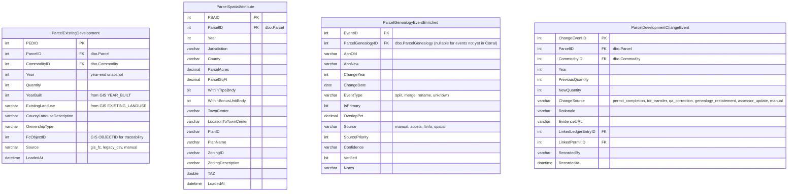
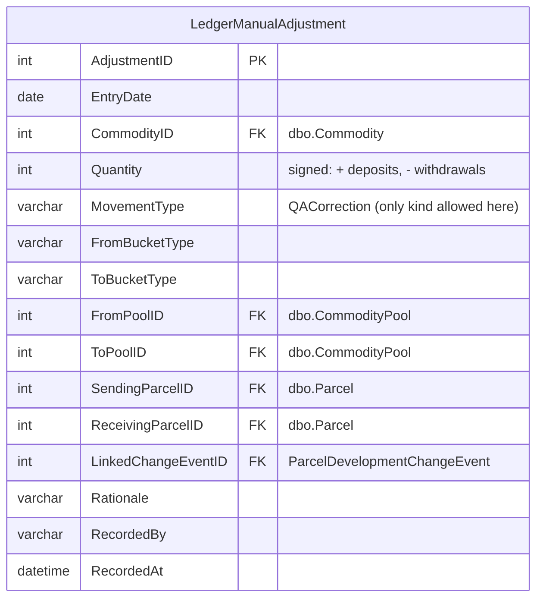
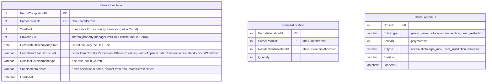
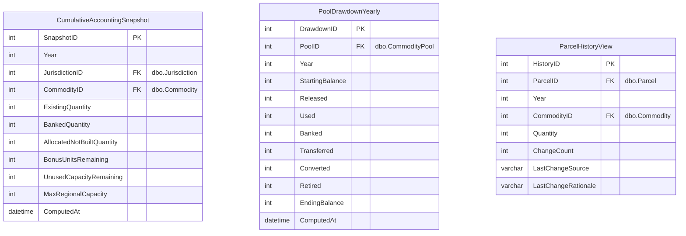

# Target schema — TRPA Cumulative Accounting tracking store

> **Status: DRAFT PROPOSAL — ready for team review.**
> **Audience: TRPA dev team, Ken, Dan, DB/GIS admins, partner jurisdictions.**

Proposed ERD for new tables in the **existing SDE SQL backend** that hosts
Corral + the enterprise GIS geodatabase. Anchored on the TRPA Cumulative
Accounting framework (TRPA Code §16.8.2). See
[.claude/skills/trpa-cumulative-accounting/SKILL.md](../.claude/skills/trpa-cumulative-accounting/SKILL.md)
for the full vocabulary.

> **Scope**: residential (SFRUU, MFRUU, RBU, ADU), tourist accommodation
> (TAU), commercial floor area (CFA). **Shorezone** (Mooring, Pier,
> `ShorezoneAllocation`, SHORE transaction type) is handled by a separate
> system and **out of scope**. PAOT and mitigation funds are deferred to v2+.

> **This is an ERD proposal, not DDL.** It captures entities, attributes, and
> relationships so the shape can be reviewed before CREATE TABLE statements.
> DDL is a later step.

## For reviewers — how to read this

1. **Skim the Design principles and Scope notes above** to orient on the
   constraints that shaped the design.
2. **Read the five ERDs in order** — they flow from reference data into the
   five buckets, the movement ledger, permits, and dashboard outputs. All
   diagrams render together in [development_rights_erd.html](./development_rights_erd.html).
3. **Jump to [Questions for the team](#questions-for-the-team)** at the end.
   That's the review checklist. Every question has a proposed answer;
   confirm or override.
4. **Check the supporting docs if you want to know *why*:**
   - [raw_data_vs_corral.md](./raw_data_vs_corral.md) — what Corral doesn't hold.
   - [validation_findings.md](./validation_findings.md) — empirical tests.
   - [xlsx_decomposition.md](./xlsx_decomposition.md) — why we don't load Ken's XLSX as a table.

### Key numbers at a glance

- **8 new physical tables + 1 view + 2 materialized snapshots** in this proposal.
- **16 Corral reference / transaction tables** reused as-is (no duplication).
- **5 buckets per (Commodity, Jurisdiction)**: Existing, Banked, Allocated, Bonus Units, Unused Capacity.
- **10 ledger movement types** (9 from Corral's `TransactionType` + Banking + QACorrection, minus Shorezone).
- **3 v1 dashboards**: cumulative accounting, allocation drawdown, parcel history lookup.
- **Corral freshness**: our backup is Feb 2024; live reads use LTinfo web services until deployment.
- **GIS freshness**: FC covers 2006–2023 with a 2016–2017 gap (see Questions).

## Design principle — never duplicate Corral

Corral is the system of record for TDR transactions, residential allocations,
banked rights, commodity pools, parcels, permits, deed restrictions, IPES, and
all reference lookups. **The new DB only creates tables for data Corral
genuinely lacks.** Everything else is FK'd, UNION'd in a view, or sidecar'd
with net-new columns only. When in doubt: don't duplicate.

## Where this lives — architecture

The new tables fold into the **same SDE-registered SQL Server instance** as
Corral and the enterprise GIS geodatabase. That means:

- **No bridge columns.** Foreign keys go directly to `dbo.Parcel`,
  `dbo.Commodity`, `dbo.CommodityPool`, `dbo.ResidentialAllocation`, etc.
  No more string-ID round-tripping.
- **Reference data is reused, not duplicated.** `Commodity`, `Jurisdiction`,
  `BaileyRating`, `LandCapabilityType`, `CommodityPool`, `TransactionType`,
  `ResidentialAllocationType`, `ResidentialAllocationUseType`,
  all stay in Corral as-is. We FK into them.
- **Publishing via ESRI is native.** SDE-registered tables can be exposed as
  MapServer / FeatureServer layers (like
  [Existing_Development/MapServer/2](https://maps.trpa.org/server/rest/services/Existing_Development/MapServer/2) — the future **Parcel Development History** service).
- **LTinfo JSON web services** remain the live read path for external
  systems but are not needed for in-DB queries once we're deployed.

## The accounting identity the schema serves

For every `(Commodity, Jurisdiction)`:

```
Max Regional Capacity  =  Existing + Banked + Allocated (not built)
                       +  Bonus Units + Unused Capacity
```

Every event moves commodity between these five buckets.

## Reference entities — reused from Corral

These tables **already exist in `dbo.*`** and don't get recreated. Listed so
you can see what the new tables FK into.

| Corral table | Row count | Role |
|---|---:|---|
| `dbo.Commodity` | 17 | Canonical commodity taxonomy (SFRUU, MFRUU, CFA, TAU, RBU, etc.) |
| `dbo.Jurisdiction` | 10 | Jurisdictions + abbreviations |
| `dbo.BaileyRating` | — | Bailey land-capability ratings (1a, 1b, 2, 3, ...) |
| `dbo.LandCapabilityType` | 114 | `Commodity × BaileyRating` |
| `dbo.CommodityPool` | 129 | All pools (Community Plan, Area Plan, Incentive, Bonus, CEP, generic) |
| `dbo.TransactionType` | 9 | The 9 canonical transaction types — see below |
| `dbo.ResidentialAllocationType` | 4 | **Allocation source**: Original, Reissued, LitigationSettlement, AllocationPool |
| `dbo.ResidentialAllocationUseType` | 2 | **Allocation use**: SingleFamily, MultiFamily |
| `dbo.Parcel` | 72K | Canonical parcel identity + geometry |
| `dbo.ParcelGenealogy` | 2.4K | Parent/Child parcel links (skeleton — enriched by new table below) |
| `dbo.ResidentialAllocation` | 1.9K | Allocation records (FK target; not redefined) |
| `dbo.TdrTransaction` + family | 2K | Transaction records — become inputs to the ledger |
| `dbo.AccelaCAPRecord` + `dbo.ParcelAccelaCAPRecord` | 124K / 179K | Accela bridge |
| `dbo.ParcelPermit` | 1.3K | Permit records — we extend, not replace |
| `dbo.ParcelCommodityInventory` | 10.5K | Current verified inventory (61% gap for residential; supplemented by `ParcelExistingDevelopment` below) |

### Found domain values

**`dbo.ResidentialAllocationType`** — what I earlier called "AllocationType":

| ID | Name | Code | Description |
|---:|---|---|---|
| 1 | Original | O | Original |
| 2 | Reissued | R | Reissued |
| 3 | LitigationSettlement | LS | Litigation Settlement |
| 4 | AllocationPool | AP | Allocation Pool |

My earlier sketch of `Allocation | BonusUnit | ADU` was wrong — those aren't
types, they're either sub-entities (`ResidentialBonusUnit`) or modeled
elsewhere (ADU probably as a flag on the permit or as a
`ResidentialAllocationUseType` value to be added).

**`dbo.ResidentialAllocationUseType`**:

| ID | Name | Display |
|---:|---|---|
| 1 | SingleFamily | Single-Family |
| 2 | MultiFamily | Multi-Family |

**`dbo.TransactionType`** — the 9 authoritative movement types:

| ID | Name | Abbr | Sending? | Receiving? | Conversion? | LandBank? |
|---:|---|---|:---:|:---:|:---:|:---:|
| 1 | Allocation | ALLOC | | ✓ | | |
| 2 | Conversion | CONV | | | ✓ | |
| 3 | ECM Retirement | ECM | ✓ | | | |
| 4 | Land Bank Acquisition | LBA | ✓ | | | |
| 5 | Transfer | TRF | ✓ | ✓ | | |
| 7 | Allocation Assignment | ALLOCASSGN | | ✓ | | |
| 8 | Conversion With Transfer | CONVTRF | ✓ | ✓ | | |
| 9 | Land Bank Transfer | LBT | | ✓ | | ✓ |

(ID 10 — Shorezone Allocation — is handled by the separate shorezone system
and **out of scope** for this schema.)

**`dbo.CommodityPool` — no formal PoolType column.** Pool type is encoded in
the pool name. Empirical classification by commodity:

| Commodity | Bonus | Incentive | Community Plan | Area Plan | CEP | Total |
|---|---:|---:|---:|---:|---:|---:|
| CFA | 0 | 0 | 15 | 5 | 1 | 30 |
| RBU | 2 | 1 | 5 | 3 | 1 | 18 |
| TAU | 0 | 0 | 1 | 4 | 0 | 21 |
| PAOT | 0 | 0 | 9 | 0 | 0 | 43 |
| Res. Alloc. | 0 | 0 | 0 | 0 | 0 | 9 |

Recommendation: **don't add a `PoolType` enum column to `CommodityPool`**.
Instead add a derived classification in the ETL layer or a view — parses
the name into `{CommunityPlan, AreaPlan, Bonus, Incentive, CEP, Generic}`.
Keeps the source table unchanged; accounting queries use the derived view.

## GIS source — the future Parcel Development History service

The existing prototype at
[Existing_Development/MapServer/2](https://maps.trpa.org/server/rest/services/Existing_Development/MapServer/2)
("Parcel Annual Attributes") is the shape the new **Parcel Development
History** service will have. Key fields:

| Field | Type | Role |
|---|---|---|
| `APN` | String(16) | Parcel key |
| `YEAR` | Integer | Year (part of composite key) |
| `Residential_Units` | Integer | RES count (→ new `ParcelExistingDevelopment`) |
| `TouristAccommodation_Units` | Integer | TAU count |
| `CommercialFloorArea_SqFt` | Double | CFA sq ft |
| `YEAR_BUILT` | String(5) | Assessor year-built |
| `JURISDICTION` | String(4) | |
| `COUNTY` | String(2) | |
| `OWNERSHIP_TYPE` | String(12) | |
| `EXISTING_LANDUSE` | String(50) | |
| `COUNTY_LANDUSE_DESCRIPTION` | String(150) | |
| `PLAN_ID`, `PLAN_NAME` | String | → new `ParcelSpatialAttribute` |
| `ZONING_ID`, `ZONING_DESCRIPTION` | String | |
| `TOWN_CENTER`, `LOCATION_TO_TOWNCENTER` | String | |
| `TAZ` | Double | |
| `WITHIN_TRPA_BNDY`, `WITHIN_BONUSUNIT_BNDY` | SmallInt | 0/1 flags |
| `PARCEL_ACRES`, `PARCEL_SQFT` | Double | |
| `Shape` | Polygon | |

No coded-value domains on the layer today. The new tables mirror these
field names 1:1 to simplify the loader.

## ERD — new core tables (parcel-keyed buckets)



The two pool-keyed buckets (`Bonus Units`, `Unused Capacity`) don't need
new tables — they're derivable from the existing `dbo.CommodityPool`
records plus the movement ledger, materialized nightly into
`PoolDrawdownYearly` (below).

## ERD — movement ledger

**No physical ledger table.** Corral is the system of record for every TDR
transaction (`dbo.TdrTransaction` + children) and every banked right
(`dbo.ParcelPermitBankedDevelopmentRight`). Don't duplicate. Instead:

- **`vCommodityLedger` (view)** — UNIONs Corral's transaction and banking
  tables into a unified `(EntryDate, CommodityID, Quantity, MovementType,
  From*, To*)` shape. Read-only.
- **`LedgerManualAdjustment` (small new table)** — the only net-new ledger
  data we hold: manual QA corrections that don't correspond to any Corral
  event. UNIONed into `vCommodityLedger`.



### `vCommodityLedger` — the view

Three branches UNIONed:

```sql
-- branch 1: TDR transactions from Corral (the bulk)
SELECT
    tt.TdrTransactionID              AS source_id,
    'corral_tdr'                     AS source,
    tt.ApprovalDate                  AS EntryDate,
    tt.CommodityID,
    COALESCE(ttt.ReceivingQuantity, tta.AllocatedQuantity,
             ttc.Quantity, tla.Quantity, tlt.Quantity) AS Quantity,
    tty.TransactionTypeAbbreviation  AS MovementType,
    -- FromBucketType / ToBucketType derived from TransactionType flags
    ...
FROM dbo.TdrTransaction tt
JOIN dbo.TransactionType tty ON tty.TransactionTypeID = tt.TransactionTypeID
LEFT JOIN dbo.TdrTransactionTransfer ttt ON ttt.TdrTransactionID = tt.TdrTransactionID
LEFT JOIN dbo.TdrTransactionAllocation tta ON tta.TdrTransactionID = tt.TdrTransactionID
LEFT JOIN dbo.TdrTransactionConversion ttc ON ttc.TdrTransactionID = tt.TdrTransactionID
LEFT JOIN dbo.TdrTransactionLandBankAcquisition tla ON tla.TdrTransactionID = tt.TdrTransactionID
LEFT JOIN dbo.TdrTransactionLandBankTransfer tlt ON tlt.TdrTransactionID = tt.TdrTransactionID
WHERE tty.TransactionTypeAbbreviation <> 'SHORE'     -- shorezone out of scope

UNION ALL

-- branch 2: banking events (Corral has them but not as transactions)
SELECT
    ppbdr.ParcelPermitBankedDevelopmentRightID AS source_id,
    'corral_banking'                 AS source,
    pp.FinalInspectionDate           AS EntryDate,
    lct.CommodityID,
    -ppbdr.Quantity                  AS Quantity,     -- negative: leaves Existing
    'Banking'                        AS MovementType,
    ...
FROM dbo.ParcelPermitBankedDevelopmentRight ppbdr
JOIN dbo.ParcelPermit pp ON pp.ParcelPermitID = ppbdr.ParcelPermitID
JOIN dbo.LandCapabilityType lct ON lct.LandCapabilityTypeID = ppbdr.LandCapabilityTypeID

UNION ALL

-- branch 3: manual QA adjustments (the only net-new data in the ledger)
SELECT
    lma.AdjustmentID                 AS source_id,
    'manual_qa'                      AS source,
    lma.EntryDate,
    lma.CommodityID,
    lma.Quantity,
    lma.MovementType,
    ...
FROM LedgerManualAdjustment lma;
```

### Mapping Corral `TransactionType` → `MovementType`

| Corral abbr | MovementType in ledger | Bucket move | Source branch |
|---|---|---|---|
| ALLOC | ALLOC | UnusedPool → Allocated | corral_tdr |
| ALLOCASSGN | ALLOCASSGN | Allocated → Existing (on permit final) | corral_tdr |
| CONV | CONV | Existing → Existing (paired entries) | corral_tdr |
| CONVTRF | CONVTRF | Existing(parcel A) → Existing(parcel B) with commodity swap | corral_tdr |
| TRF | TRF | Existing(A) → Existing(B) | corral_tdr |
| ECM | ECM | Existing → OutOfSystem | corral_tdr |
| LBA | LBA | Existing → LandBank | corral_tdr |
| LBT | LBT | LandBank → Existing | corral_tdr |
| (none — Corral event) | Banking | Existing → Banked | corral_banking |
| (none — manual) | QACorrection | any → any | manual_qa |

## ERD — permit completion + cross-system IDs



`PermitCompletion` extends `dbo.ParcelPermit` with the fields that live in
Ken's XLSX today. Eventually this becomes a direct sync from Accela once a
live feed is wired.

## ERD — materialized dashboard outputs



| Dashboard | Driven by |
|---|---|
| **Cumulative accounting report** (annual XLSX replacement) | `CumulativeAccountingSnapshot` |
| **Allocation drawdown** (stacked area by pool × year; `html/allocation_drawdown.html`) | `PoolDrawdownYearly` |
| **Parcel history lookup** (per-APN + change log) | `ParcelHistoryView` + `ParcelDevelopmentChangeEvent` |

## Loading strategy

| Source | Target tables | Cadence | Notes |
|---|---|---|---|
| **Parcel Development History REST service** (future; `C:\GIS\Scratch.gdb\Parcel_History_Attributed` today) | `ParcelExistingDevelopment`, `ParcelSpatialAttribute`; `ParcelDevelopmentChangeEvent` on year-over-year diffs | Weekly | Field-for-field map. APN resolved through `ParcelGenealogyEventEnriched` at load. |
| **`dbo.TdrTransaction*` + `dbo.ParcelPermitBankedDevelopmentRight`** | *(none — exposed through `vCommodityLedger` view)* | — | Corral is the system of record; no table-level duplication. |
| **Manual QA workflow** | `LedgerManualAdjustment` | As-needed | Only for events that don't correspond to any Corral transaction or banking record. |
| **`Transactions_Allocations_Details.xlsx`** (Ken) | `PermitCompletion`, `PermitAllocation`, `CrossSystemID` | Seed + manual refresh | Only load the 8 Ken-unique columns per [xlsx_decomposition.md](./xlsx_decomposition.md). |
| **`ExistingResidential_2012_2025_unstacked.csv`** (Ken) | `ParcelExistingDevelopment` 2012–2015 baseline | Seed once | Retire after GIS FC fills pre-2016. |
| **`apn_genealogy_tahoe.csv`** + ongoing derivation jobs | `ParcelGenealogyEventEnriched` | Seed + scheduled | Resolver reads this on every APN-keyed write. |

## What v2+ adds (deferred)

- `IPESScore` + `ParcelLandCapabilityVerification` (already exist in `dbo.*` — wrap as view for the new DB)
- `DeedRestriction` + `ParcelDeedRestriction` (already in `dbo.*` — wrap as view)
- `QaChecklist` + `QaChecklistItem` + `QaChecklistResponse` (manual workflow)
- PAOT recreation pools (overnight / summer day / winter day)
- `MitigationFundAccount` + `MitigationFundLedger` (threshold-attainment category)
- Resource Utilization metrics (VMT, DVTE, impervious, water, sewage, SEZ)

## Questions for the team

Each question has a **proposed answer** (our current leaning). The review
task is to confirm, override, or add context. Mark with ✅ / ❌ / comment as
you go.

### Data model

**Q1. ADU modeling.** Corral's `dbo.ResidentialAllocationUseType` has only
two values: `SingleFamily` and `MultiFamily`. No ADU. How should we represent
ADUs?

- (a) Add a third value `ADU` to `ResidentialAllocationUseType`.
- (b) Add an `IsADU` bit to the allocation or permit.
- (c) Separate ADU concept tied to a parent unit (ADU = accessory to an existing SFRUU).
- **Proposed**: (a). Cleanest — ADU becomes a first-class use type alongside Single/Multi-Family.
- *Needs input from*: Ken + whoever manages the ADU Tracking XLSX today.

**Q2. `AllocationType` enum values.** `dbo.ResidentialAllocationType` has:
`Original`, `Reissued`, `LitigationSettlement`, `AllocationPool`. Does that
cover all the allocation "sources" TRPA cares about, or are there more we'll
encounter (e.g., `CommunityEnhancement`, `TransferOfDevelopmentRights`)?

- **Proposed**: accept the current 4; add values if we hit a case they don't cover.

**Q3. Conversion representation in the ledger.** A Conversion event (e.g.,
`1 TAU → 1 SFRUU`) is modeled as **two paired ledger entries** linked via
`PairedEntryID` — one row debits `TAU`, one row credits `SFRUU`, both for
the same parcel on the same date.

- Alternative: a single row with `FromCommodityID` / `ToCommodityID` columns.
- **Proposed**: two-entry. Keeps bucket-balance arithmetic clean (`SUM(Quantity)` by commodity is always correct).

**Q4. Conversion ratios — lookup table or hardcoded?** The 2013 Regional
Plan sets `600 CFA = 2 TAU = 2 SFRUU = 3 MFRUU`. Store as rows in a new
`ConversionRatio` lookup, or hardcode in ETL logic?

- **Proposed**: lookup table. Future-proofs against policy changes; also
  gives the dashboard something to display.

**Q5. `Banking` and `Unbanking` as ledger MovementTypes.** Corral has no
"Banking" transaction in `dbo.TdrTransaction` — banking events live in
`dbo.ParcelPermitBankedDevelopmentRight` (707 rows). We synthesize `Banking`
ledger rows at read time by joining `ParcelPermitBankedDevelopmentRight` to
the permit's `FinalInspectionDate`.

- Concern: is `FinalInspectionDate` the right "BankedDate"? Is there a
  better source in Corral?
- **Proposed**: accept `FinalInspectionDate` as a proxy; revisit if a
  stronger banking-date field exists.

### Integration with Corral

**Q6. `PermitCompletion` sidecar vs extending `dbo.ParcelPermit`.** The
completion-state fields (YearBuilt, PMYearBuilt, enriched completion status,
detailed development type, supplemental notes) don't exist in Corral.

- Option A: **Sidecar `PermitCompletion` table** FK'd to `dbo.ParcelPermit`.
  Avoids touching a live Corral table. Adds one join to read.
- Option B: `ALTER TABLE dbo.ParcelPermit ADD ...` — columns live next to
  existing permit fields. Cleaner long-term, but modifies a table the LTinfo
  app writes to.
- **Proposed**: (A) sidecar for v1. Migrate fields into `dbo.ParcelPermit`
  in a later phase if TRPA is comfortable with it.

**Q7. `PermitAllocation` linkage strategy.** Corral has no direct FK between
`dbo.ParcelPermit` and `dbo.ResidentialAllocation`. The bridge today is via
`dbo.TdrTransaction.AccelaCAPRecordID` → `dbo.AccelaCAPRecord.AccelaID` →
(matched against permit's Accela record in the workflow system). **But only
32% of `TdrTransaction` rows have `AccelaCAPRecordID` populated.**

- Option A: Accept the 32% crosswalk coverage; build `PermitAllocation` from
  whatever joins today.
- Option B: **Back-fill `AccelaCAPRecordID` in Corral** from Ken's XLSX
  (`Transaction Record ID` column), then build `PermitAllocation` from the
  improved Corral data.
- **Proposed**: (B). It's Ken's XLSX that has the missing Accela IDs;
  loading them back into Corral improves both systems.
- *This is the highest-leverage cleanup task we've identified.* Worth its
  own mini-project.

**Q8. Retroactive genealogy restatements.** When `apn_genealogy_tahoe.csv`
gets a new `old_apn → new_apn` mapping that affects historical rows, do we
rewrite the `ParcelExistingDevelopment` rows in place, or leave them and
insert `ChangeSource='genealogy_restatement'` rows in
`ParcelDevelopmentChangeEvent`?

- **Proposed**: the latter. Preserves an audit trail; matches Dan's
  change-rationale framing.

### GIS integration

**Q9. Geometry on `ParcelExistingDevelopment`.** Carry the polygon from the
GIS service for spatial queries inside this DB, or reference only by
`ParcelID` + `Year`?

- **Proposed**: carry. SDE-registered on the same server means the polygon
  is ~free, and it makes the ERD diagrams easier to publish as ESRI services
  directly.
- *Counterargument*: one more thing to keep in sync.

**Q10. 2016–2017 gap in the GIS FC.** `Parcel_History_Attributed` covers
2006–2015 and 2018–2023. 2016 and 2017 are missing.

- Is that real data loss, or just "we haven't published yet"?
- If real: do we leave nulls in `ParcelExistingDevelopment` for those years,
  interpolate, or reconstruct from AuditLog (which only has post-2016-Dec
  data for PCI)?
- **Needs input from**: whoever owns the FC population pipeline.

**Q11. Pre-2012 data horizon.** Dan's email framed scope as "2012 and on."
The FC actually has 2006–2011 records.

- Do we load 2006–2011 as `Source='pre_2012_baseline'` (future-proofed), or
  load only 2012+?
- **Proposed**: load everything; flag with `Source` so reports can filter.

### Operations

**Q12. Ken's XLSX transition.** Keep `Transactions_Allocations_Details.xlsx`
as Ken's authoring surface with a scheduled ETL that upserts the 8 Ken-unique
columns into the new tables (see [xlsx_decomposition.md](./xlsx_decomposition.md))
— or build a form-entry app to replace the XLSX?

- **Proposed**: v1 keeps the XLSX (zero disruption to Ken's workflow). v2+
  can replace with a form once the new DB is stable.

**Q13. Dashboard refresh cadence.** Can we commit to **nightly** recomputation
for `PoolDrawdownYearly` and `CumulativeAccountingSnapshot`? Affects ETL SLA.

- **Proposed**: yes, nightly. Annual cumulative accounting is produced once;
  the drawdown dashboard refreshes nightly.

### Scope

**Q14. PAOT and mitigation funds — v2 timing.** The TRPA Cumulative
Accounting framework also tracks PAOT (recreation) and mitigation fund
accounts. Currently deferred to v2+. Is that OK, or are there stakeholders
who need them in v1?

**Q15. Shorezone** — confirmed out of scope (handled by a separate system).
No action; noting for completeness.

---

### Quick vote sheet

Copy this and return with your votes:

```
Q1  ADU modeling:                    (a) / (b) / (c) / comment:
Q2  AllocationType enum:             accept-4 / add:___________
Q3  Conversion representation:       two-entry / one-row / comment:
Q4  Conversion ratios:               lookup / hardcoded / comment:
Q5  Banking date source:             FinalInspectionDate OK / use:___________
Q6  PermitCompletion placement:      sidecar / extend-ParcelPermit / comment:
Q7  PermitAllocation linkage:        32%-crosswalk / back-fill-Corral / comment:
Q8  Retroactive genealogy:           rewrite-in-place / correction-entries / comment:
Q9  Geometry on PED:                 carry-polygon / ID-only / comment:
Q10 2016-2017 GIS gap:               leaving-null / reconstruct / comment:
Q11 Pre-2012 data:                   load-all-flag / 2012-only / comment:
Q12 Ken XLSX transition:             keep-XLSX / form-entry-v1 / comment:
Q13 Dashboard refresh:               nightly-OK / other:___________
Q14 PAOT/mitigation v2 timing:       OK / need-in-v1
```

## Ready-to-build v1 new-table list

Folded into existing SDE backend. **8 new physical tables + 1 view + 2 materializations**.
Every item holds data Corral doesn't — no duplication.

New physical tables:

1. `ParcelExistingDevelopment` — per-parcel × year × commodity quantity (GIS-sourced; Corral has no year-indexed inventory for non-permit-verified parcels)
2. `ParcelSpatialAttribute` — per-parcel × year spatial context (GIS-sourced year snapshot; distinct from `dbo.Parcel` current state)
3. `ParcelGenealogyEventEnriched` — 10+ metadata columns on top of `dbo.ParcelGenealogy` (3 columns)
4. `ParcelDevelopmentChangeEvent` — Dan's change rationale; no Corral analog
5. `PermitCompletion` — sidecar on `dbo.ParcelPermit` with YearBuilt, richer CompletionStatus, DetailedDevelopmentType (all net-new)
6. `PermitAllocation` — crosswalk between `dbo.ParcelPermit` and `dbo.ResidentialAllocation` (Corral has no direct FK)
7. `LedgerManualAdjustment` — manual QA-correction ledger entries only (TDR + Banking live in Corral)
8. `CrossSystemID` — polymorphic ID map (Accela, LTinfo, TRPA_MOU, Local Jurisdiction, Assessor)

View (no physical table):

- `vCommodityLedger` — UNIONs `dbo.TdrTransaction*` + `dbo.ParcelPermitBankedDevelopmentRight` + `LedgerManualAdjustment` into a unified movement log.

Materialized (computed nightly, safe to duplicate since derived):
- `CumulativeAccountingSnapshot`
- `PoolDrawdownYearly`
- `ParcelHistoryView`
