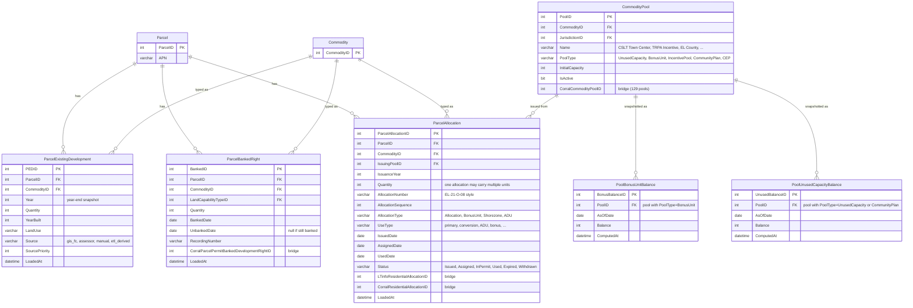
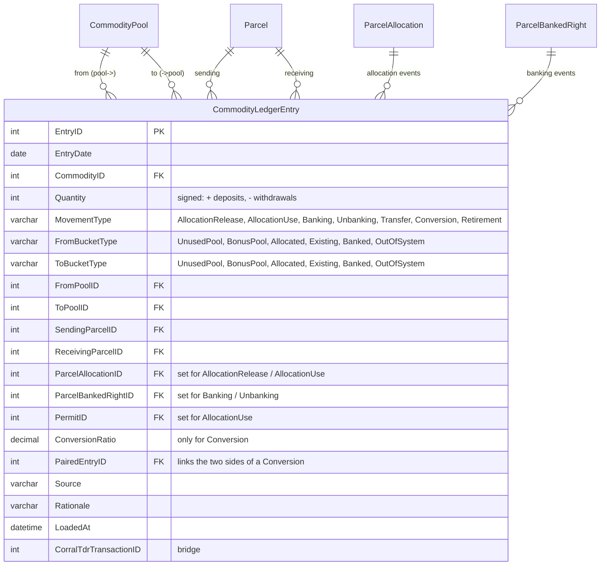
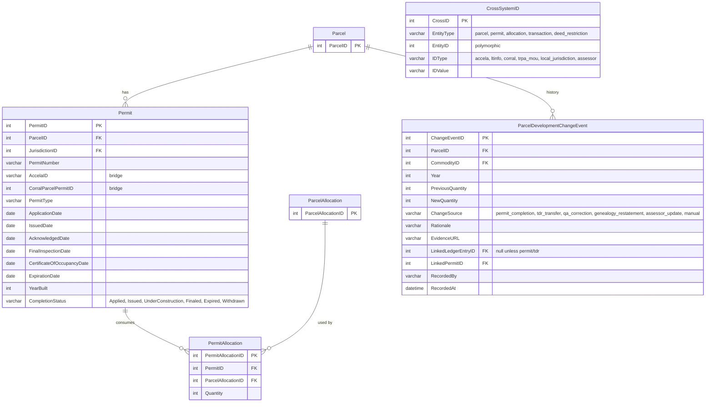
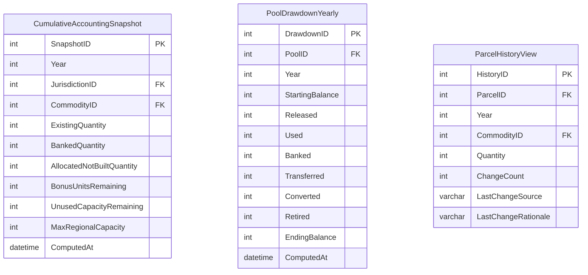

# Target schema — TRPA Cumulative Accounting tracking store

Proposed ERD for a new SQL database that tracks development and
development-rights accounting for Tahoe, anchored on the TRPA Cumulative
Accounting framework (TRPA Code §16.8.2). See
[.claude/skills/trpa-cumulative-accounting/SKILL.md](../.claude/skills/trpa-cumulative-accounting/SKILL.md)
for the full vocabulary.

> **This is an ERD proposal, not DDL.** It captures entities, attributes, and
> relationships so the shape can be reviewed and iterated on before committing
> to CREATE TABLE statements. DDL is a later step.

## The accounting identity the schema serves

For every `(Commodity, Jurisdiction)`:

```
Max Regional Capacity  =  Existing
                       +  Banked
                       +  Allocated (not yet built)
                       +  Bonus Units
                       +  Unused Capacity (pool)
```

Every event in the TRPA system moves commodity **between these five buckets**.
The database holds three things:

1. **Where things currently are** — one authoritative table per bucket type.
2. **Every movement that got them there** — one `CommodityLedgerEntry` log.
3. **Materialized snapshots** for dashboards — precomputed yearly balances.

## Design principles

1. **Buckets, not transactions.** Schema shape follows the five-bucket
   accounting model. Allocations are one of seven movement types; they don't
   get their own hierarchy.
2. **ETL-only writes.** Every insert/update goes through Python loaders. APN
   genealogy resolution happens at load time; no SQL UDF needed.
3. **Three upstream sources of truth, synced but not duplicated.**
   - GIS enterprise GDB (spatial + existing development) — via REST service
   - LTinfo / Corral (allocations, pools, TDR events) — via LTinfo JSON
   - Accela (permit workflow) — via Corral's `AccelaCAPRecord` bridge for now
4. **Every row has provenance.** `Source`, `SourcePriority`, `LoadedAt` on all
   fact tables.
5. **Vocabulary matches the skill exactly.** Existing / Banked / Allocated /
   Bonus Units / Unused Capacity — no synonyms, no overlap.

## ERD — reference entities

```mermaid
erDiagram
    Commodity {
        int CommodityID PK
        varchar ShortName "SFRUU, MFRUU, RBU, TAU, CFA, PAOT, ..."
        varchar DisplayName
        bit IsCoverage
        bit CanHaveLandCapability
        int CorralCommodityID "bridge"
    }
    Jurisdiction {
        int JurisdictionID PK
        varchar Name
        varchar Abbreviation "EL, PL, DG, WA, CSLT, TRPA"
        int CorralJurisdictionID "bridge"
    }
    BaileyRating {
        int BaileyRatingID PK
        varchar Name "1a, 1b, 2, 3, ..."
        int AllowableBasePercent
    }
    LandCapabilityType {
        int LCTypeID PK
        int CommodityID FK
        int BaileyRatingID FK
        int CorralLandCapabilityTypeID "bridge"
    }
    Parcel {
        int ParcelID PK
        varchar APN UK
        varchar APN_raw "as-provided before genealogy resolve"
        int JurisdictionID FK
        int CorralParcelID "bridge"
        varchar LTinfoAPN "string bridge for LTinfo joins"
        bit IsRetired
        datetime FirstSeen
        datetime LastSeen
    }
    ParcelGenealogyEvent {
        int EventID PK
        varchar ApnOld
        varchar ApnNew
        int ChangeYear
        date ChangeDate
        varchar EventType "split, merge, rename, unknown"
        bit IsPrimary
        decimal OverlapPct
        varchar Source "manual, accela, ltinfo, spatial"
        int SourcePriority
        varchar Confidence
        bit Verified
        varchar Notes
    }
    Commodity      ||--o{ LandCapabilityType   : "has"
    BaileyRating   ||--o{ LandCapabilityType   : "rated by"
    Jurisdiction   ||--o{ Parcel               : "has"
```



## ERD — the five buckets

Three **parcel-keyed** buckets (something attached to a specific parcel) and
two **pool-keyed** buckets (capacity held in a jurisdiction pool).



**Why three parcel tables instead of one** with a `BucketType` column: each
has different natural attributes and update cadences. ExistingDevelopment is
year-indexed (GIS snapshots), BankedRight is event-indexed with an optional
`UnbankedDate`, Allocation has a rich lifecycle status.

## ERD — the movement ledger

Every bucket transition is one row in `CommodityLedgerEntry`. Seven movement
types exactly — matching the skill.



The seven movement types, as ledger entries:

| MovementType | From → To | Typical fields set |
|---|---|---|
| **AllocationRelease** | UnusedPool → Allocated | `FromPoolID`, `ParcelAllocationID`, `Quantity` |
| **AllocationUse** | Allocated → Existing | `ParcelAllocationID`, `PermitID`, `ReceivingParcelID` |
| **Banking** | Existing → Banked | `SendingParcelID`, `ParcelBankedRightID` |
| **Unbanking** | Banked → Existing | `ParcelBankedRightID`, `ReceivingParcelID` |
| **Transfer** | Existing → Existing | `SendingParcelID`, `ReceivingParcelID` |
| **Conversion** | Existing → Existing | two paired entries via `PairedEntryID`; `ConversionRatio` on both |
| **Retirement** | any → OutOfSystem | appropriate From*, zero the inverse |

## ERD — permits, change events, cross-system bridges



`ParcelDevelopmentChangeEvent` is Dan's change-rationale table. Every
year-over-year change in `ParcelExistingDevelopment` generates a row here
with `ChangeSource` explaining why.

## ERD — materialized outputs for dashboards



| Dashboard | Table(s) that drive it |
|---|---|
| **Cumulative accounting report** (annual XLSX replacement) | `CumulativeAccountingSnapshot` |
| **Allocation drawdown** (stacked area by pool × year; `html/allocation_drawdown.html`) | `PoolDrawdownYearly` |
| **Parcel history lookup** (per-APN detail + change log) | `ParcelHistoryView` + `ParcelDevelopmentChangeEvent` |

Both materialized tables recompute nightly from `CommodityLedgerEntry` +
the bucket tables.

## Loading strategy

| Source | Target tables | Cadence | Notes |
|---|---|---|---|
| **GIS enterprise GDB REST service** | `ParcelExistingDevelopment`; `ParcelDevelopmentChangeEvent` on diffs | Weekly | Wide FC columns (RES / TAU / CFA) fan out into per-commodity rows. APN resolved through genealogy at load. Year-over-year diffs → `ParcelDevelopmentChangeEvent` with `ChangeSource='gis_sync'`. |
| **LTinfo `GetAllParcels`** | `Parcel` (UPSERT by APN) | Weekly | Authoritative for current parcel attributes. |
| **LTinfo `GetTransactedAndBankedDevelopmentRights`** | `ParcelAllocation`, `CommodityLedgerEntry` (Transfer, Banking, Unbanking, Conversion, Retirement) | Weekly | Each returned row fans out into one or more ledger entries by TransactionType. |
| **LTinfo `GetBankedDevelopmentRights`** | `ParcelBankedRight` (current state) | Weekly | Reconcile against ledger; discrepancies logged. |
| **`Transactions_Allocations_Details.xlsx`** (Ken) | `Permit.CompletionStatus`, `Permit.YearBuilt`, `PermitAllocation`, `CrossSystemID` | Manual / seed | Retire once Accela live feed lands. |
| **`ExistingResidential_2012_2025_unstacked.csv`** (Ken) | `ParcelExistingDevelopment` (2012–2015 baseline) | Manual / seed | Retire once GIS FC covers pre-2016. |
| **`apn_genealogy_tahoe.csv`** | `ParcelGenealogyEvent` | Manual + scheduled derivation jobs | Resolver runs on every APN-keyed write. |
| **Corral SQL (frozen snapshot)** | Initial seed for `Commodity`, `Jurisdiction`, `LandCapabilityType`, `CommodityPool` | One-time bulk | After v1 go-live, LTinfo becomes the live-sync path. |

## What v2+ adds (deferred)

- `IPESScore` + `ParcelLandCapabilityVerification` (sync from `GetParcelIPESScores`)
- `DeedRestriction` + `ParcelDeedRestriction` (sync from `GetDeedRestrictedParcels`)
- `QaChecklist` + `QaChecklistItem` + `QaChecklistResponse` (manual workflow)
- `PAOT` recreation pools (overnight / summer day / winter day)
- `MitigationFundAccount` + `MitigationFundLedger` (threshold-attainment category)
- Resource Utilization metrics (VMT, DVTE, impervious, water, sewage, SEZ)

## Open decisions

1. **`AllocationType` enum.** Currently `Allocation | BonusUnit | Shorezone | ADU`.
   Four values right, or is there a finer split Corral already uses?
2. **`PoolType` enum.** Currently `UnusedCapacity | BonusUnit | IncentivePool | CommunityPlan | CEP`.
   129 pools in Corral likely need richer classification; confirm during the
   `CommodityPoolGridExport.csv` walkthrough.
3. **Conversion paired entries.** Two ledger rows linked via `PairedEntryID` (current choice),
   or one row with A/B commodity fields? Two-entry is cleaner for bucket-balance math.
4. **Bucket-balance validation.** Database CHECK/trigger that `ParcelExistingDevelopment.Quantity`
   equals `SUM(CommodityLedgerEntry)` for that parcel — or nightly validation job? Leaning job.
5. **Geometry in the new DB.** Spatial-light (IDs only, let GIS handle spatial) or SDE-registered
   with a Parcel geometry column? Likely SDE once the enterprise GDB lands on the same server.
6. **Retroactive restatements.** New `apn_genealogy_tahoe.csv` mappings — rewrite historical rows,
   or insert `ChangeSource='genealogy_restatement'` ledger entries? Leaning the latter.

## Ready-to-build v1 entity list

In dependency order:

1. `Commodity`, `Jurisdiction`, `BaileyRating`, `LandCapabilityType`
2. `Parcel`, `ParcelGenealogyEvent`
3. `CommodityPool`
4. `ParcelExistingDevelopment`
5. `ParcelBankedRight`
6. `ParcelAllocation`
7. `Permit`, `PermitAllocation`
8. `CommodityLedgerEntry`
9. `ParcelDevelopmentChangeEvent`
10. `CrossSystemID`
11. `CumulativeAccountingSnapshot` *(materialized)*
12. `PoolDrawdownYearly` *(materialized)*

**12 entities in v1.** Each maps to a concrete bucket or movement in TRPA
Cumulative Accounting.
