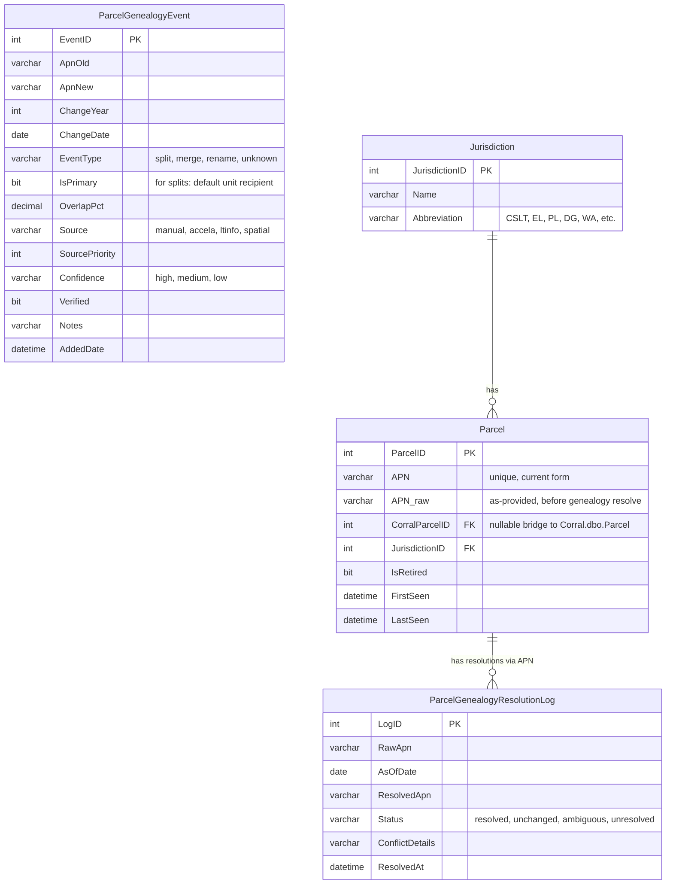
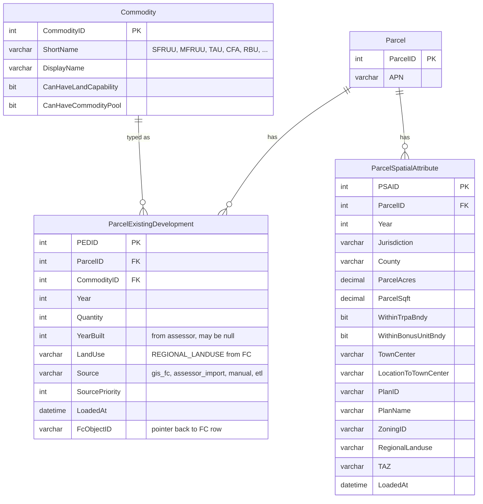
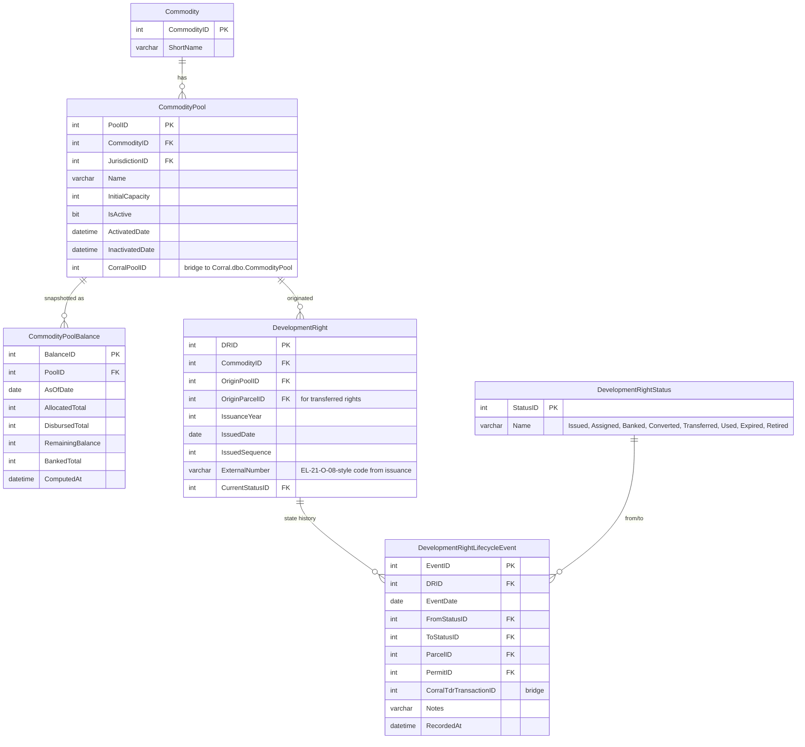
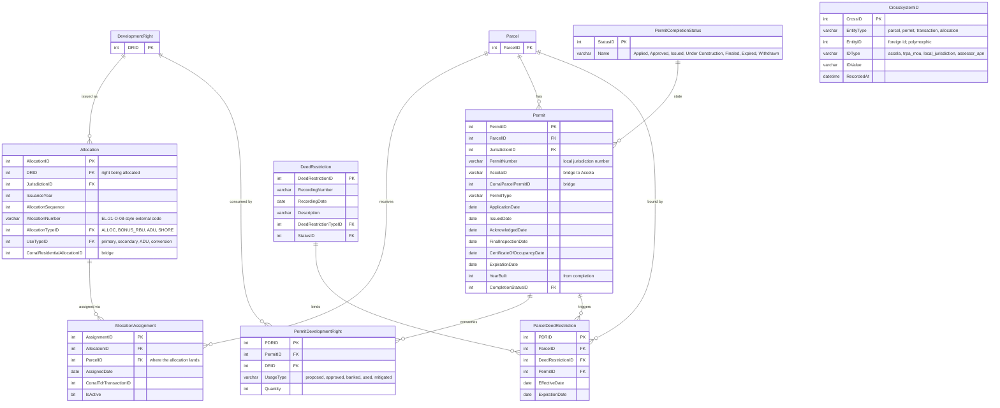

# Target schema — TRPA development-rights tracking store

First-pass ERD for a new SQL database that integrates three authoritative
upstream sources:

- **GIS enterprise geodatabase** (future — today in `C:\GIS\Scratch.gdb\Parcel_History_Attributed`) → existing development per parcel × year
- **Corral** (SQL Server, today a 2024-02 snapshot) → TDR transactions, allocations, commodity pools
- **Accela** (via Corral's `AccelaCAPRecord` bridge, eventually a live feed) → permit workflow

The new store holds the **joins, lifecycle state machines, and pool-balance
accounting** that none of those upstream systems own individually. It does
*not* duplicate inventory data that the GIS service will expose.

## Design principles

1. **APN-genealogy is write-path infrastructure.** Every APN-keyed table's
   upsert goes through `fn_resolve_apn(apn, as_of_date)`. Writes cannot land
   on a stale APN. Reads don't think about genealogy.
2. **Development rights are atomic instances.** One `DevelopmentRight` row per
   unit of RU/TAU/CFA/RBU that was ever issued. Its state transitions are
   event-sourced in `DevelopmentRightLifecycleEvent`.
3. **Corral vocabulary wins where it's mature.** Commodities, land-capability
   types, jurisdictions — mirror Corral's taxonomy so joins round-trip cleanly.
4. **Spatial truth lives upstream.** `ParcelExistingDevelopment` is a
   **cache-and-join** of the GIS service for fast reporting; the service stays
   canonical. Periodic reconciliation sweeps re-pull from the service.
5. **Every row carries a source.** `Source` + `SourcePriority` + `LoadedAt`
   on every fact table makes provenance queryable.

## ERD — core identity and genealogy



**Key pattern**: `ParcelGenealogyEvent` is loaded from `apn_genealogy_tahoe.csv`
(42,159 rows) plus ongoing inputs from Accela/LTinfo/spatial workflows.
`fn_resolve_apn(@apn, @as_of)` walks this table deterministically
(priority + confidence + verified) and returns the canonical APN; ambiguities
get logged to `ParcelGenealogyResolutionLog` instead of silently choosing.

## ERD — existing development (sourced from GIS service)



**Loader**: a sync job pulls from the GIS REST service weekly, UPSERT-s into
`ParcelExistingDevelopment` keyed on `(ParcelID, CommodityID, Year)`, runs APNs
through `fn_resolve_apn` first. The `RES` / `TAU` / `CFA` wide columns in the
FC fan out into three rows per parcel × year.

`ParcelSpatialAttribute` is a separate table because spatial context changes
less frequently than development counts and lets us denormalize once per year
rather than per commodity-year.

## ERD — commodity pools and development rights lifecycle



**Key pattern**: `DevelopmentRight` is *atomic*. If a pool disburses 10 RUs in
2014, that's 10 rows. Each row tracks its own journey through the lifecycle.
Pool balances at any date = aggregate query over `DevelopmentRight` x
`DevelopmentRightLifecycleEvent`, materialized nightly into
`CommodityPoolBalance` for fast dashboarding.

ADU and RBU tracking fall out naturally: `WHERE Commodity.ShortName = 'RBU'`
or `WHERE Commodity.ShortName = 'SFRUU' AND allocation.UseType = 'ADU'`
(ADU classification lives on the allocation side — see next section).

## ERD — allocations, permits, completion



## DDL sketches (the six tables that matter most)

```sql
-- 1. Canonical parcel identity
CREATE TABLE Parcel (
    ParcelID          int IDENTITY PRIMARY KEY,
    APN               varchar(30) NOT NULL UNIQUE,
    APN_raw           varchar(30)     NULL,
    CorralParcelID    int             NULL,
    JurisdictionID    int             NOT NULL REFERENCES Jurisdiction(JurisdictionID),
    IsRetired         bit             NOT NULL DEFAULT 0,
    FirstSeen         datetime        NOT NULL DEFAULT GETDATE(),
    LastSeen          datetime        NOT NULL DEFAULT GETDATE()
);
CREATE INDEX IX_Parcel_CorralParcelID ON Parcel(CorralParcelID);

-- 2. Enriched genealogy (the apn_genealogy_tahoe.csv shape)
CREATE TABLE ParcelGenealogyEvent (
    EventID           int IDENTITY PRIMARY KEY,
    ApnOld            varchar(30) NOT NULL,
    ApnNew            varchar(30) NOT NULL,
    ChangeYear        int             NULL,
    ChangeDate        date            NULL,
    EventType         varchar(20) NOT NULL CHECK (EventType IN ('split','merge','rename','unknown')),
    IsPrimary         bit             NOT NULL DEFAULT 0,
    OverlapPct        decimal(5,2)    NULL,
    Source            varchar(30) NOT NULL,
    SourcePriority    int             NOT NULL DEFAULT 0,
    Confidence        varchar(10) NOT NULL DEFAULT 'medium',
    Verified          bit             NOT NULL DEFAULT 0,
    Notes             varchar(1000)   NULL,
    AddedDate         datetime        NOT NULL DEFAULT GETDATE()
);
CREATE INDEX IX_Genealogy_ApnOld ON ParcelGenealogyEvent(ApnOld, ChangeYear);
CREATE INDEX IX_Genealogy_ApnNew ON ParcelGenealogyEvent(ApnNew);

-- 3. Existing development (cache of GIS service)
CREATE TABLE ParcelExistingDevelopment (
    PEDID             int IDENTITY PRIMARY KEY,
    ParcelID          int NOT NULL REFERENCES Parcel(ParcelID),
    CommodityID       int NOT NULL REFERENCES Commodity(CommodityID),
    Year              int NOT NULL,
    Quantity          int NOT NULL DEFAULT 0,
    YearBuilt         int     NULL,
    LandUse           varchar(50) NULL,
    Source            varchar(30) NOT NULL,
    SourcePriority    int NOT NULL DEFAULT 0,
    FcObjectID        int     NULL,
    LoadedAt          datetime NOT NULL DEFAULT GETDATE(),
    CONSTRAINT UQ_PED UNIQUE (ParcelID, CommodityID, Year)
);

-- 4. Atomic development right
CREATE TABLE DevelopmentRight (
    DRID              int IDENTITY PRIMARY KEY,
    CommodityID       int NOT NULL REFERENCES Commodity(CommodityID),
    OriginPoolID      int     NULL REFERENCES CommodityPool(PoolID),
    OriginParcelID    int     NULL REFERENCES Parcel(ParcelID),
    IssuanceYear      int NOT NULL,
    IssuedDate        date    NULL,
    IssuedSequence    int     NULL,
    ExternalNumber    varchar(50) NULL,
    CurrentStatusID   int NOT NULL REFERENCES DevelopmentRightStatus(StatusID)
);
CREATE INDEX IX_DR_Commodity_Pool ON DevelopmentRight(CommodityID, OriginPoolID);

-- 5. Event-sourced lifecycle
CREATE TABLE DevelopmentRightLifecycleEvent (
    EventID           int IDENTITY PRIMARY KEY,
    DRID              int NOT NULL REFERENCES DevelopmentRight(DRID),
    EventDate         date NOT NULL,
    FromStatusID      int     NULL REFERENCES DevelopmentRightStatus(StatusID),
    ToStatusID        int NOT NULL REFERENCES DevelopmentRightStatus(StatusID),
    ParcelID          int     NULL REFERENCES Parcel(ParcelID),
    PermitID          int     NULL REFERENCES Permit(PermitID),
    CorralTdrTransactionID int NULL,
    Notes             varchar(1000) NULL,
    RecordedAt        datetime NOT NULL DEFAULT GETDATE()
);
CREATE INDEX IX_DRLE_DR ON DevelopmentRightLifecycleEvent(DRID, EventDate);

-- 6. APN-resolver
CREATE FUNCTION fn_resolve_apn(@apn varchar(30), @as_of date)
RETURNS varchar(30)
AS BEGIN
    DECLARE @resolved varchar(30) = @apn;
    -- walk genealogy: find latest applicable mapping
    WHILE EXISTS (
        SELECT 1 FROM ParcelGenealogyEvent
        WHERE ApnOld = @resolved
          AND (ChangeYear IS NULL OR ChangeYear <= YEAR(@as_of))
          AND IsPrimary = 1
          AND Verified = 1
    )
    BEGIN
        SELECT TOP 1 @resolved = ApnNew
        FROM ParcelGenealogyEvent
        WHERE ApnOld = @resolved
          AND (ChangeYear IS NULL OR ChangeYear <= YEAR(@as_of))
          AND IsPrimary = 1
          AND Verified = 1
        ORDER BY SourcePriority DESC, ChangeYear ASC;
    END;
    RETURN @resolved;
END;
```

## Loading strategy

| Source | Target tables | Cadence | Notes |
|---|---|---|---|
| GIS enterprise GDB REST service | `ParcelExistingDevelopment`, `ParcelSpatialAttribute` | Weekly UPSERT | APN resolved on write |
| Corral `TdrTransaction*` + `ResidentialAllocation*` + `CommodityPool*` | `DevelopmentRight`, `DevelopmentRightLifecycleEvent`, `Allocation`, `CommodityPool`, `CommodityPoolBalance` | Initial bulk, then delta by `LastUpdateDate` | Fans out transactions into atomic rights |
| Corral `ParcelPermit` + `AccelaCAPRecord` + (Accela live, future) | `Permit`, `PermitDevelopmentRight` | Nightly | `AccelaID` is the stable key |
| `apn_genealogy_tahoe.csv` + ongoing Accela/LTinfo/spatial feeds | `ParcelGenealogyEvent` | Manual + scheduled derivation jobs | Loader resolves conflicts by source priority |
| `Transactions_Allocations_Details.xlsx` | Fills gaps in `PermitCompletion`, `CrossSystemID` during initial load | One-time seed, then retire | Once Accela live feed is wired, this XLSX goes away |

## Gaps this schema deliberately closes

1. **61% PCI coverage gap** — `ParcelExistingDevelopment` holds every parcel × year × commodity from GIS, not only permit-verified ones.
2. **Genealogy metadata** — `ParcelGenealogyEvent` is the 23-column shape, not Corral's 3-column skeleton.
3. **"Permitted vs completed" state** — `Permit.CompletionStatusID` + `YearBuilt` + `PermitCompletionStatus` lookup.
4. **Pool balance as of date** — `CommodityPoolBalance` materialized view.
5. **ADU/RBU lifecycle** — first-class `DevelopmentRight` + `DevelopmentRightLifecycleEvent` state machine.
6. **Cross-system identifiers** — `CrossSystemID` polymorphic map (TRPA/MOU, Local Project #, Assessor APN).

## Open decisions

1. **Where does `fn_resolve_apn` live** — as a SQL UDF in the new store, or in an ETL layer upstream of any write? UDF is simpler; ETL is more flexible if you want to log resolutions before hitting the table.
2. **Commodity + Jurisdiction: duplicate or reference Corral?** Probably duplicate the lookup values as local tables (so the new store runs if Corral's down), with a nightly reconciliation.
3. **`DevelopmentRight` granularity** — genuinely one row per atomic unit (e.g., 10 rows for a 10-RU disbursement), or one row per issuance with a `Quantity` field? Atomic is cleaner for lifecycle tracking; `Quantity` is cheaper if rights always move as groups. Worth deciding up-front.
4. **Retroactive genealogy resolution** — if a new `ParcelGenealogyEvent` is added that maps an APN we've already written, do we rewrite existing rows? Recommended: nightly sweep job; log each rewrite to `ParcelGenealogyResolutionLog`.

## Next steps

Once you share the GIS / end-goals / spreadsheet-reality context, we'll:

1. Nail down the `DevelopmentRight` atomicity decision.
2. Map each Corral table → target table explicitly (which fields travel, which get dropped).
3. Define the lifecycle event state transitions (e.g., allowed `FromStatus → ToStatus` pairs).
4. Decide whether the new store lives alongside Corral on the same server or on its own (impacts UDF/cross-DB join choices).
