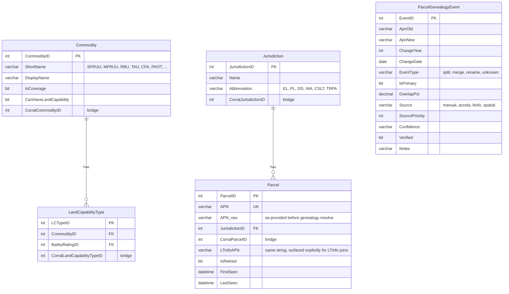
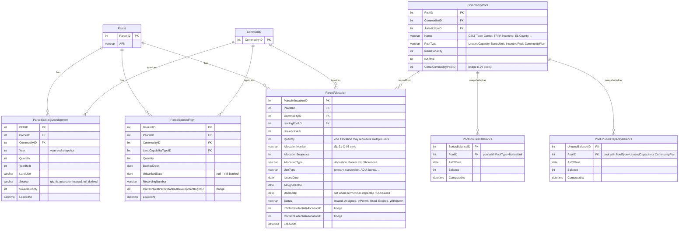
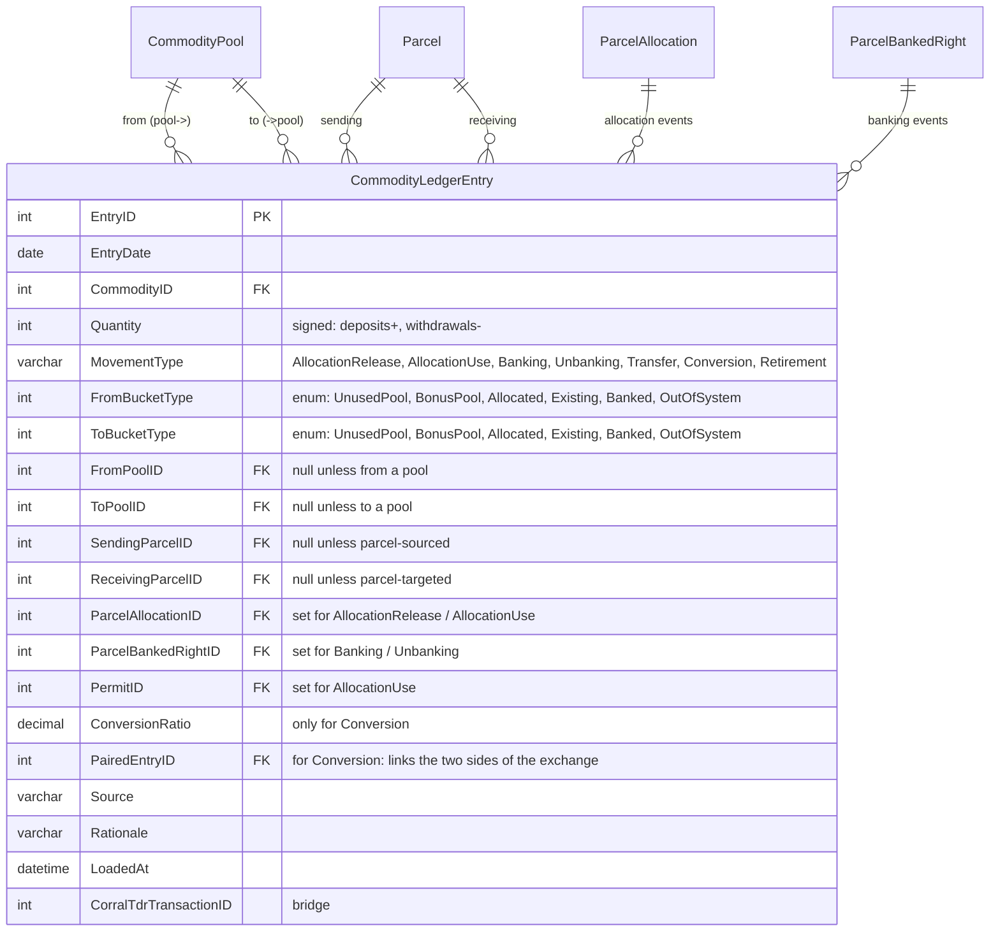
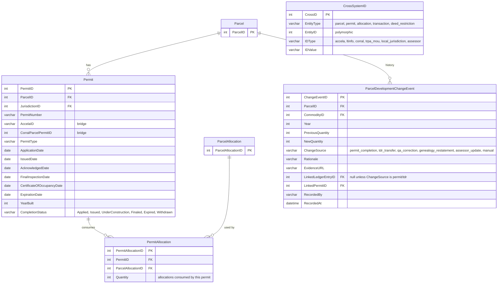
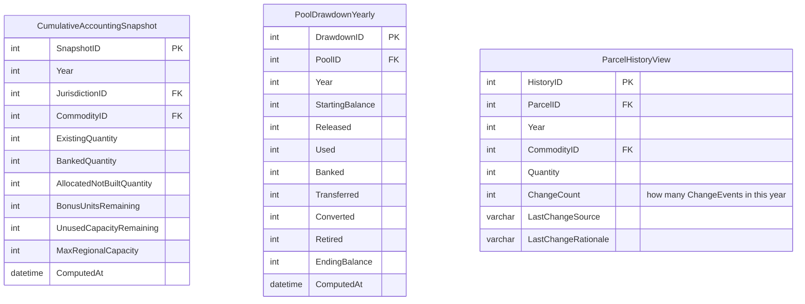

# Target schema — TRPA Cumulative Accounting tracking store

**Second-pass design** anchored on the TRPA Cumulative Accounting framework
(TRPA Code §16.8.2). See [.claude/skills/trpa-cumulative-accounting/SKILL.md](../.claude/skills/trpa-cumulative-accounting/SKILL.md)
for the full vocabulary. This schema replaces the allocation-centric first
pass — pools and buckets are the spine.

## The accounting identity we are serving

For every `(Commodity, Jurisdiction)` pair, the Regional Plan asserts:

```
Max Regional Capacity  =  Existing
                       +  Banked
                       +  Allocated (not yet built)
                       +  Bonus Units
                       +  Unused Capacity (pool)
```

Every data event in TRPA's system is a movement of commodity **between these
five buckets**. The database holds three things:

1. **Where things currently are** — one authoritative table per bucket type.
2. **Every movement that got them there** — a single `CommodityLedgerEntry` log.
3. **Materialized snapshots** for dashboards — precomputed year-end bucket balances.

## Design principles

1. **Buckets, not transactions.** Schema shape follows the five-bucket accounting
   model directly. Allocations are one of seven canonical movement types; they
   don't get their own hierarchy.
2. **ETL-only writes.** Every insert/update flows through Python loaders.
   APN genealogy resolution happens at load time; no SQL UDF needed.
3. **Three upstream sources of truth, synced but not duplicated.**
   - GIS enterprise GDB (spatial + existing development) — via REST service
   - LTinfo / Corral (allocations, pools, TDR events) — via LTinfo JSON endpoints
   - Accela (permits) — via Corral's `AccelaCAPRecord` bridge for now
4. **Every row has provenance.** `Source`, `SourcePriority`, `LoadedAt` on all fact tables.
5. **Vocabulary matches the skill exactly.** Existing / Banked / Allocated /
   Bonus Units / Unused Capacity — no synonyms, no overlap.

## ERD — reference entities



## ERD — the five buckets

Three **parcel-keyed** buckets (something is on or attached to a specific parcel)
and two **pool-keyed** buckets (capacity held in a jurisdiction pool).



**Why three parcel tables instead of one `ParcelBucket` with a `BucketType` column**:
each has different natural attributes and different update cadences.
`ParcelExistingDevelopment` is year-indexed (snapshots from GIS), `ParcelBankedRight`
is event-indexed with optional `UnbankedDate`, `ParcelAllocation` has a rich
lifecycle status and links to an issuing pool.

## ERD — the movement ledger

Every change between buckets is one row in `CommodityLedgerEntry`. Seven movement
types, matching the skill exactly.



The seven movement types, as ledger entries:

| MovementType | From → To | Typical fields set |
|---|---|---|
| **AllocationRelease** | UnusedPool → Allocated | `FromPoolID`, `ParcelAllocationID`, `Quantity` |
| **AllocationUse** | Allocated → Existing | `ParcelAllocationID`, `PermitID`, `ReceivingParcelID` |
| **Banking** | Existing → Banked | `SendingParcelID`, `ParcelBankedRightID` |
| **Unbanking** | Banked → Existing | `ParcelBankedRightID`, `ReceivingParcelID` |
| **Transfer** | Existing → Existing | `SendingParcelID`, `ReceivingParcelID` |
| **Conversion** | Existing → Existing (paired) | `FromParcelID`, `ConversionRatio`, `PairedEntryID` — two rows, commodity A and commodity B |
| **Retirement** | any → OutOfSystem | set `FromBucketType`, zero the inverse |

## ERD — permits, deed restrictions, cross-system bridges



`ParcelDevelopmentChangeEvent` is Dan's change-rationale table. Every
year-over-year change in `ParcelExistingDevelopment` has one row here,
with `ChangeSource` explaining why. v2+ can add the QA checklist tables
around this.

## Materialized outputs for dashboards

Three pre-computed tables drive the v1 dashboards directly.



| Dashboard | Driven by |
|---|---|
| **Cumulative accounting report** (annual XLSX replacement) | `CumulativeAccountingSnapshot` |
| **Allocation drawdown** (stacked area by pool × year) | `PoolDrawdownYearly` |
| **Parcel history lookup** (per-APN detail + change log) | `ParcelHistoryView` + `ParcelDevelopmentChangeEvent` |

## Loading strategy

| Source | Target tables | Cadence | Notes |
|---|---|---|---|
| **GIS enterprise GDB REST service** | `ParcelExistingDevelopment`, plus `ParcelDevelopmentChangeEvent` on diffs | Weekly | Wide FC columns (RES, TAU, CFA) fan out into per-commodity rows; APN resolved through genealogy at load. When year-over-year diff is non-zero → insert ChangeEvent with `ChangeSource='gis_sync'`. |
| **LTinfo `GetAllParcels`** | `Parcel` (UPSERT on APN) | Weekly | Authoritative for current APN → ParcelID mapping + parcel attributes. |
| **LTinfo `GetTransactedAndBankedDevelopmentRights`** | `ParcelAllocation`, `CommodityLedgerEntry` (Transfer/Banking/Unbanking/Conversion/Retirement) | Weekly | Each returned row = one or more ledger entries; fan out by TransactionType. |
| **LTinfo `GetBankedDevelopmentRights`** | `ParcelBankedRight` (current state) | Weekly | Reconcile against ledger; discrepancies logged. |
| **LTinfo `GetParcelIPESScores`** | optional `IPESScore` table (deferred to v2) | Weekly | Not in v1 scope. |
| **LTinfo `GetDeedRestrictedParcels`** | optional deed restriction tables (deferred to v2) | Weekly | Not in v1 scope. |
| **`Transactions_Allocations_Details.xlsx`** (Ken) | Fills `Permit.CompletionStatus`, `Permit.YearBuilt`, `PermitAllocation`, `CrossSystemID` during initial load | Manual / seed | Retire once Accela live feed lands. |
| **`ExistingResidential_2012_2025_unstacked.csv`** (Ken) | Fills `ParcelExistingDevelopment` for 2012–2015 baseline | Manual / seed | Retire once GIS FC covers pre-2016. |
| **`apn_genealogy_tahoe.csv`** | `ParcelGenealogyEvent` | Manual + scheduled derivation jobs | Resolver runs at every APN-keyed write. |
| **Corral SQL (frozen snapshot)** | Initial seed for `Commodity`, `Jurisdiction`, `LandCapabilityType`, `CommodityPool`, historic allocations | One-time bulk then retire as source | After v1 go-live, LTinfo becomes the sync path for live data. |

## DDL sketches — the five core tables

```sql
-- ============================================================================
-- Reference
-- ============================================================================
CREATE TABLE Commodity (
    CommodityID          int IDENTITY PRIMARY KEY,
    ShortName            varchar(20)  NOT NULL UNIQUE,     -- 'SFRUU', 'TAU', 'CFA', ...
    DisplayName          varchar(200) NOT NULL,
    IsCoverage           bit          NOT NULL DEFAULT 0,
    CanHaveLandCapability bit         NOT NULL DEFAULT 1,
    CorralCommodityID    int              NULL
);

CREATE TABLE CommodityPool (
    PoolID               int IDENTITY PRIMARY KEY,
    CommodityID          int NOT NULL REFERENCES Commodity(CommodityID),
    JurisdictionID       int NOT NULL REFERENCES Jurisdiction(JurisdictionID),
    Name                 varchar(300) NOT NULL,
    PoolType             varchar(30) NOT NULL
        CHECK (PoolType IN ('UnusedCapacity','BonusUnit','IncentivePool','CommunityPlan','CEP')),
    InitialCapacity      int              NULL,
    IsActive             bit NOT NULL DEFAULT 1,
    CorralCommodityPoolID int             NULL
);
CREATE INDEX IX_Pool_CommodityJur ON CommodityPool(CommodityID, JurisdictionID, PoolType);

-- ============================================================================
-- The 5 buckets — 3 parcel-keyed + 2 pool-keyed (balance only)
-- ============================================================================
CREATE TABLE ParcelExistingDevelopment (
    PEDID                int IDENTITY PRIMARY KEY,
    ParcelID             int NOT NULL REFERENCES Parcel(ParcelID),
    CommodityID          int NOT NULL REFERENCES Commodity(CommodityID),
    Year                 int NOT NULL,
    Quantity             int NOT NULL DEFAULT 0,
    YearBuilt            int      NULL,
    LandUse              varchar(50) NULL,
    Source               varchar(30) NOT NULL,
    SourcePriority       int  NOT NULL DEFAULT 0,
    LoadedAt             datetime NOT NULL DEFAULT GETDATE(),
    CONSTRAINT UQ_PED UNIQUE (ParcelID, CommodityID, Year)
);
CREATE INDEX IX_PED_ParcelYear ON ParcelExistingDevelopment(ParcelID, Year);

CREATE TABLE ParcelBankedRight (
    BankedID             int IDENTITY PRIMARY KEY,
    ParcelID             int NOT NULL REFERENCES Parcel(ParcelID),
    CommodityID          int NOT NULL REFERENCES Commodity(CommodityID),
    LandCapabilityTypeID int      NULL REFERENCES LandCapabilityType(LCTypeID),
    Quantity             int NOT NULL,
    BankedDate           date NOT NULL,
    UnbankedDate         date     NULL,        -- null while still banked
    RecordingNumber      varchar(100) NULL,
    CorralParcelPermitBankedDevelopmentRightID int NULL,
    LoadedAt             datetime NOT NULL DEFAULT GETDATE()
);
CREATE INDEX IX_Banked_Parcel ON ParcelBankedRight(ParcelID, CommodityID) WHERE UnbankedDate IS NULL;

CREATE TABLE ParcelAllocation (
    ParcelAllocationID   int IDENTITY PRIMARY KEY,
    ParcelID             int NOT NULL REFERENCES Parcel(ParcelID),
    CommodityID          int NOT NULL REFERENCES Commodity(CommodityID),
    IssuingPoolID        int NOT NULL REFERENCES CommodityPool(PoolID),
    IssuanceYear         int NOT NULL,
    Quantity             int NOT NULL DEFAULT 1,
    AllocationNumber     varchar(50) NOT NULL,      -- 'EL-21-O-08'
    AllocationSequence   int      NULL,
    AllocationType       varchar(30) NOT NULL
        CHECK (AllocationType IN ('Allocation','BonusUnit','Shorezone','ADU')),
    UseType              varchar(30)  NULL,
    IssuedDate           date         NULL,
    AssignedDate         date         NULL,
    UsedDate             date         NULL,
    Status               varchar(30) NOT NULL
        CHECK (Status IN ('Issued','Assigned','InPermit','Used','Expired','Withdrawn')),
    LTinfoResidentialAllocationID int NULL,
    CorralResidentialAllocationID int NULL,
    LoadedAt             datetime NOT NULL DEFAULT GETDATE()
);
CREATE INDEX IX_Alloc_Pool ON ParcelAllocation(IssuingPoolID, Status);
CREATE INDEX IX_Alloc_Parcel ON ParcelAllocation(ParcelID);

-- The two pool-keyed buckets are materialized snapshots only; see below.

-- ============================================================================
-- The movement ledger — one row per event across all seven MovementTypes
-- ============================================================================
CREATE TABLE CommodityLedgerEntry (
    EntryID              int IDENTITY PRIMARY KEY,
    EntryDate            date NOT NULL,
    CommodityID          int NOT NULL REFERENCES Commodity(CommodityID),
    Quantity             int NOT NULL,              -- signed
    MovementType         varchar(30) NOT NULL
        CHECK (MovementType IN ('AllocationRelease','AllocationUse','Banking',
                                'Unbanking','Transfer','Conversion','Retirement')),
    FromBucketType       varchar(20) NOT NULL,
    ToBucketType         varchar(20) NOT NULL,
    FromPoolID           int          NULL REFERENCES CommodityPool(PoolID),
    ToPoolID             int          NULL REFERENCES CommodityPool(PoolID),
    SendingParcelID      int          NULL REFERENCES Parcel(ParcelID),
    ReceivingParcelID    int          NULL REFERENCES Parcel(ParcelID),
    ParcelAllocationID   int          NULL REFERENCES ParcelAllocation(ParcelAllocationID),
    ParcelBankedRightID  int          NULL REFERENCES ParcelBankedRight(BankedID),
    PermitID             int          NULL REFERENCES Permit(PermitID),
    ConversionRatio      decimal(10,4) NULL,
    PairedEntryID        int          NULL REFERENCES CommodityLedgerEntry(EntryID),
    Source               varchar(30) NOT NULL,
    Rationale            varchar(1000) NULL,
    CorralTdrTransactionID int        NULL,
    LoadedAt             datetime NOT NULL DEFAULT GETDATE()
);
CREATE INDEX IX_Ledger_Date ON CommodityLedgerEntry(EntryDate, MovementType);
CREATE INDEX IX_Ledger_FromPool ON CommodityLedgerEntry(FromPoolID, EntryDate);
CREATE INDEX IX_Ledger_ToPool ON CommodityLedgerEntry(ToPoolID, EntryDate);
```

## Dashboard-driver materializations

```sql
-- CumulativeAccountingSnapshot — powers the annual accounting report
CREATE TABLE CumulativeAccountingSnapshot (
    SnapshotID               int IDENTITY PRIMARY KEY,
    Year                     int NOT NULL,
    JurisdictionID           int NOT NULL,
    CommodityID              int NOT NULL,
    ExistingQuantity         int NOT NULL,
    BankedQuantity           int NOT NULL,
    AllocatedNotBuiltQuantity int NOT NULL,
    BonusUnitsRemaining      int NOT NULL,
    UnusedCapacityRemaining  int NOT NULL,
    MaxRegionalCapacity      int NOT NULL,
    ComputedAt               datetime NOT NULL DEFAULT GETDATE(),
    CONSTRAINT UQ_CAS UNIQUE (Year, JurisdictionID, CommodityID)
);

-- PoolDrawdownYearly — powers allocation_drawdown.html stacked area chart
CREATE TABLE PoolDrawdownYearly (
    DrawdownID      int IDENTITY PRIMARY KEY,
    PoolID          int NOT NULL,
    Year            int NOT NULL,
    StartingBalance int NOT NULL,
    Released        int NOT NULL,
    Used            int NOT NULL,
    Banked          int NOT NULL,
    Transferred     int NOT NULL,
    Converted       int NOT NULL,
    Retired         int NOT NULL,
    EndingBalance   int NOT NULL,
    ComputedAt      datetime NOT NULL DEFAULT GETDATE(),
    CONSTRAINT UQ_Drawdown UNIQUE (PoolID, Year)
);
```

Both are recomputed nightly from `CommodityLedgerEntry` + bucket tables.

## Dashboard query sketches

### Cumulative accounting for 2023, residential, by jurisdiction

```sql
SELECT j.Name, c.ShortName,
       s.ExistingQuantity, s.BankedQuantity,
       s.AllocatedNotBuiltQuantity, s.BonusUnitsRemaining,
       s.UnusedCapacityRemaining, s.MaxRegionalCapacity
FROM CumulativeAccountingSnapshot s
JOIN Jurisdiction j ON j.JurisdictionID = s.JurisdictionID
JOIN Commodity    c ON c.CommodityID    = s.CommodityID
WHERE s.Year = 2023
  AND c.ShortName IN ('SFRUU','MFRUU','RBU')
ORDER BY j.Name, c.ShortName;
```

### Pool drawdown 2013–2024 for stacked-area chart

```sql
SELECT p.Name, d.Year, d.EndingBalance
FROM PoolDrawdownYearly d
JOIN CommodityPool p ON p.PoolID = d.PoolID
JOIN Commodity   c  ON c.CommodityID = p.CommodityID
WHERE c.ShortName IN ('SFRUU','MFRUU')
  AND d.Year BETWEEN 2013 AND 2024
ORDER BY p.Name, d.Year;
```

### Parcel history for a specific APN

```sql
SELECT pe.Year, c.ShortName, pe.Quantity, pe.YearBuilt,
       ce.ChangeSource, ce.Rationale
FROM ParcelExistingDevelopment pe
JOIN Parcel    p ON p.ParcelID = pe.ParcelID
JOIN Commodity c ON c.CommodityID = pe.CommodityID
LEFT JOIN ParcelDevelopmentChangeEvent ce
       ON ce.ParcelID = pe.ParcelID
      AND ce.CommodityID = pe.CommodityID
      AND ce.Year = pe.Year
WHERE p.APN = @apn
ORDER BY pe.Year, c.ShortName;
```

## What v2+ adds (deferred)

- `IPESScore` + `ParcelLandCapabilityVerification` (sync from LTinfo `GetParcelIPESScores`)
- `DeedRestriction` + `ParcelDeedRestriction` (sync from LTinfo `GetDeedRestrictedParcels`)
- `QaChecklist` + `QaChecklistItem` + `QaChecklistResponse` (when manual workflow lands)
- `PAOT` recreation pools (separate subsystem — overnight / summer day / winter day)
- `MitigationFundAccount` + `MitigationFundLedger` (the threshold-attainment third category)
- Resource Utilization metrics (VMT, DVTE, impervious, water, sewage, SEZ)

## Open decisions

1. **Conversion paired-entry enforcement.** A conversion is always two ledger
   entries (A out, B in). Enforce with a `PairedEntryID` FK (current design)
   or a single-row approach with commodity pair fields? Current design is
   cleaner for auditing.
2. **Bucket-balance sanity checks.** Should we have database-level CHECK
   constraints or triggers that assert `Quantity` on `ParcelExistingDevelopment`
   equals the sum of signed `CommodityLedgerEntry` rows touching that parcel?
   Probably better as a nightly validation job than a hard constraint.
3. **Geometry in the new DB.** Keep the DB spatial-light (ParcelID references,
   let the GIS service handle spatial queries), or register the DB as SDE
   with a Parcel geometry column for ArcGIS-native services? Likely SDE when
   Ken's spatial truth moves to enterprise GDB on the same server.
4. **Retroactive restatements.** When `apn_genealogy_tahoe.csv` gets a new
   mapping, do we rewrite historical rows or add a correction ledger entry?
   Recommended: correction ledger entry + `ParcelDevelopmentChangeEvent`
   with `ChangeSource='genealogy_restatement'`.

## Ready-to-build v1 list

Tables to create in dependency order:

1. `Commodity`, `Jurisdiction`, `BaileyRating`, `LandCapabilityType`
2. `Parcel`, `ParcelGenealogyEvent`
3. `CommodityPool`
4. `ParcelExistingDevelopment`
5. `ParcelBankedRight`
6. `ParcelAllocation`
7. `Permit`, `PermitAllocation`
8. `CommodityLedgerEntry`
9. `ParcelDevelopmentChangeEvent`
10. `CrossSystemID`
11. `CumulativeAccountingSnapshot` (materialized)
12. `PoolDrawdownYearly` (materialized)

Total: **12 tables in v1.** Down from my first-pass ~18. Each maps to a
concrete bucket or movement in the TRPA Cumulative Accounting framework.
