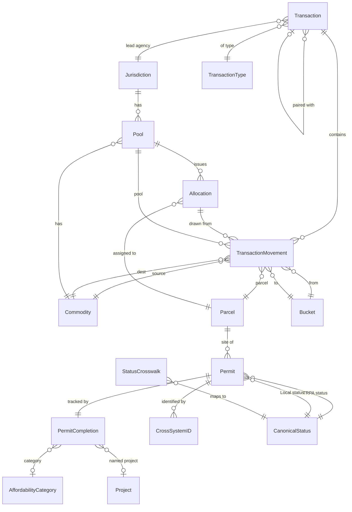
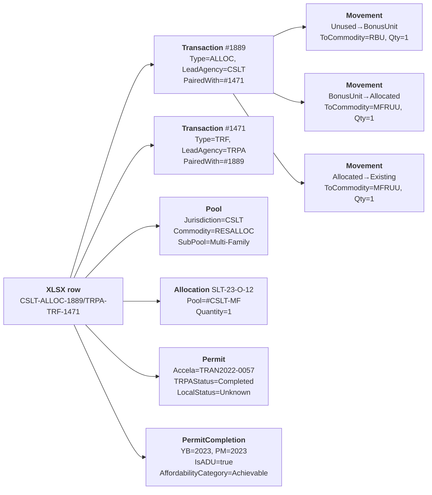

# What has been allocated, what has been built — and how did we find it?

Three things we need to know for every parcel, every year, every pool:

1. **Allocated** — was an allocation or right *authorized* to this parcel?
2. **Permitted** — did a permit get *issued* for the authorized work?
3. **Built** — is there a finished structure *recorded* on the ground?

Those three facts live in three different systems. Today the only place
they converge is a single ~2,000-row Excel file maintained by hand —
[`2025 Transactions and Allocations Details.xlsx`](../data/raw_data/2025%20Transactions%20and%20Allocations%20Details.xlsx).
That file is both our **richest source of truth** and our **worst shape**
— it has all the data we need and almost none of the structure we need.

This doc walks through (1) where each fact really lives, (2) every
column-level problem in the XLSX, and (3) the normalized target schema
that each column should decompose into.

> Supplementary: [`erd/xlsx_decomposition.md`](../erd/xlsx_decomposition.md)
> (older per-column → target-table map, from the previous file revision),
> [`erd/target_schema.md`](../erd/target_schema.md) (full schema).
> Inspection scripts: [`erd/inspect_2025_xlsx.py`](../erd/inspect_2025_xlsx.py),
> [`erd/inspect_2025_xlsx_deep.py`](../erd/inspect_2025_xlsx_deep.py),
> [`erd/inspect_2025_xlsx_full.py`](../erd/inspect_2025_xlsx_full.py).

---

## Where each fact lives today

| Fact | Authoritative source | What we get | What it can't tell us |
|---|---|---|---|
| Allocation authorized | Corral `ResidentialAllocation`, `TdrTransaction`, `CommodityPool` | Allocation number, pool, commodity, issue date, assignee parcel | Completion status, Year Built |
| Permit issued | Accela (via Corral's `AccelaCAPRecord` bridge) | Accela record ID, local permit number, issue/final dates | TRPA-side status before permit, MOU link |
| Built on the ground | GIS Parcel_History_Attributed FC (2006–2023, gap 2016–2017) + `*_2012to2025.csv` | Residential/CFA/TAU present each year | Year Built, allocation provenance |
| Completion across systems | the analyst's XLSX, column `Status Jan 2026` | Which of the ~2K rows the analyst considers done | Stale the day after it's typed |

No single system owns the *join* of all four. That's why the XLSX exists.

---

## It came from Corral

The `TransactionID` column is mechanically composed:

```
{LeadAgencyAbbreviation}-{TransactionTypeCode}-{TdrTransactionID}
```

- **Lead-agency prefixes:** `TRPA`, `EDCCA`, `CSLT`, `PCCA`, `DCNV`, `WCNV`
  (+ `TBD`, `NDSL` for edge cases) — exact match to Corral.
- **Transaction-type codes:** `ALLOC`, `TRF`, `CONV`, `CONVTRF`,
  `ALLOCASSGN`, `LBT` — exact match to Corral's `TransactionType`.
- **Numeric suffix:** matches `TdrTransaction.TdrTransactionID` in
  1,613 / 1,625 non-null rows.

Someone ran a Corral query joining `TdrTransaction` × `TransactionType` ×
lead-agency lookup, dumped the result to Excel, and the analyst appended manual
columns from then on. The 65 TransactionIDs with 5 dash-separated parts
are paired entries (`CSLT-ALLOC-1889/TRPA-TRF-1471`) representing two
Corral transactions merged into one XLSX row — a paired ALLOC/TRF for
the same unit.

**405 rows have no TransactionID at all.** They're "off-books" in
Corral — 122 are `Banking of Existing Development`, 173 are SFRUU, 107
are MFRUU. Of those 405, `Status Jan 2026 = Completed` on 388. These
are things the analyst tracks that Corral doesn't have a TDR record for
(pre-2012 baseline, informal bankings, etc.).

---

## The full chaos — column by column

Row counts are against 2,030 total. *Distinct value counts in the
Values column include nulls as one of the distinct buckets.*

### 1. `Transaction Type` — 14 distinct, 279 nulls

Should be 6 movement kinds. Actually:

| Issue | Example | Rows |
|---|---|---:|
| Valid movement types | `Residential Allocation`, `Transfer`, `Banking of Existing Development`, `Conversion With Transfer`, `Conversion`, `Allocation`, `Allocation Assignment`, `Land Bank Transfer` | 8 values, ~1,700 rows |
| **Commodity leaked into type column** | `Commercial Floor Area (CFA)` (28), `Residential Bonus Unit (RBU)` (11), `Tourist Accommodation Unit (TAU)` (3) | 42 |
| Trailing-whitespace duplicate | `Conversion ` (vs `Conversion`) | 4 |
| Placeholder | `TBD` | 7 |
| Null | | 279 |

### 2. `Jurisdiction` — 6 distinct

Should be 5 (TRPA, CSLT, EL, PL, DG, WA). Problem: `Wa` (lowercase-A)
appears in 1 row, silently excluded from `GROUP BY Jurisdiction`.

### 3. `Development Right` — 19 distinct, 2 nulls

This is **two fields fused into one string**: `{Commodity} - {Pool}`.

- Commodity alone: `Single-Family Residential Unit of Use (SFRUU)` (417),
  `Commercial Floor Area (CFA)` (160), `Multi-Family Residential Unit of Use (MFRUU)` (138),
  `Potential Residential Unit of Use (PRUU)` (73),
  `Residential Bonus Unit (RBU)` (60),
  `Tourist Accommodation Unit (TAU)` (57),
  `Residential Allocation` (683, bare — no pool suffix)
- Commodity + Pool fused: 433 rows, 9 pool variants including
  `Residential Allocation - CSLT - Single-Family Pool` (three-level),
  `Residential Allocation - El Dorado County` (county-level), etc.
- Trailing-whitespace duplicate: `Residential Allocation - CSLT - Town Center Pool ` (1)
- Placeholder: `TBD` (7)

### 4. `Development Type` — 14 distinct, 1 null

Overlaps with `Transaction Type` confusingly. Values:
`Allocation` (1,163), `Banked Unit` (192), `Transfer` (187),
`Banking From` (124), `No Project` (81),
`Converted and Transferred To` (70), `Residential Bonus Unit` (68),
`TBD` (56), `Converted To` (51), `Converted From` (32),
`Conversion With Transfer From ` (3 with trailing space),
`Conversion With Transfer From` (1 without), `Removed` (1), null (1).

The column is trying to encode **a source-bucket** (Allocation /
Banked Unit / Bonus Unit / Transfer / Conversion) and partially
**a destination-bucket** (Converted To / Converted and Transferred To).
Those belong in two separate FK columns.

### 5. `Detailed Development Type` — 115 distinct, 2 nulls

**This is the worst column.** It encodes **six** different facts in
one free-text string:

| Fact hidden in the string | Example substring | Rows |
|---|---|---:|
| Resulting commodity/form | `New Single-Family Residential`, `Multi-Family Condo Unit`, `Commercial Floor Area` | All 2,028 |
| Source bucket (`from X`) | `from Allocation`, `from Banked Unit`, `from Transfer`, `from Bonus Unit`, `from Conversion` | 1,782 (88%) |
| Commodity transformation | `(TAU to SFRUU)`, `(CFA to SFRUU)`, `(MFRUU to SFRUU)`, `(SFRUU to MFRUU)`, `(TAU to CFA)`, `(SFRUU to CFA)`, `(SFRUU to TAU)`, `(CFA to TAU)`, `(TAU to MFRUU)`, `(CFA to MFRUU)` | ~130 |
| **ADU flag** | `... ADU from ...` | 78 |
| Affordability category | `(Achievable)`, `(Affordable)`, `(Moderate)`, `(Market)`, `(LTCC)` | ~70 |
| Project name | `(Beach Club)`, `(Sierra Colina)`, `(Angora Fire Rebuild)`, `(Edgewood Lodge)`, `(Edgewood Casitas)` | ~180 |

Plus format noise on top of the hidden facts:

- Case drift: `from Allocation` (756) vs `From Allocation` (253) — same concept, 1,009 rows.
- Word drift: `Single-Family Residence` (1) vs `Single-Family Residential` (756). Hyphenation drift: `Multi-family` vs `Multi-Family`.
- Plural drift: `Tourist Accommodation Unit` vs `Tourist Accommodation Units`.
- Leading/trailing whitespace: ` Tourist Accommodation Unit from Transfer` (1), `New Single-Family Residence from SFRUU Transfer ` (3).
- Full sentences as types: `Convert 3 existing MFRUUs into 2 SFRUU including 1 ADU` (2 rows — that's a project description, not a type).
- Short vs long: `Commercial` (7) vs `Commercial Floor Area` (9) as leading terms.
- Sentence-with-period: `Commercial Business. CFA Converted from TAUs` (2 rows).

### 6. `TRPA Status` — 41 distinct, 1,001 nulls

Seven ways to say "done":
`Finaled` (285), `Project Completed` (190), `Construction Complete` (68),
`Project Complete` (29), `Final Inspection Complete` (14),
`Done` (11), `Project Complete ` (trailing space, 1).

Four ways to say "issued":
`Issued` (106), `Permit Issued` (9),
`Conditional Permit Issued` (25), `Conditional Permit` (8).

Three spellings of "review paused":
`Review Paused` (4), `Review Paused (Additional Info Required)` (2),
`Review Paused (Additional Information Reqd)` (1).

Misspelling: `Pending Withdrawl` (2) — missing `a` in "Withdrawal".

**Date values typed into the status column:**
`datetime.datetime(2021, 10, 21, 0, 0)` (2 rows),
`datetime.datetime(2022, 4, 5, 0, 0)` (1 row) — someone entered a
date where a status string belongs.

### 7. `Local Status` — 35 distinct, 847 nulls

Same chaos, smaller. Plus two special cases:

- `TRPA Placeholder` (4) — data migration leak; means "we don't know,
  TRPA created a stub row."
- `Permit Expired` (3) vs `Expired Permit` (1) — word-order variants.
- `Conditional Permit ` (trailing space, 1).

### 8. `Status Jan 2026` — 6 distinct, 1 null

`Completed` (1,579), `Not Completed` (365), `No Project` (81),
`TBD` (3), `Expired` (1). Clean vocabulary — but it's a **point-in-time
snapshot**. Load it as a column and the next monthly update adds
`Status Feb 2026`; in a year the DB has twelve stale columns.

### 9. `TransactionID` — see "It came from Corral" above

5-part "paired" TransactionIDs (65 rows) encode two Corral transactions
merged into one XLSX row, e.g.
`CSLT-ALLOC-1889/TRPA-TRF-1471`.

### 10. `Allocation Number` — 1,131 non-null, 1,090 unique

Clean pattern `{Agency}-{Year}-{Letter}-{Seq}` (e.g. `EL-21-O-08`,
`SLT-23-O-12`) for 1,088 rows. Exceptions:

- `TBD` (42 rows)
- **Unicode-hyphen typo**: one row uses U+2010 HYPHEN instead of
  U+002D HYPHEN-MINUS: `AA‐##‐#‐##`. Silent join failure waiting to happen.

### 11. `Quantity` — 2,021 non-null, 208 distinct

Mostly 1.0 (1,678). But there are **negative quantities** in 68+ rows:
`-1.0` (40), `-2.0` (20), `-3.0` (8), `-4.0` (3), `-300.0` (4) —
these are debit entries (removing from a bucket). The column is
being used as a signed ledger quantity but there's no "direction"
indicator separate from the sign.

Big CFA quantities exist for Commercial Floor Area transactions
(23,156 sqft, 18,000 sqft, 17,290 sqft) and RBU bulks (19, 21 units).

### 12. `Transaction Record ID` — 515 non-null, 323 unique

- Clean Accela formats: `TRAN####-####` (383), `ERSP####-####` (99),
  `SUBD####-####` (4), `VBOU####-####` (4), `ALLC####-####` (2).
- Literal string `Multiple` (4 rows) — means "there are multiple but I
  won't list them."
- Literal string `TBD` (6).
- Comma-joined multi-value: `TRAN2021-0057, TRAN2021-0058, TRAN2021-0059, TRAN2021-0060, TRAN2021-0061` (3 rows with 5-value lists).

### 13. `TRPA/MOU Project #` — 1,312 non-null, 889 unique

- Clean patterns: `ERSP####-####` (389), `######` (168), `TRP##-#####` (118), `VBOU####-####` (54), `MOUA####-####` (36).
- `plus Revisions` suffix (194) and `plus revisions` lowercase-r variant (76 of which overlap? or 118 additional).
- Parenthetical status: `(Withdrawn)` (9).
- Slash-joined: `ERSP####-####/ERSP####-####-##` (38).
- Semicolon-joined (12). Literal `TBD` (26).

### 14. `Local Jurisdiction Project #` — 1,179 non-null, 946 unique

20+ distinct format patterns (per-jurisdiction permit numbering):
`########` (420), `######` (248), `TRP##-#####` (122), `BLD##-#####` (56), `DB##-####` (50), `WBLD##-######` (45),
`WSUP##-####` (22), `RESNEW##-####` (16), `ADU##-####` (8),
`COMNEW##-####` (14).

Multi-value: `########; ########` (6), `BLD##-#####, BLD##-#####, BLD##-##### ` with trailing space (4), literal `Multiple` (42), `TBD` (29).

### 15. `Year Built` / `PM Year Built` — divergence

| Field | Range | Non-null |
|---|---|---:|
| Year Built | 2009–2026 | 1,581 |
| PM Year Built | **1940**–2025 | 1,093 |

**Of 1,075 rows where both are present, 171 disagree (16%).** Some
disagreements are 79+ years apart (`YB=2024, PM=1945`). These are
two different facts:

- `Year Built` = the year TRPA considers the unit built for
  accounting (when the allocation counts as used).
- `PM Year Built` = when the physical structure was actually built
  (assessor's record).

For rebuilds / replacement-on-existing-footprint, these legitimately
differ by decades.

### 16. `APN` — 3 formats

| Format | Rows | Jurisdiction |
|---|---:|---|
| `###-###-###` | 1,607 | California post-2018 |
| `####-##-###-###` | 258 | Nevada (DG/WA) |
| `###-###-##` | 165 | El Dorado County pre-2018 (2-digit suffix issue — see `parcel_genealogy.md`) |

### 17. Date columns — one bogus date

`TRPA Status Date` minimum value is **1970-01-01** (Unix epoch) —
almost certainly a system default written where a real date should
have been. Any aggregation by date needs to filter this out.

### Summary of problems

- **Concatenation**: 5 columns (`Development Right`, `Detailed Development Type`, `TRPA/MOU Project #`, `Transaction Record ID`, `Local Jurisdiction Project #`) encode 2+ facts per cell.
- **Uncontrolled vocabulary**: 3 columns (`TRPA Status`, `Local Status`, `Detailed Development Type`) have 35, 41, and 115 distinct values where ~6 would suffice.
- **Dirty data**: trailing whitespace, case drift, word drift, plural drift, misspellings, unicode-hyphen typos, date values in status columns, Unix-epoch dates.
- **Snapshot columns**: `Status Jan 2026` is point-in-time; loading it guarantees monthly schema creep.
- **Off-books rows**: 405 rows have no TransactionID — they're legitimately not in Corral and need their own non-FK-constrained path.
- **Hidden signed direction**: `Quantity` uses negatives to indicate debits where a separate `Direction` column would be clearer.

---

## The normalized target schema

The XLSX is a denormalized report. The proposal below fans it out into
10 tables (6 reference / lookup + 4 fact), each with a controlled
domain. Two key moves:

1. **Every enumerated field becomes a lookup table** (or a CHECK-constrained
   ENUM) — `CanonicalStatus`, `Jurisdiction`, `Commodity`, `Bucket`,
   `TransactionType`, `AffordabilityCategory`. No free-text status strings.
2. **Every concatenated cell becomes multiple columns or multiple rows**
   — `Development Right` → `Pool` (commodity + jurisdiction + subpool);
   `Detailed Development Type` → 6 fields spread across `TransactionMovement`
   and `PermitCompletion`; multi-value Project # → multiple `CrossSystemID`
   rows.

### Entity-relationship overview



### Reference / lookup tables

#### `Jurisdiction`

| Column | Type | Example |
|---|---|---|
| `JurisdictionCode` | `CHAR(4)` PK | `TRPA`, `CSLT`, `EL`, `PL`, `DG`, `WA` |
| `Name` | `VARCHAR(80)` | `City of South Lake Tahoe`, `El Dorado County` |
| `State` | `CHAR(2)` | `CA`, `NV` |
| `IsRegional` | `BIT` | `1` for TRPA, `0` for the others |

6 rows. Kills the `Wa` typo case at constraint level.

#### `Commodity`

| Column | Type | Example |
|---|---|---|
| `CommodityCode` | `VARCHAR(20)` PK | `SFRUU`, `MFRUU`, `PRUU`, `RBU`, `CFA`, `TAU`, `RESALLOC` |
| `DisplayName` | `VARCHAR(80)` | `Single-Family Residential Unit of Use` |
| `Unit` | `VARCHAR(10)` | `unit`, `sqft` |
| `IsResidential` | `BIT` | 1 for SFRUU/MFRUU/PRUU/RBU |

7 rows.

#### `Pool`

| Column | Type | Notes |
|---|---|---|
| `PoolID` | `INT` PK | |
| `JurisdictionCode` | FK | |
| `CommodityCode` | FK | |
| `SubPool` | `VARCHAR(40)` nullable | `Single-Family`, `Multi-Family`, `Town Center` (only used by CSLT) |
| `MaxCapacity` | `INT` | From Regional Plan / allocation ordinance |
| `DisplayName` | `VARCHAR(120)` computed | For UX — rebuilds the XLSX string if needed |

~25 rows. Decomposes `Development Right` completely. The single CSLT
trailing-space row becomes constraint-enforced clean.

#### `Bucket` — ENUM

`Existing | Banked | Allocated | BonusUnit | Unused`. 5 values.
These are the buckets in the Cumulative Accounting identity.

#### `TransactionType`

| Code | Name |
|---|---|
| `ALLOC` | Residential Allocation |
| `ALLOCASSGN` | Allocation Assignment |
| `TRF` | Transfer |
| `CONV` | Conversion |
| `CONVTRF` | Conversion With Transfer |
| `BANK` | Banking of Existing Development |
| `LBT` | Land Bank Transfer |

7 rows. Closes the `Conversion ` trailing-space issue and removes
commodity-leakage (the `Commercial Floor Area (CFA)` / `RBU` / `TAU`
rows where commodity was typed into the type column are reassigned by
ETL to their correct movement type based on `Detailed Development Type`).

#### `CanonicalStatus`

| Code | Meaning |
|---|---|
| `NotStarted` | Not yet submitted |
| `InReview` | Submitted, under review |
| `Issued` | Permit issued, construction may begin |
| `Finaled` | Construction finaled / CofO issued |
| `Completed` | Completed for accounting purposes |
| `Expired` | Lapsed without completion |
| `Withdrawn` | Cancelled / withdrawn / voided |
| `Unknown` | `TRPA Placeholder` / unmapped |

8 values. Populated by `StatusCrosswalk`.

#### `StatusCrosswalk`

| Column | Type | Example |
|---|---|---|
| `RawValue` | `VARCHAR(80)` | `Project Complete `, `Done`, `TRPA Placeholder` |
| `System` | `VARCHAR(10)` | `TRPA`, `Local` |
| `CanonicalStatus` | FK | `Completed` |

~76 rows (41 TRPA + 35 Local, minus shared strings). Built once,
maintained by the analyst + Planning. Every raw status the XLSX has ever
carried gets mapped here. New unmapped strings trigger a data-quality
alert; they don't silently fall through.

#### `AffordabilityCategory`

`Market | Achievable | Moderate | Affordable | LTCC`. 5 values.
Parsed out of the `(Achievable)` / `(Affordable)` / etc. parentheticals
in `Detailed Development Type`.

#### `Project` (optional)

| Column | Type | Example |
|---|---|---|
| `ProjectID` | `INT` PK | |
| `Name` | `VARCHAR(80)` | `Sierra Colina`, `Beach Club`, `Angora Fire Rebuild`, `Edgewood Lodge`, `Edgewood Casitas`, `Homewood` |
| `Description` | `TEXT` | |

Parsed from the `(Name)` parentheticals. Small table; optional FK
from `PermitCompletion`.

### Fact tables

#### `Transaction`

One row per Corral TDR transaction (or per off-books movement the analyst tracks).

| Column | Type | Source |
|---|---|---|
| `TransactionID` | `INT` PK | Corral `TdrTransaction.TdrTransactionID` when available |
| `LeadAgency` | FK `Jurisdiction` | Parsed from `TransactionID` prefix |
| `TransactionType` | FK `TransactionType` | Parsed from `TransactionID` middle segment |
| `TransactionDate` | `DATE` | From `Transaction Created Date` |
| `AcknowledgedDate` | `DATE` nullable | From `Transaction Acknowledged Date` |
| `PairedTransactionID` | FK self, nullable | For the 65 paired XLSX rows |
| `IsOffBooks` | `BIT` | `1` for the 405 no-TransactionID rows |

#### `TransactionMovement`

N:1 with `Transaction`. One row per bucket-to-bucket flow. Each
conversion generates 2+ movement rows; each simple allocation-use
generates 2 rows (unused→allocated, allocated→existing).

| Column | Type | Notes |
|---|---|---|
| `MovementID` | `INT` PK | |
| `TransactionID` | FK | |
| `SequenceNumber` | `SMALLINT` | Ordering within a transaction |
| `FromBucket` | FK `Bucket` | |
| `ToBucket` | FK `Bucket` | |
| `FromCommodity` | FK `Commodity` nullable | NULL unless a conversion |
| `ToCommodity` | FK `Commodity` | |
| `PoolID` | FK `Pool` | |
| `ParcelID` | FK | Resolved via `fn_resolve_apn` at load |
| `Quantity` | `DECIMAL(10,2)` | Always positive; direction is in `FromBucket`/`ToBucket` |

**No negative quantities.** A debit is expressed as `FromBucket=X,
ToBucket=X, Quantity=-1` → refactored into `FromBucket=X,
ToBucket=Unused, Quantity=1` (or similar).

Parsing the `Detailed Development Type` string `"New Single-Family
Residential ADU from Bonus Unit (Achievable)"` into movements:

1. (bonus pool) `Unused → BonusUnit, ToCommodity=RBU, Quantity=1`
2. (assignment) `BonusUnit → Allocated, ToCommodity=SFRUU, Quantity=1`
3. (build) `Allocated → Existing, ToCommodity=SFRUU, Quantity=1`

#### `Permit`

Accela permit record. One row per permit number.

| Column | Type | Source |
|---|---|---|
| `PermitID` | `INT` PK | |
| `AccelaRecordID` | `VARCHAR(40)` UNIQUE nullable | `Transaction Record ID` — the primary; `NULL` for off-books |
| `LocalJurisdictionPermitNumber` | `VARCHAR(40)` | `Local Jurisdiction Project #` |
| `JurisdictionCode` | FK | |
| `ParcelID` | FK | |
| `TRPAStatus` | FK `CanonicalStatus` | Via `StatusCrosswalk` |
| `LocalStatus` | FK `CanonicalStatus` | Via `StatusCrosswalk` |
| `TRPAStatusRaw` | `VARCHAR(80)` | For audit — the original raw string |
| `LocalStatusRaw` | `VARCHAR(80)` | For audit |
| `TRPAStatusDate` | `DATE` nullable | |
| `LocalStatusDate` | `DATE` nullable | |
| `IssuedDate` | `DATE` nullable | |
| `FinalInspectionDate` | `DATE` nullable | |

Raw values preserved for audit. If a new unmapped raw string shows up
in a future XLSX load, the crosswalk table grows rather than the
application breaking.

#### `PermitCompletion`

the analyst's manually-tracked facts — the truly unique contribution.

| Column | Type | Source |
|---|---|---|
| `PermitID` | FK PK | |
| `CompletionStatus` | ENUM | `Completed | NotCompleted | NoProject | TBD | Expired` — from `Status Jan 2026` **but** as a live field, not a column-per-month snapshot |
| `YearBuilt` | `SMALLINT` nullable | TRPA-accounting year |
| `PMYearBuilt` | `SMALLINT` nullable | Physical-structure year |
| `IsADU` | `BIT` | Parsed from `Detailed Development Type` substring |
| `AffordabilityCategory` | FK nullable | From parenthetical in Detailed Dev Type |
| `ProjectID` | FK nullable | From `(Project Name)` parenthetical |
| `Notes` | `TEXT` | Free text preserved |

#### `CrossSystemID`

Multi-value IDs (TRPA/MOU project numbers, multi-Accela permits) fan
out to multiple rows here.

| Column | Type | Example |
|---|---|---|
| `CrossSystemIDID` | `INT` PK | |
| `PermitID` | FK | |
| `IDType` | ENUM | `accela`, `local_permit`, `trpa_mou`, `local_jurisdiction_project` |
| `IDValue` | `VARCHAR(40)` | `ERSP2014-0375` |
| `Status` | ENUM nullable | `Active`, `Withdrawn`, `Expired` — parsed from `(Withdrawn)` parentheticals |
| `IsPrimary` | `BIT` | One per `(PermitID, IDType)` |
| `Notes` | `VARCHAR(200)` | e.g., `"plus Revisions"` kept as a note, not as part of the ID |

#### `Allocation`

The right issued (separate from its use).

| Column | Type | Source |
|---|---|---|
| `AllocationNumber` | `VARCHAR(20)` PK | `EL-21-O-08` — normalized (fixes U+2010 typo) |
| `PoolID` | FK | |
| `AssignedParcelID` | FK nullable | |
| `IssuedYear` | `SMALLINT` | Parsed from `AllocationNumber` segment 2 |
| `SeriesLetter` | `CHAR(2)` | Segment 3 |
| `Sequence` | `SMALLINT` | Segment 4 |
| `Quantity` | `DECIMAL(10,2)` | |
| `IssuedDate` | `DATE` | |

---

## How each messy XLSX column lands in the new schema

| XLSX column | Destination |
|---|---|
| `TransactionID` | `Transaction.TransactionID` + `LeadAgency` + `TransactionType` parsed from string; `PairedTransactionID` from 5-part variants |
| `Transaction Type` | `Transaction.TransactionType` (dropping commodity-leakage rows, reclassifying by `Detailed Dev Type` parse) |
| `APN` | `TransactionMovement.ParcelID` → `Parcel.APN` via `fn_resolve_apn` |
| `Jurisdiction` | `Transaction.LeadAgency` (+ normalized `Wa → WA`) |
| `Development Right` | `Pool.CommodityCode` + `Pool.JurisdictionCode` + `Pool.SubPool` — three columns |
| `Allocation Number` | `Allocation.AllocationNumber` (+ normalize unicode-hyphen) |
| `Quantity` | `TransactionMovement.Quantity` (+ sign converted to direction in `FromBucket`/`ToBucket`) |
| `Transaction Record ID` | `Permit.AccelaRecordID` for 1st; additional values → `CrossSystemID` rows |
| `Transaction Created Date` | `Transaction.TransactionDate` |
| `Transaction Acknowledged Date` | `Transaction.AcknowledgedDate` |
| `Development Type` | `TransactionMovement.FromBucket` (+ `ToBucket` for "Converted and Transferred To") |
| `Detailed Development Type` | 6 separate fields: `TransactionMovement.ToCommodity`, `.FromCommodity`, `.FromBucket`, `PermitCompletion.IsADU`, `.AffordabilityCategory`, `.ProjectID` |
| `Status Jan 2026` | `PermitCompletion.CompletionStatus` (not a column-per-month) |
| `TRPA/MOU Project #` | `CrossSystemID` rows with `IDType='trpa_mou'`, `Status` parsed from parentheticals |
| `TRPA Status` | `Permit.TRPAStatus` via crosswalk, raw preserved in `TRPAStatusRaw` |
| `TRPA Status Date` | `Permit.TRPAStatusDate` (filter out 1970-01-01) |
| `Local Jurisdiction Project #` | `Permit.LocalJurisdictionPermitNumber` for 1st; multi-value → `CrossSystemID` rows |
| `Local Status` | `Permit.LocalStatus` via crosswalk |
| `Local Status Date` | `Permit.LocalStatusDate` |
| `Year Built` | `PermitCompletion.YearBuilt` |
| `PM Year Built` | `PermitCompletion.PMYearBuilt` |
| `Notes` | `PermitCompletion.Notes` |

---

## Worked example — one ugly row decomposed

An actual XLSX row (TransactionID `CSLT-ALLOC-1889/TRPA-TRF-1471`):

| XLSX field | Raw value |
|---|---|
| TransactionID | `CSLT-ALLOC-1889/TRPA-TRF-1471` |
| Transaction Type | *(blank)* |
| APN | `025-041-023` |
| Jurisdiction | `CSLT` |
| Development Right | `Residential Allocation - CSLT - Multi-Family Pool` |
| Allocation Number | `SLT-23-O-12` |
| Quantity | `1` |
| Transaction Record ID | `TRAN2022-0057` |
| Development Type | `Allocation` |
| Detailed Development Type | `New Multi-Family Residential ADU from Bonus Unit (Achievable)` |
| Status Jan 2026 | `Completed` |
| TRPA Status | `Project Complete ` (trailing space) |
| Local Status | `TRPA Placeholder` |
| Year Built | `2023` |
| PM Year Built | `2023` |

Decomposes into:



One chaotic XLSX row becomes **11 normalized records**, every field
constrained, every enumerated value crosswalked, every concatenation
unpacked, the ADU / affordability facts first-class, and the trailing
space on `Project Complete ` canonicalized to `Completed` via the
`StatusCrosswalk`. `TRPA Placeholder` maps cleanly to `Unknown`.

---

## The 5-bucket accounting model

TRPA's Cumulative Accounting framework (Code §16.8.2):

```
Max Regional Capacity = Existing + Banked + Allocated + BonusUnits + Unused
```

`TransactionMovement` rows are the ledger that makes that identity
computable. Every movement has a `FromBucket` and `ToBucket`, so
summing net flow per bucket × commodity × jurisdiction × year yields
each bucket balance directly. A flat XLSX can't do that at query time.

---

## The coverage gap Corral can't close

Corral's `ParcelCommodityInventory` has only **39%** of residential
parcels represented. Details in
[`erd/validation_findings.md`](../erd/validation_findings.md). That's
why `ParcelExistingDevelopment` (fed from the GIS Parcel_History_Attributed
FC) exists in the target schema — it's the only source that covers
every parcel every year.

---

## Open decisions

- **StatusCrosswalk authorship.** 76 raw status strings need human
  mapping to 8 canonical values. the analyst owns the domain knowledge; who
  owns the data entry? Proposed: the analyst + Planning review once, then
  append-only as new strings appear.
- **Off-books rows (no TransactionID).** 405 of them. Two options:
  (a) insert synthetic `Transaction` rows with `IsOffBooks=1` and a
  numbering scheme like `OFFBOOKS-{seq}`; (b) accept NULL TransactionID
  on `TransactionMovement` and use `Permit` alone as the anchor.
  Leaning (a) for uniform query shape.
- **ADU detection.** Substring match on `"ADU"` in
  `Detailed Development Type` — reliable enough, or should the analyst add an
  explicit `IsADU` column upstream in the XLSX? (Probably explicit;
  substring matches will fail on rare wording like
  `"Accessory Dwelling Unit"`.)
- **Project name normalization.** Six names recur with high frequency
  (`Beach Club`, `Sierra Colina`, `Edgewood Lodge`, `Edgewood Casitas`,
  `Angora Fire Rebuild`, `Homewood`). Do we hard-code those, or
  auto-extract from parentheticals and let the analyst merge duplicates later?
  Leaning auto-extract + merge UI.
- **Signed quantity → direction.** Converting the 68 negative-quantity
  rows to positive + bucket direction requires reinterpreting each by
  hand for v1 load. Who reviews the ambiguous ones?
- **Paired-transaction semantics.** For the 65 5-part TransactionIDs,
  both Corral transactions exist — do we emit one `TransactionMovement`
  spanning both, or two linked `Transactions` with 6 movement rows
  total? Leaning two linked for auditability.
- **Year Built vs PM Year Built disagreement (171 rows).** Which drives
  the Cumulative Accounting "year the unit entered Existing bucket"?
  Proposed: `YearBuilt` (TRPA's) for accounting; `PMYearBuilt` for
  physical-age queries.

---

## Next steps

1. **Build the exhaustive crosswalks** — one per enumerated column:
   - `status_crosswalk.csv` (76 rows)
   - `transaction_type_crosswalk.csv` (14 raw → 7 canonical)
   - `development_type_crosswalk.csv` (14 raw → 5 from-buckets + 1 removal)
   - `detailed_development_type_parser.py` (regex → 6 extracted fields,
     backstopped by a manual crosswalk for the ~30 idiosyncratic strings)
   - `pool_crosswalk.csv` (19 Development Right strings → PoolID)
   the analyst + Planning validate each.
2. **Write the loader** (`etl/load_transactions_xlsx.py`):
   - Parse TransactionID (regular + 5-part paired).
   - Split `Development Right` → `Pool`.
   - Parse `Detailed Development Type` → 6 extracted fields.
   - Resolve APN via `fn_resolve_apn` (see `parcel_genealogy.md`).
   - Emit `Transaction` / `TransactionMovement` / `Permit` / `PermitCompletion` / `Allocation` / `CrossSystemID` rows.
   - Route unmapped raw values to a `data_quality_queue` table
     rather than failing the load.
3. **Canonicalize the XLSX in place as a one-time cleanup**:
   - Fix `Wa → WA`, `Conversion → Conversion` (strip trailing spaces
     globally), `Residence → Residential`, `from → from` (global
     lowercase for the `from X` connector).
   - Replace U+2010 hyphens with U+002D.
   - Filter `TRPA Status Date = 1970-01-01` to NULL.
   - Move the 3 date-valued `TRPA Status` cells to
     `TRPA Status Date` and set `TRPA Status` to NULL.
4. **Freeze the XLSX schema** — no more `Status {Month} {Year}`
   columns. the analyst updates the single `CompletionStatus` cell in-place.
5. **Publish a data-quality dashboard** showing:
   - Crosswalk coverage (raw values not yet mapped)
   - Unparseable `Detailed Development Type` strings
   - Rows where the canonical `TRPAStatus` and `Status Jan 2026`
     disagree (today's 570 rows where completion is only in
     `Status Jan 2026`)
   - APN resolution misses (from `ParcelGenealogyResolutionLog`)
6. **Retire `Status Jan 2026` as a column name.** Convert its row
   values into a single `PermitCompletion.CompletionStatus` field; any
   future monthly update writes to the same cell.

---

## References

- [`data/raw_data/2025 Transactions and Allocations Details.xlsx`](../data/raw_data/2025%20Transactions%20and%20Allocations%20Details.xlsx) — source of truth, worst shape.
- [`erd/xlsx_decomposition.md`](../erd/xlsx_decomposition.md) — previous per-column destination map.
- [`erd/target_schema.md`](../erd/target_schema.md) — full schema proposal.
- [`erd/validation_findings.md`](../erd/validation_findings.md) — Corral coverage gaps.
- [`resources/parcel_genealogy.md`](./parcel_genealogy.md) — APN resolver this loader depends on.
- [`erd/inspect_2025_xlsx_full.py`](../erd/inspect_2025_xlsx_full.py) — run this to regenerate every number in this doc.
