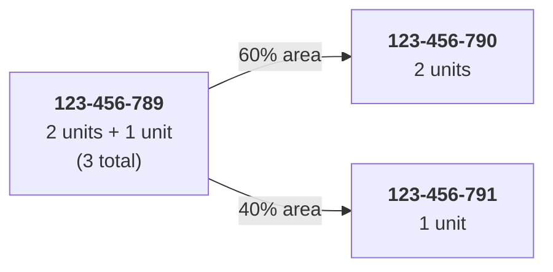
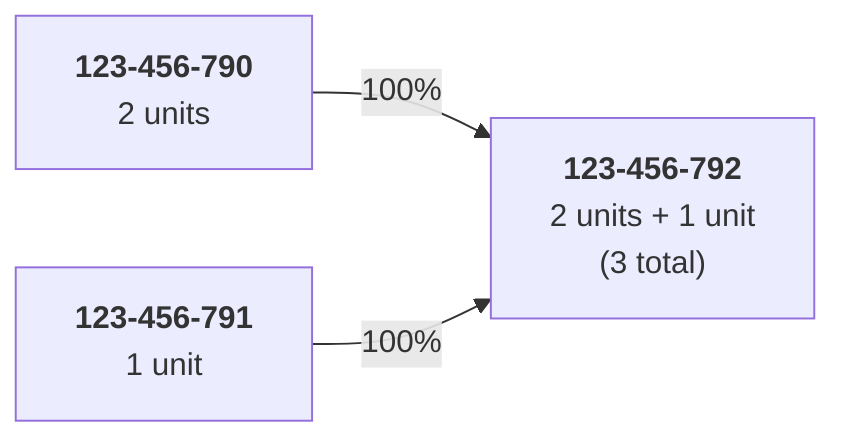
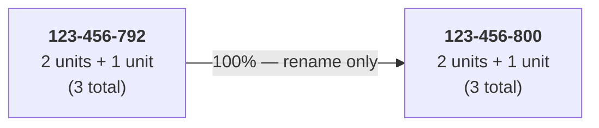

# How We Keep APNs Up to Date

To track residential units, CFA, and TAUs as parcels change over time,
we record **parcel genealogy** — a history of how each APN was created
from or transformed into other APNs, and how development rights moved
along with those changes.

> For the full algorithmic contract of the APN-as-of-date resolver, see
> [`erd/target_schema.md`](../erd/target_schema.md) ("Multi-hop genealogy
> resolver"). This doc is the 10-minute read.

---

## The problem

Every development-tracking analysis at TRPA is keyed on **APN**. APNs are
not stable. A parcel can be **split**, two or more parcels can be
**merged**, or a parcel can simply be **changed** (renumbered) by the
county. When that happens:

- A naive join on raw APN silently drops rows or attributes work to the
  wrong parcel.
- Development rights that existed on the old APN need to land somewhere
  under the new APN(s) — the system has to record *where* and *how much*.

Two specific gotchas make this worse in our data:

- **El Dorado County format shift.** El Dorado moved from a 2-digit
  suffix to a 3-digit suffix in 2018. Every string-join that crosses 2018
  on an El Dorado APN is wrong unless it normalizes the format first.
- **Multi-hop chains.** A parcel can be split, then the successor re-split,
  then one of those merged back. Resolving A → B → C requires iteration,
  not a single lookup.

---

## What we have today

| Source | Location | Rows | What it is |
|---|---|---|---|
| `dbo.ParcelGenealogy` (Corral) | SQL Server `Corral` on `sql24` | ~2.4K | 3-column skeleton: old APN, new APN, a parent key. No date, no event type, no source attribution, no rights-transfer fields. |
| `apn_genealogy_tahoe.csv` | [`data/raw_data/apn_genealogy_tahoe.csv`](../data/raw_data/apn_genealogy_tahoe.csv) | 42,159 events | Consolidated event log, 23 columns: `change_year`, `event_type`, `overlap_pct`, `source`, `source_priority`, `confidence`, `verified`, etc. |
| `apn_genealogy_{accela,ltinfo,spatial,master}.csv` | [`data/raw_data/`](../data/raw_data/) | ~43K combined | Upstream per-source feeds that the tahoe CSV consolidates. |

Consolidated source mix inside `apn_genealogy_tahoe.csv`:

| `source` | events |
|---|---|
| ACCELA | 37,331 |
| LTINFO | 2,574 |
| MANUAL | 1,909 |
| SPATIAL | 345 |

Event-type mix is dominated by **renames** (~36K), then **splits** (~2.7K)
and **merges** (~0.6K).

The CSV is the best raw material we have. **The single biggest gap** is
that it describes *parcel* changes but not *development-rights* changes —
no columns for residential units, CFA, or TAU carried from old APN to
new. Filling that gap is the core of the target schema below.

---

## Genealogy Table Schema

Each row in the genealogy table represents a single relationship between
an old APN and a new APN resulting from a parcel change event. A split
produces N rows (one per child); a merge produces N rows (one per parent);
a rename produces one row.

| Column | Type | Description |
|---|---|---|
| `Genealogy_ID` | Integer | Unique identifier for each genealogy record |
| `Year` | Integer | Year the parcel change occurred |
| `Old_APN` | String | The APN before the change |
| `New_APN` | String | The APN after the change |
| `Change_Type` | String | Type of change: `Split`, `Merge`, or `Change` |
| `Percent_Area` | Integer | Percentage of the old parcel's area transferred to the new APN |
| `Residential_Units` | Integer | Number of residential units carried from the old APN |
| `CFA` | Integer | Commercial floor area (sq ft) carried from the old APN |
| `TAU` | Integer | Tourist accommodation units carried from the old APN |
| `Source` | String | Data source for the record |
| `Verified` | Boolean | Whether the record has been verified |
| `Comments` | String | Any additional notes |

Provenance columns already present in `apn_genealogy_tahoe.csv`
(`source_priority`, `confidence`, `is_primary`, `overlap_pct`) are retained
as **internal** columns used by the resolver — they don't need to be on
the user-facing schema above, but they aren't dropped either.

---

## Worked Example

The following example traces a single parcel through a **split**, a
**merge**, and an **APN change** over three years.

### 2022 — Split

`123-456-789` (3 units total) is split into two new parcels. Development
rights are allocated proportionally by area.

### 2023 — Merge

The two parcels are merged into a single new APN. Units from both
predecessors sum back to the original three.

### 2024 — APN Change

The parcel is renumbered. No change to area or development rights —
rights pass through unchanged.

---

## Resulting Genealogy Records

| ID | Year | Old APN | New APN | Change Type | % Area | Res. Units | CFA | TAU | Source | Verified | Comments |
|:--:|:----:|:-------:|:-------:|:-----------:|:------:|:----------:|:---:|:---:|:------:|:--------:|:--------:|
| 1 | 2022 | <nobr>123-456-789</nobr> | <nobr>123-456-790</nobr> | Split  | 60%  | 2 | 0 | 0 | | Yes | |
| 2 | 2022 | <nobr>123-456-789</nobr> | <nobr>123-456-791</nobr> | Split  | 40%  | 1 | 0 | 0 | | Yes | |
| 3 | 2023 | <nobr>123-456-790</nobr> | <nobr>123-456-792</nobr> | Merge  | 100% | 2 | 0 | 0 | | No  | |
| 4 | 2023 | <nobr>123-456-791</nobr> | <nobr>123-456-792</nobr> | Merge  | 100% | 1 | 0 | 0 | | No  | |
| 5 | 2024 | <nobr>123-456-792</nobr> | <nobr>123-456-800</nobr> | Change | 100% | 3 | 0 | 0 | | Yes | |

Read across the five rows:

- **2022 split.** The 3 units on `123-456-789` split 2 + 1 by area share.
- **2023 merge.** The two successors merge and their rights sum back to 3.
  `Verified = No` flags the rows for analyst review — a merge is where
  double-counting bugs bite, so they shouldn't auto-approve.
- **2024 change.** A pure rename: rights pass through unchanged.

---

## Why current tools can't answer "what was APN X on 2015-06-01?"

- **No time-aware lookup.** Corral's skeleton has no change date.
- **No multi-hop walker.** A one-step join hits at most one hop of a
  split/merge/change chain.
- **No ambiguity or cycle handling.** Real data has both; a silent-drop
  join hides them.
- **No source-priority arbitration.** When ACCELA disagrees with SPATIAL,
  nothing documents a tie-break.
- **No rights-transfer record.** Even if we resolve the APN correctly, we
  don't know how many units or how much CFA/TAU moved with the change.

The target schema + resolver address all five.

---

## Proposed path forward

Minimal surface area; one table, one read path, one log.

- **One table:** the `Genealogy` schema above, seeded from
  `apn_genealogy_tahoe.csv` plus a rights-transfer backfill job that
  allocates residential-unit / CFA / TAU values to each event.
- **One function:** `fn_resolve_apn(@apn varchar, @as_of date)`. The only
  supported way for code to join on APN. Deterministic tie-breaking,
  hop limit of 10, cycle-safe. Full contract in
  [`erd/target_schema.md`](../erd/target_schema.md).
- **One log:** `ParcelGenealogyResolutionLog`. Every ambiguity, cycle, or
  unresolved APN writes a row. Its growth is the data-quality dashboard.
- **Ingestion:** county assessor updates, Accela/LTinfo feeds, and
  analyst overrides (`Source = MANUAL`, `Verified` gate for review).

---

## Open decisions

- **Rights-transfer defaulting rule on splits.** Proportional to
  `Percent_Area` by default, with an analyst override that sets
  `Verified = No` until reviewed? Or require explicit analyst entry for
  every split (slower but safer)?
- **ADU modeling.** Does `Residential_Units` include ADUs, or do we carry
  ADU as its own column? (Tied to an open question in `erd/target_schema.md`
  about how Corral represents ADU.)
- **Source of truth.** Do we retire Corral's 3-column `dbo.ParcelGenealogy`
  in favor of the new table, or keep the skeleton and layer on top?
- **Retroactive restatements.** When a new event would change the
  resolver's answer for a historical query, rewrite the historical row or
  insert a correction event? *Leaning correction events* — audit trail.
- **Ownership.** Who owns ongoing ingestion of splits/merges/changes —
  TRPA GIS, TRPA Planning, or the ETL author?
- **Ambiguity SLA.** Who reviews flagged rows, how often? Weekly by a
  named analyst is the minimum viable answer.
- **El Dorado format normalization.** Handled inside the resolver (one
  place, consistent) or as a pre-normalization step in each ETL job
  (distributed, faster, error-prone)? Leaning inside the resolver.

---

## Next steps

1. Confirm the **source-priority ladder** with stakeholders. Current CSV
   encoding has MANUAL at priority 1; confirm the ordering of SPATIAL vs
   ACCELA vs LTINFO.
2. Draft the **rights-transfer defaulting rule** — area-proportional on
   splits, sum-of-parents on merges, pass-through on changes — with the
   analyst-override path that holds rows at `Verified = No`.
3. Stand up the new genealogy table in the dev SDE schema; seed from
   `apn_genealogy_tahoe.csv` and backfill rights-transfer columns from
   the existing inventory data.
4. Write `fn_resolve_apn` plus unit tests against real
   split/merge/change examples pulled from the CSV.
5. Wire every APN-keyed ETL write through the resolver.
6. Publish a small dashboard off `ParcelGenealogyResolutionLog` so drift
   is visible to the team.
7. Decide ownership and the ambiguity-review cadence before any of the
   above goes to production.

---

## References

- [`data/raw_data/apn_genealogy_tahoe.csv`](../data/raw_data/apn_genealogy_tahoe.csv)
  — the consolidated event log (42,159 rows).
- [`erd/target_schema.md`](../erd/target_schema.md) — full schema proposal;
  see "Multi-hop genealogy resolver".
- [`erd/validation_findings.md`](../erd/validation_findings.md) — empirical
  coverage gaps that motivated this work.
