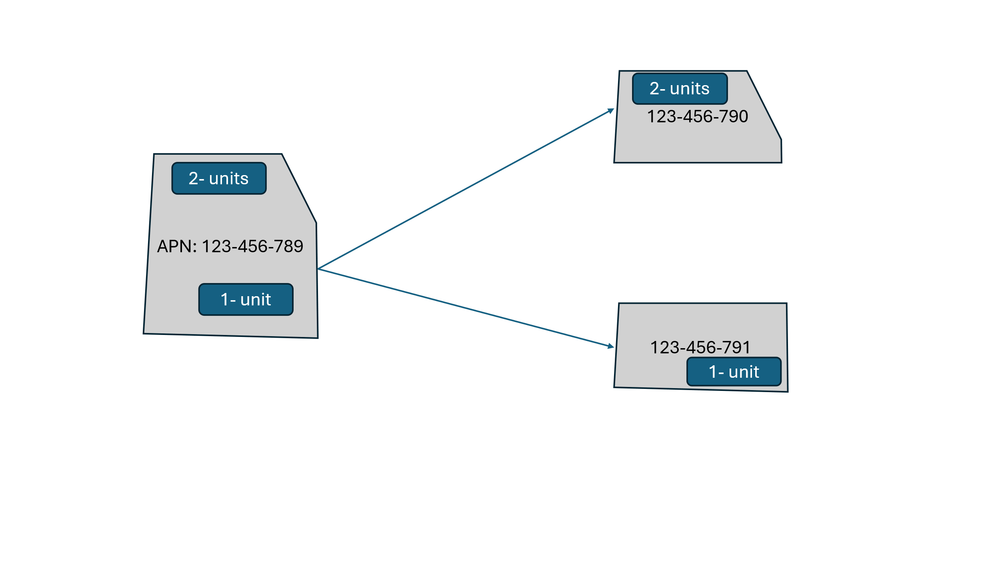
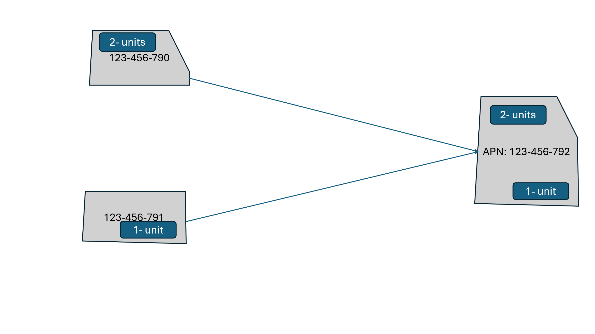
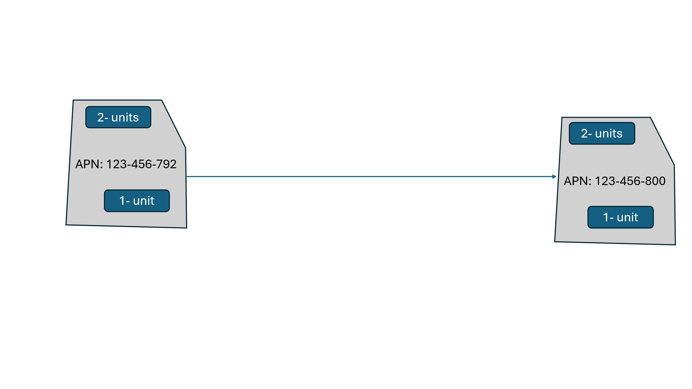

## How We Keep APNs Up to Date

To track residential units, CFA, and TAUs as parcels change over time, we record parcel genealogy — a history of how each APN was created from or transformed into other APNs.

---

## Genealogy Table Schema

Each row in the genealogy table represents a single relationship between an old APN and a new APN resulting from a parcel change event.

| Column | Type | Description |
|---|---|---|
| `Genealogy_ID` | Integer | Unique identifier for each genealogy record |
| `Year` | Integer | Year the parcel change occurred |
| `Old_APN` | String | The APN before the change |
| `New_APN` | String | The APN after the change |
| `Change_Type` | String | Type of change: `Split`, `Merge`, or `Change` |
| `Percent_Area` | Integer | Percentage of the old parcel's area transferred to the new APN |
| `Residential_Units` | Integer | Number of residential units carried from the old APN |
| `CFA` | Integer | Commercial floor area (sq ft) carried from the old APN |
| `TAU` | Integer | Tourist accommodation units carried from the old APN |
| `Source` | String | Data source for the record |
| `Verified` | Boolean | Whether the record has been verified |
| `Comments` | String | Any additional notes |

---

## Worked Example

The following example traces a single parcel through a split, a merge, and an APN change over three years.

### 2022 — Split

`123-456-789` is split into two new parcels, with development rights allocated proportionally by area.

### 2023 — Merge

The two parcels are merged into a single new APN. Units from both predecessors are summed.

### 2024 — APN Change

The parcel is renumbered. No change to area or development rights.

---

## Resulting Genealogy Records

| ID | Year | Old APN | New APN | Change Type | % Area | Res. Units | CFA | TAU | Source | Verified | Comments |
|:--:|:----:|:-------:|:-------:|:-----------:|:------:|:----------:|:---:|:---:|:------:|:--------:|:--------:|
| 1 | 2022 | <nobr>123-456-789</nobr> | <nobr>123-456-790</nobr> | Split  | 60%  | 2 | 0 | 0 | | Yes | |
| 2 | 2022 | <nobr>123-456-789</nobr> | <nobr>123-456-791</nobr> | Split  | 40%  | 1 | 0 | 0 | | Yes | |
| 3 | 2023 | <nobr>123-456-790</nobr> | <nobr>123-456-792</nobr> | Merge  | 100% | 2 | 0 | 0 | | No  | |
| 4 | 2023 | <nobr>123-456-791</nobr> | <nobr>123-456-792</nobr> | Merge  | 100% | 1 | 0 | 0 | | No  | |
| 5 | 2024 | <nobr>123-456-792</nobr> | <nobr>123-456-800</nobr> | Change | 100% | 3 | 0 | 0 | | Yes | |